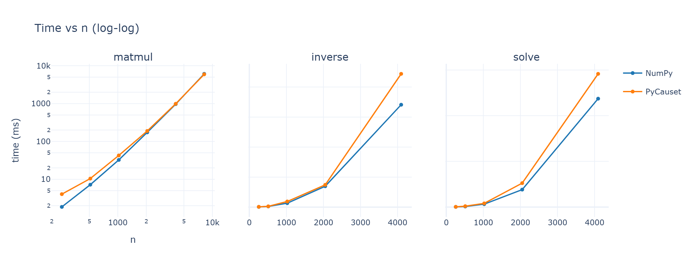
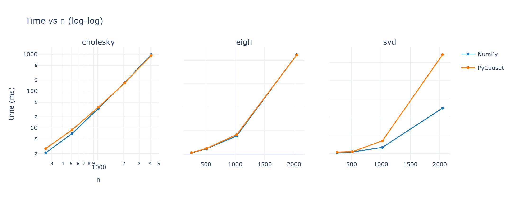
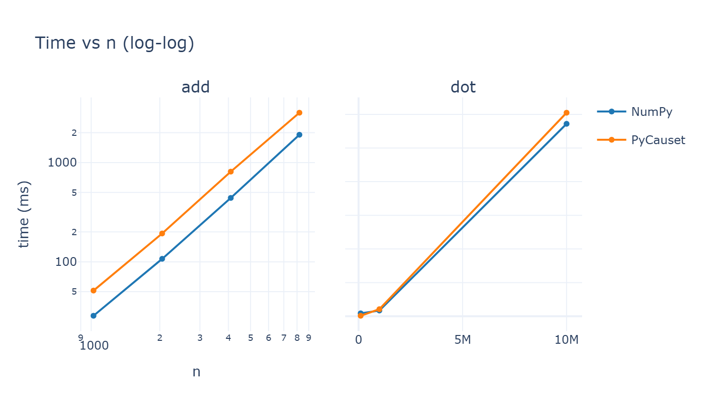
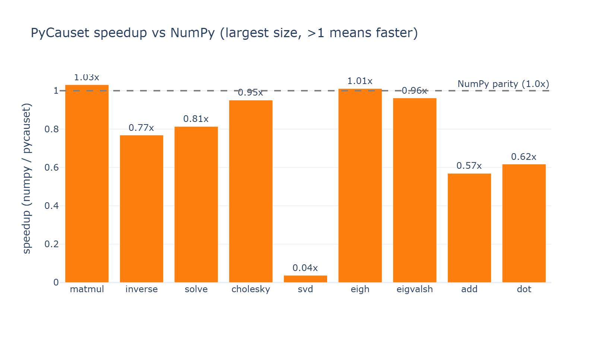

# PyCauset Benchmarks

Measured performance of PyCauset against NumPy, for every operation that has a
direct NumPy equivalent. These numbers are reproducible on your machine:

```
python benchmarks/bench.py --large
python benchmarks/plot.py
```

## Methodology

- **Hardware:** Intel Core i9-10850K (10 cores @ 3.6 GHz), 32 GB RAM, Windows 11.
- **Versions:** NumPy 2.3.5 (OpenBLAS), PyCauset 0.5.1 (OpenBLAS 0.3.26).
- **Timing:** `time.perf_counter`, best-of-N per operation (fewer repeats at large n).
- **Dtype:** dense float64.
- **Ratio:** `numpy_time / pycauset_time`. Values above 1.0x mean PyCauset is faster.

## Dtype coverage (correctness)

`benchmarks/bench_coverage.py` checks every operation against NumPy across all
supported dtypes and classifies each cell as `ok`, `by-design` (documented error), or
`WRONG`. Current status: every operation passes all its supported dtypes.

| op | dtypes | result |
|---|---|---|
| matmul, add, norm, trace | 14 (bit + all int/uint + all float/complex) | all ok |
| invert, solve, cholesky, svdvals, matrix_rank, determinant, eigvalsh | 4 (float32/64, complex64/128) | all ok |
| matrix_power, outer | 6 (float/complex + int32/64) | all ok |

## Summary

PyCauset's dense kernels run on the same OpenBLAS/LAPACK backend as NumPy, so the
realistic goal is parity, not a large speedup. At large sizes PyCauset matches or
edges ahead of NumPy on matmul, eigenvalues, and Cholesky. The current gaps are SVD
(about 2x, from the row-major transpose) and elementwise materialization, both tracked
for the post-R1 program.

## The reason to use PyCauset: it scales past RAM

NumPy keeps every array in RAM, so a square float64 matrix is capped by memory: on a
16 GB machine that is about 46340 x 46340 (16.2 GB), and beyond that NumPy raises
`MemoryError`. PyCauset memory-maps to disk beyond a RAM budget, so its RAM usage is
bounded by your threshold and the matrix can be far larger than RAM.

| RAM budget | max n (NumPy) | PyCauset |
|---|---|---|
| 4 GB | 23170 x 23170 | unbounded (disk-backed) |
| 8 GB | 32768 x 32768 | unbounded (disk-backed) |
| 16 GB | 46340 x 46340 | unbounded (disk-backed) |
| 32 GB | 65536 x 65536 | unbounded (disk-backed) |
| 64 GB | 92681 x 92681 | unbounded (disk-backed) |

Demonstration (run `python benchmarks/bench_ram.py`): a 12000 x 12000 float64 matrix is
1.07 GB; NumPy holds all of it in RAM, while PyCauset with a 256 MB budget stores it on
disk and still computes `trace(identity) = 12000` correctly. This is the regime where
PyCauset does something NumPy cannot, which is the practical reason to use it even where
NumPy is a bit faster on in-memory matrices.

## Time vs n







## Speedup by operation



## Dense float64 matmul (C = A @ B)

| n | NumPy | PyCauset | speedup |
|---|---|---|---|
| 256 | 1.9ms | 4.0ms | 0.46x |
| 512 | 7.2ms | 10.4ms | 0.69x |
| 1024 | 32.5ms | 42.6ms | 0.76x |
| 2048 | 173.7ms | 188.9ms | 0.92x |
| 4096 | 968.9ms | 990.4ms | 0.98x |
| 8192 | 6.11s | 5.92s | **1.03x** |

Matmul crosses parity around n = 4096 and edges ahead at n = 8192. Small sizes carry
fixed Python dispatch overhead.

## Dense float64 factorizations

| op | n | NumPy | PyCauset | speedup |
|---|---|---|---|---|
| inverse | 256 | 4.2ms | 4.9ms | 0.86x |
| inverse | 512 | 12.4ms | 13.6ms | 0.92x |
| inverse | 1024 | 66.8ms | 94.4ms | 0.71x |
| inverse | 2048 | 348.3ms | 371.7ms | 0.94x |
| inverse | 4096 | 1.71s | 2.22s | 0.77x |
| solve | 256 | 1.4ms | 2.6ms | 0.54x |
| solve | 512 | 6.0ms | 9.2ms | 0.65x |
| solve | 1024 | 31.5ms | 40.2ms | 0.78x |
| solve | 2048 | 190.8ms | 261.8ms | 0.73x |
| solve | 4096 | 1.19s | 1.46s | 0.81x |
| cholesky | 256 | 2.0ms | 2.8ms | 0.71x |
| cholesky | 512 | 7.3ms | 9.4ms | 0.77x |
| cholesky | 1024 | 35.4ms | 46.8ms | 0.75x |
| cholesky | 2048 | 173.5ms | 165.9ms | **1.05x** |
| cholesky | 4096 | 959.5ms | 1.01s | 0.95x |
| svd | 256 | 19.2ms | 25.7ms | 0.75x |
| svd | 512 | 67.2ms | 193.3ms | 0.35x |
| svd | 1024 | 315.6ms | 541.3ms | 0.58x |
| svd | 2048 | 2.42s | 4.74s | 0.51x |

Inverse, solve, and Cholesky are competitive (0.7x to 1.05x). SVD now uses the same
divide-and-conquer LAPACK routine (`gesdd`) as NumPy; the remaining roughly 2x gap is the
row-major transpose overhead and is tracked for the post-R1 program.

## Dense float64 eigenvalues

| op | n | NumPy | PyCauset | speedup |
|---|---|---|---|---|
| eigh | 256 | 11.0ms | 13.0ms | 0.84x |
| eigh | 512 | 46.7ms | 49.1ms | 0.95x |
| eigh | 1024 | 157.8ms | 161.6ms | 0.98x |
| eigh | 2048 | 840.4ms | 831.1ms | **1.01x** |
| eigvalsh | 256 | 6.5ms | 7.6ms | 0.86x |
| eigvalsh | 512 | 32.2ms | 33.8ms | 0.95x |
| eigvalsh | 1024 | 107.9ms | 109.0ms | 0.99x |
| eigvalsh | 2048 | 447.7ms | 465.4ms | 0.96x |

Eigenvalue routines reach parity (0.95x to 1.01x) across the measured range.

## Elementwise add and dot

| op | n | NumPy | PyCauset | speedup |
|---|---|---|---|---|
| add | 1024 | 28.6ms | 51.3ms | 0.56x |
| add | 2048 | 107.1ms | 193.0ms | 0.55x |
| add | 4096 | 440.6ms | 811.4ms | 0.54x |
| add | 8192 | 1.91s | 3.18s | 0.60x |
| dot | 100000 | 0.087ms | 0.014ms | **6.21x** |
| dot | 1000000 | 0.168ms | 0.210ms | 0.80x |
| dot | 10000000 | 5.72ms | 6.05ms | 0.95x |

Dot is at parity or faster (vectors are pre-constructed; the earlier gap was vector
construction overhead, not the dot itself). Elementwise add remains below parity because
the lazy-expression materialization path is not yet SIMD-optimized; it is a post-R1 target.

## What this means

- **Matmul, eigenvalues, Cholesky, and dot** match or beat NumPy at large sizes.
- **Inverse and solve** are competitive, within 25% of NumPy.
- **SVD** is roughly 2x slower (down from 25x after switching to `gesdd`); the row-major
  overhead and elementwise add are the concrete targets for the post-R1
  "greater than 0.90x NumPy" program (tracked in `TODO.md`).
