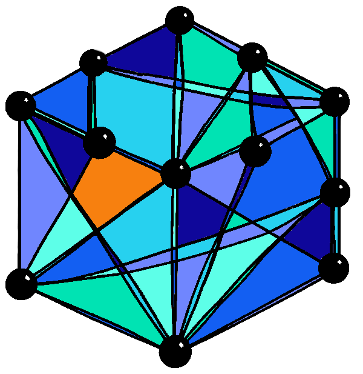

<div align="center">
  
  

  <br><br>

[](https://brorh.github.io/pycauset/)
[](https://badge.fury.io/py/pycauset)
[](https://opensource.org/licenses/MIT)

</div>

### **PyCauset** is a high-performance Python library for **Causal Set Theory**. 

PyCauset is **NumPy for causal sets**. Any programmer familiar with [NumPy](https://github.com/numpy/numpy) will automatically also know how to operate PyCauset. Like NumPy, PyCauset is backed by a strong C++ engine for efficient numerical linear algebra, while storage, hardware dispatch (CPU/GPU), and performance optimizations happen automatically behind the scenes. 

PyCauset allows for handling of _humongous_ matrices, as the module efficiently balances storage through both RAM and disk. The only limit to how large matrices you can work with is your disk storage. Example: with a 4TB external SSD, you can work with dense $N\times N$ float64 matrices of $N \sim 10^6$ (check this claim!).


**[Explore the Full Documentation »](https://brorh.github.io/pycauset/)**


## Installation

### From PyPI (Recommended)
```bash
pip install pycauset
```
We provide pre-compiled binary wheels for Windows, macOS, and Linux.

### From Source
```bash
git clone https://github.com/BrorH/pycauset.git
cd pycauset
pip install .
```

## Development Status and Roadmap
PyCauset is currently in pre-alpha. Here is the three-step roadmap plan for the future version 1.0:

  1.  **(WIP) High-performance C++ backed numerical linear algebra library**. First focus is to build a _robust_, _reliable_ and _highly efficient_ linear algebra module that is designed with causal sets in mind. It is to behave like NumPy
  2.  **(PLANNED) Physics enginge and causal sets**. With a robust linear algebra system in place, we will implement efficient methods for researchers to work with causal sets. Examples include: sprinkling methods, Pauli-Jordan eigenvalues, vev and propagator calculations, visualizations. Focus is on user experience and ease of use.
  3.  **(PLANNED) Documentation, guides, tests and benchmarks**. Create an extensive suite of documentation and guides to help people use PyCauset and show its power and potential. Also perform extensive tests and squash bugs and perform benchmarks to illustrate proficiency.

Version 1.0 will feature the above and more.

## Key Features

*   **Hybrid Storage Architecture**: PyCauset automatically manages memory. Small matrices live in RAM for speed, while massive datasets spill seamlessly to **memory-mapped disk storage** (single-file `.pycauset` containers).
*   **GPU Acceleration**: Built-in NVIDIA CUDA backend for matrix multiplication, inversion, and eigenvalue problems. Includes custom kernels for **accelerated bit-matrix operations**.
*   **Smart Precision**: Automatically selects `Float64` or `Float32` based on matrix size and hardware capabilities to maximize throughput.
*   **Physics Engines**:
    *   **Spacetimes**: Minkowski Diamond, Cylinder, and Box manifolds.
    *   **Fields**: Scalar field propagators ($K_R$) and path integrals.
*   **Visualization**: Interactive 3D visualization of embeddings and causal structures using Plotly.
*   **Pausing Calculations**: A long-winded and tedious calculation may be paused at any time and continued later. The calculation may also be exported and continued on another machine (WIP).


## Quick Start

### 1. Simulating Spacetime
The `CausalSet` class is the main entry point for physics simulations.

```python
import pycauset as pc
from pycauset.vis import plot_embedding

# 1. Sprinkle 5000 points into a 2D Minkowski Diamond
c = pc.CausalSet(n=5000, density=100, seed=42)

# 2. Access the Causal Matrix (TriangularBitMatrix)
# Stored efficiently (1 bit per element)
C = c.C

# 3. Visualize the embedding
fig = plot_embedding(c)
fig.show()
```

### 2. Quantum Field Theory
Compute the Retarded Propagator ($K_R$) for a scalar field.

```python
from pycauset.field import ScalarField

# Define a massive scalar field (m=1.5) on the causal set
field = ScalarField(c, mass=1.5)

# Compute the propagator K = aC(I - b aC)^-1
# This uses GPU acceleration if available
K = field.propagator()
```

### 3. Pure Linear Algebra
You can use PyCauset as a high-performance sparse/dense matrix library.

```python
# Create random causal matrices (10k x 10k)
A = pc.causal_matrix(10000, populate=True)
B = pc.causal_matrix(10000, populate=True)

# Fast GPU-accelerated BitMatrix multiplication
# Returns an IntegerMatrix of path counts
Paths = A @ B 

# Invert a dense float matrix
M = pc.zeros((2000, 2000), dtype=pc.float32)  # also accepts np.float32 or "float32" (case-insensitive)
M_inv = ~M # or M.inverse()
```

## License information
PyCauset is published under the MIT license. 

If you use PyCauset in your research, please cite:
[https://github.com/BrorH/pycauset](https://github.com/BrorH/pycauset)

If you wish to contribute or have any questions, please contact me at _bror_\[dot\]_hjemgaard_[you can probably guess which symbol comes here]_gmail_(another dot)_com_

This repo contains AI-genetated code