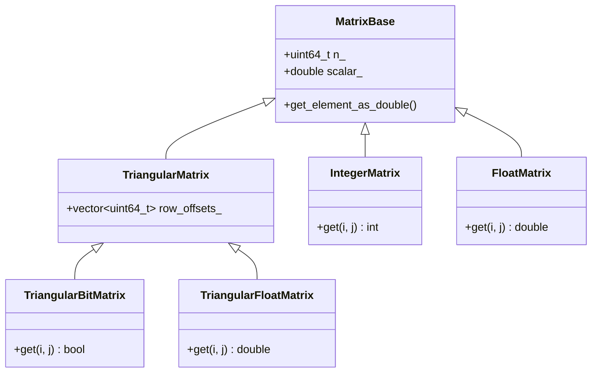

The back-bone of pycauset is the matrix system. It is built from the ground-up to allow a seamless workflow as similar to possible to numpy.
# Creating a Matrix


# Matrix Operations

`pycauset` provides efficient implementations for matrix operations, mirroring `numpy` semantics where appropriate but optimized for the specific matrix structures (e.g., triangular, bit-packed) used in causal analysis.

## Matrix Multiplication (`matmul`)

Matrix multiplication is performed using the `pycauset.matmul(A, B)` function.
### Supported Types
Currently, matrix multiplication is optimized and exposed for **`TriangularBitMatrix`**.
### Syntax
```python
import pycauset

# A and B are TriangularBitMatrix instances
C = pycauset.matmul(A, B)
```

### Return Value
The operation returns an **`IntegerMatrix`**. 
- Since `TriangularBitMatrix` entries are boolean (0 or 1), the dot product of a row and a column results in an integer.
- Geometrically, if $A$ and $B$ represent adjacency matrices of graphs, $C_{ij}$ counts the number of paths of length 2 from node $i$ to node $j$ (i.e., number of intermediate nodes $k$ such that $i \to k$ and $k \to j$).
## Element-wise Multiplication

Element-wise multiplication is performed using the standard multiplication operator `*`.
### Syntax
```python
# A and B can be any matrix type (TriangularBitMatrix, TriangularFloatMatrix, etc.)
C = A * B
```
### Semantics
-   $C_{ij} = A_{ij} \times B_{ij}$
-   For `TriangularBitMatrix`, this is equivalent to a bitwise AND operation ($1 \times 1 = 1$, others $0$).
-   Returns a new matrix of the same type as the operands.

## Scalar Multiplication

Scalar multiplication is supported for all matrix types and is highly optimized.
### Syntax
```python
# A is any matrix
B = A * 5.0
C = 0.5 * A
```

# Saving and Storing Matrices
In pycauset, matrices never live in-memory, but are stored on your device's storage disk. This allows for work humongous matrices.
### Saving a Matrix
Matrices are backed by temporary files that are deleted when the program exits, unless [`pycauset.keep_temp_files`](pycauset.keep_temp_files.md) is set to `True`. To permanently save a specific matrix, use [`pycauset.save()`](pycauset.save). 
```python
# Save the matrix to a permanent location
pycauset.save(C, "my_saved_matrix.pycauset")
```

### Loading a Matrix
You can load any previously saved matrix file using `pycauset.load()`. The function automatically detects the matrix type (Causal, Integer, Float, etc.) from the file header.

```python
# Load a matrix from disk
matrix = pycauset.load("my_saved_matrix.pycauset")

# Check the type
print(type(matrix)) 
# <class 'pycauset.pycauset.CausalMatrix'> (or IntegerMatrix, etc.)
```

### Temporary Files
By default, `pycauset` manages backing files automatically. Files are stored in a `.pycauset` directory (or `$PYCAUSET_STORAGE_DIR`).
- **Automatic Cleanup**: Temporary files are deleted on exit.
- **Persistence**: Set `pycauset.keep_temp_files = True` to prevent deletion of temporary files (useful for debugging).
- **Explicit Saving**: Use `pycauset.save()` to keep specific matrices.


# Matrix Hierarchy

All matrix types derive from a shared C++ `MatrixBase` that owns the memory-mapped backing file and lifecycle management. The hierarchy is designed to support both dense and sparse/triangular structures efficiently.



For working with causal matrices (a backbone of the causal set theory), `TriangularBitMatrix` is the primary boolean specialization.  It is exposed as `pycauset.CausalMatrix`. `IntegerMatrix` stores 32-bit counts (e.g., from matrix multiplication). `TriangularFloatMatrix` and `FloatMatrix` (dense) provide floating-point storage for analytical results.