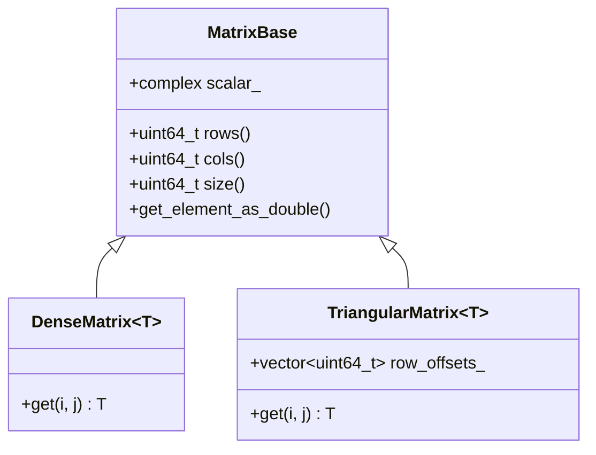

The back-bone of pycauset is the matrix system. While most users will interact with the high-level [[docs/classes/spacetime/pycauset.CausalSet.md|pycauset.CausalSet]] class, the matrix engine powers everything underneath. It is built from the ground-up to allow a seamless workflow as similar to possible to numpy.

`pycauset` behaves like NumPy at small scales (storing data in RAM), but converts to a memory-efficient beast at high scales (automatically spilling to disk).

# Creating a Matrix

Matrices can be created from data using **[[docs/functions/pycauset.matrix.md|pycauset.matrix]]**. Allocation is done via **[[docs/functions/pycauset.zeros.md|pycauset.zeros]]**, **[[docs/functions/pycauset.ones.md|pycauset.ones]]**, or **[[docs/functions/pycauset.empty.md|pycauset.empty]]**.

## Rectangular support (what is and isn’t NxM)

- **Dense numeric matrices are rectangular-aware**: for integer/float/complex dtypes you can allocate and operate on `(rows, cols)` shapes.
- **Dense boolean/bit matrices are rectangular-aware**: `dtype="bool"` / `dtype="bit"` maps to `DenseBitMatrix` and supports `(rows, cols)` shapes.
- **Some matrix *types* are square-only by definition** (e.g. triangular/causal, identity, diagonal, symmetric/antisymmetric).

`pycauset.matrix(...)` is a data constructor (aligned with `np.array(...)` semantics). It does not interpret integers/tuples as shapes. When you want to allocate by shape, use `zeros/ones/empty` with an explicit `dtype`.

`dtype` accepts multiple forms:
*   `pc` dtype tokens like `pc.int8`, `pc.int16`, `pc.int32`, `pc.int64`, `pc.uint32`, `pc.float16`, `pc.float32`, `pc.float64`, `pc.complex_float32`, `pc.bool_`
*   NumPy dtypes like `np.int16`, `np.float32`, `np.bool_`
*   Strings like `"int16"`, `"FLOAT32"` (case-insensitive)
*   Builtins like `int`, `float`, `bool`

Supported dtype strings (recommended):

- Bit/boolean: `"bit"`, `"bool"`, `"bool_"`
- Signed integers: `"int8"`, `"int16"`, `"int32"`, `"int64"`
- Unsigned integers: `"uint8"`, `"uint16"`, `"uint32"`, `"uint64"`
- Floats: `"float16"`, `"float32"`, `"float64"`
- Complex floats: `"complex_float16"`, `"complex_float32"`, `"complex_float64"`

Notes:

- `"int"` normalizes to `"int32"`; `"float"` normalizes to `"float64"`; `"uint"` normalizes to `"uint32"`.
- Complex is limited to complex floats (no `complex int*` / `complex bit`).
- Exact op coverage is declared in the support matrix (see `documentation/internals/DType System.md`).

```python
import pycauset as pc
import numpy as np

# 1. From a list of lists (infers type)
M1 = pc.matrix(((1, 2), (3, 4)))  # Creates IntegerMatrix

# 2. From a NumPy array
arr = np.random.rand(5, 5)
M2 = pc.matrix(arr)               # Creates FloatMatrix

# 3. Allocate by shape (dtype required)
M3 = pc.zeros((100, 200), dtype=int)   # 100x200 IntegerMatrix (zeros)
M4 = pc.zeros((100, 100), dtype=bool)  # 100x100 DenseBitMatrix (zeros)

# 4. Explicit int16 storage
M5 = pc.empty((100, 100), dtype=pc.int16)  # returns Int16Matrix

# 5. Unsigned integer storage
Mu = pc.empty((100, 100), dtype=pc.uint32)  # returns UInt32Matrix

# 6. Complex float storage (construct from data)
Mc = pc.matrix(((1 + 2j, 0), (0, 3 - 4j)), dtype=pc.complex_float32)  # ComplexFloat32Matrix

# 7. Causal Matrix (Specialized Triangular Bit Matrix)
# This is optimized for causal sets (strictly upper triangular)
C = pc.causal_matrix(100)
```

## Block matrices (experimental)

!!! warning "Pre-alpha / experimental"
    Block matrices are supported as an experimental Python `BlockMatrix` type.

    The behavior is usable today, but the exact semantics and public API surface may change as the feature hardens.

### Goal

Represent a large matrix as a 2D grid of child matrices (blocks) without global densification.

### Minimal example

```python
import pycauset as pc

A = pc.matrix(((1.0, 0.0), (0.0, 1.0)))
B = pc.matrix(((2.0, 3.0), (4.0, 5.0)))

# 2x2 block grid of 2x2 blocks -> overall 4x4
BM = pc.matrix(((A, B), (B, A)))

assert BM.shape == (4, 4)
assert BM.block_rows == 2
assert BM.block_cols == 2

# Block access is explicit
blk00 = BM.get_block(0, 0)
assert blk00.shape == (2, 2)

# Element access reads through to the relevant block
_ = BM[0, 0]
```

### Construction rules (important)

For 2D nested sequences:

- If **every** element is matrix-like: constructs a block matrix.
- If **no** elements are matrices: constructs a dense native matrix (normal `pycauset.matrix` behavior).
- If you **mix** matrices and scalars: raises `TypeError` (ambiguous; no implicit lifting).

Block-grid input rejects `dtype` and `**kwargs`.

### Operations and laziness

When either operand is a block matrix, the result stays block (“once block, always block”) for:

- `@` / [[docs/functions/pycauset.matmul.md|pycauset.matmul]]
- `+`, `-`, `*`, `/`

Results are typically **thunked per output block** and only evaluate on triggers:

- Accessing an element (e.g. `C[i, j]`)
- Converting to NumPy (`np.asarray(C)`) — useful for debugging, but it evaluates all elements via Python loops
- Saving (`pc.save(C, ...)`) — evaluates blocks as needed to persist a stable snapshot

### Saving and loading

Saving a block matrix writes a container file plus a sidecar directory:

```python
pc.save(BM, "bm.pycauset")
# creates bm.pycauset and bm.pycauset.blocks/

BM2 = pc.load("bm.pycauset")
```

See [[internals/Block Matrices.md|Block Matrices]] for the manifest shape.


## Precision and Storage

Choose precision explicitly via `dtype` at allocation time:

```python
M16 = pc.empty((5000, 5000), dtype="float16")
M32 = pc.empty((5000, 5000), dtype="float32")
M64 = pc.empty((5000, 5000), dtype="float64")
```

# Matrix Operations

`pycauset` provides efficient implementations for matrix operations, mirroring `numpy` semantics where appropriate but optimized for specific matrix structures (e.g., triangular, bit-packed).

## Indexing, slicing, and assignment (NumPy-style)

PyCauset implements NumPy-like 2D indexing for dense matrices only. Structured/triangular matrices currently reject slicing.

### Basic indexing → views (shared storage)

* Supported: integers (negative wrap), `:`, `slice` with step (±), `...`.
* Returns a view when both row/col steps are `1`; mutations reflect in the source.

```python
M = pc.matrix([ [1, 2, 3], [4, 5, 6] ], dtype="float64")
sub = M[:, 1:]          # view, shares backing
sub[0, 0] = 20
assert M.get(0, 1) == 20
```

### Advanced indexing → copies

* Supported per axis: 1D integer arrays (negative wrap) and 1D boolean masks.
* Any use of arrays (alone or mixed with basic) returns a copy with NumPy shape rules; two array axes must have equal length or length-1.

```python
rows = pc.np.array([0, 1], dtype=int)
cols = pc.np.array([2, 1], dtype=int)
picked = M[rows, cols]   # copy; shape (1, 2) after broadcast
```

### Assignment with broadcasting

* RHS may be a scalar, NumPy 0/1/2-D array, or another dense matrix.
* NumPy 2D broadcast rules apply; shape mismatch raises `ValueError`.
* Casting RHS arrays triggers `PyCausetDTypeWarning`; narrowing or float→int casts also trigger `PyCausetOverflowRiskWarning`.

```python
rhs = pc.np.arange(6).reshape(2, 3)
M[:2, :3] = rhs          # broadcasts OK

M[:, :2] = pc.np.array([1.5, 2.5], dtype=pc.np.float32)  # warns: cast float32 → float64
```

### Unsupported (current build)

* `None` / `newaxis` (matrices stay 2D-only).
* Slicing structured/triangular types.

### Kernel guardrails

Views with storage offsets are rejected by `matmul`, `qr`, `lu`, and `inverse`; call `copy()` first.

See also: [[docs/classes/matrix/pycauset.MatrixBase.md|pycauset.MatrixBase]], [[project/protocols/NumPy Alignment Protocol.md|NumPy Alignment Protocol]], [[guides/Storage and Memory.md|Storage and Memory]]

## GPU Acceleration

If a compatible NVIDIA GPU is detected, PyCauset will automatically accelerate:
*   **Multiplication**: $A \times B$ for Float64, Float32, and Boolean matrices.
*   **Inversion**: $A^{-1}$ for Float64 and Float32 matrices.

**Boolean Matrix Acceleration:**
Multiplying `DenseBitMatrix` (boolean) on the GPU is highly optimized. It uses bit-packing to perform 64 operations per cycle, making it ideal for path counting in large causal sets.

```python
A = pc.zeros((4096, 4096), dtype=bool)
B = pc.zeros((4096, 4096), dtype=bool)
# ... fill matrices ...

# Extremely fast GPU multiplication
C = A @ B 
```

## Matrix Multiplication (`matmul`)

Matrix multiplication is performed using [[docs/functions/pycauset.matmul.md|pycauset.matmul]](A, B). It follows the standard shape rule: `A.cols() == B.rows()` and returns a matrix of shape `(A.rows(), B.cols())`.

It supports many combinations of matrix types, automatically promoting the result to the most general required structure (Dense > TriangularFloat > Integer > Bit).

| Operand A | Operand B | Result Type |
| :--- | :--- | :--- |
| [[docs/classes/matrix/pycauset.FloatMatrix.md|pycauset.FloatMatrix]] (Dense) | Any | [[docs/classes/matrix/pycauset.FloatMatrix.md|pycauset.FloatMatrix]] |
| Any | [[docs/classes/matrix/pycauset.FloatMatrix.md|pycauset.FloatMatrix]] (Dense) | [[docs/classes/matrix/pycauset.FloatMatrix.md|pycauset.FloatMatrix]] |
| [[docs/classes/matrix/pycauset.TriangularFloatMatrix.md|pycauset.TriangularFloatMatrix]] | Triangular (Any) | [[docs/classes/matrix/pycauset.TriangularFloatMatrix.md|pycauset.TriangularFloatMatrix]] |
| Triangular (Any) | [[docs/classes/matrix/pycauset.TriangularFloatMatrix.md|pycauset.TriangularFloatMatrix]] | [[docs/classes/matrix/pycauset.TriangularFloatMatrix.md|pycauset.TriangularFloatMatrix]] |
| [[docs/classes/matrix/pycauset.IntegerMatrix.md|pycauset.IntegerMatrix]] | [[docs/classes/matrix/pycauset.IntegerMatrix.md|pycauset.IntegerMatrix]] or [[docs/classes/matrix/pycauset.TriangularBitMatrix.md|pycauset.TriangularBitMatrix]] | [[docs/classes/matrix/pycauset.IntegerMatrix.md|pycauset.IntegerMatrix]] |
| [[docs/classes/matrix/pycauset.TriangularBitMatrix.md|pycauset.TriangularBitMatrix]] | [[docs/classes/matrix/pycauset.IntegerMatrix.md|pycauset.IntegerMatrix]] | [[docs/classes/matrix/pycauset.IntegerMatrix.md|pycauset.IntegerMatrix]] |
| [[docs/classes/matrix/pycauset.TriangularBitMatrix.md|pycauset.TriangularBitMatrix]] | [[docs/classes/matrix/pycauset.TriangularBitMatrix.md|pycauset.TriangularBitMatrix]] | [[docs/classes/matrix/pycauset.IntegerMatrix.md|pycauset.IntegerMatrix]] |
| [[docs/classes/matrix/pycauset.DenseBitMatrix.md|pycauset.DenseBitMatrix]] | [[docs/classes/matrix/pycauset.DenseBitMatrix.md|pycauset.DenseBitMatrix]] | [[docs/classes/matrix/pycauset.IntegerMatrix.md|pycauset.IntegerMatrix]] |

**Note**: [[pycauset.IntegerMatrix]] is a **dense** matrix storing 32-bit integers, commonly returned for discrete path counting operations.

### Implementation Details
Operations use memory-mapped files to handle large matrices.
- **Triangular Matrices**: Uses a row-addition algorithm exploiting the strictly upper triangular structure.
- **Dense Matrices**: Uses a row-wise accumulation (IKJ) algorithm.
- **Mixed Types**: Optimized to use the sparse structure of triangular matrices while producing dense results.
- **Scalar Propagation**: $C.scalar = A.scalar \times B.scalar$.

## Element-wise Multiplication

Use the standard `*` operator: `C = A * B`.
-   $C_{ij} = A_{ij} \times B_{ij}$
-   For [[pycauset.TriangularBitMatrix]], this is equivalent to bitwise AND.
-   Returns a new matrix of the same type as the operands.

## Scalar Multiplication

Scalar multiplication is supported for all matrix types and is **lazily evaluated**: `C = 0.5 * A`.
-   The operation is $O(1)$ and does not iterate over data.
-   It updates an internal `scalar` field.
-   Values are multiplied on-the-fly when accessed or converted to numpy.

## Vector-Matrix Multiplication

Use the `@` operator for matrix-vector multiplication.
-   **Matrix @ Vector**: `M @ v` returns a column vector ($M \times v$).
-   **Vector @ Matrix**: `v.T @ M` returns a row vector ($v^T \times M$).

# Linear Algebra

PyCauset includes a suite of linear algebra tools.

## Inversion

Matrix inversion is supported for selected floating-point dense matrices and requires a square matrix (`rows == cols`).

```python
# Compute inverse
Inv = M.inverse()
```


# Saving and Storing Matrices
In pycauset, large matrices are automatically stored on your device's storage disk to allow for work with humongous datasets. Small matrices may live in RAM for performance until they grow too large.

### Temporary Files & Lifecycle
By default, `pycauset` manages backing files automatically. Files are stored in a `.pycauset` directory in the current working directory.

*   **Configuration**: Set the `PYCAUSET_STORAGE_DIR` environment variable to relocate the storage directory.
*   **Automatic Cleanup**: Temporary files are deleted when the Python interpreter exits.
*   **Persistence**: Set `pycauset.keep_temp_files = True` to prevent deletion (useful for debugging).
*   **Manual Cleanup**: Call `matrix.close()` to release the memory-mapped handle immediately.

### Saving a Matrix
Matrices are backed by temporary files that are deleted when the program exits, unless [[pycauset.keep_temp_files]] is set to `True`. To permanently save a specific matrix, use [[pycauset.save]]. 

**Note:** If you are working with a [[pycauset.CausalSet]], you should use its `.save()` method (or `pycauset.save(causet)`) to save the entire object including metadata. The method below is for raw matrices.

```python
# Save the matrix to a permanent location
pc.save(C, "my_saved_matrix.pycauset")
```

### Loading a Matrix
You can load any previously saved matrix file using [[pycauset.load]]. The function automatically detects the matrix type (Causal, Integer, Float, etc.) from the file header.

```python
# Load a matrix from disk
matrix = pc.load("my_saved_matrix.pycauset")

# Check the type
print(type(matrix)) 
# <class 'pycauset.pycauset.TriangularBitMatrix'> (or IntegerMatrix, etc.)
```

### Temporary Files
By default, `pycauset` manages backing files automatically. Files are stored in a `.pycauset` directory (or `$PYCAUSET_STORAGE_DIR`).
- **Automatic Cleanup**: Temporary files are deleted on exit.
- **Persistence**: Set `pycauset.keep_temp_files = True` to prevent deletion of temporary files (useful for debugging).
- **Explicit Saving**: Use [[pycauset.save]] to keep specific matrices.

# Caching and Persistence

Some operations cache small derived values (for example `trace` / `determinant`) into the file’s typed metadata when saving matrices. Other caches are build-dependent and may not be available in all builds.


# Matrix Hierarchy

All matrix types derive from a shared C++ `MatrixBase` that owns the memory-mapped backing file and lifecycle management. The hierarchy is designed to support both dense and sparse/triangular structures efficiently.



### Common Types
| Python Class | C++ Implementation | Description |
| :--- | :--- | :--- |
| `IntegerMatrix` | `DenseMatrix<int32_t>` | Dense matrix of 32-bit integers. |
| `FloatMatrix` | `DenseMatrix<double>` | Dense matrix of 64-bit floats. |
| `DenseBitMatrix` | `DenseMatrix<bool>` | Dense matrix of booleans (bit-packed). |
| `TriangularBitMatrix` | `TriangularMatrix<bool>` | Strictly upper triangular boolean matrix (Causal Matrix). |
| `TriangularFloatMatrix` | `TriangularMatrix<double>` | Strictly upper triangular float matrix. |

For working with causal matrices (a backbone of the causal set theory), `TriangularBitMatrix` is the primary boolean specialization. Use `pycauset.causal_matrix(...)` to create one. `IntegerMatrix` stores 32-bit counts (e.g., from matrix multiplication). `TriangularFloatMatrix` and `FloatMatrix` (dense) provide floating-point storage for analytical results.

# Performance & Parallelism

Pycauset is designed to handle large matrices ($N > 5000$) efficiently by leveraging multi-core CPUs.

## Automatic Parallelization

The library automatically detects the number of available CPU cores and parallelizes computationally intensive operations. No user configuration is required, but manual control is available.

*   **Matrix Inversion**: Uses a parallel Block Gauss-Jordan algorithm.
*   **Eigenvalues**: Uses a parallel QR algorithm with Hessenberg Reduction.
*   **Matrix Multiplication**: Uses optimized parallel block multiplication.
*   **Skew-Symmetric Solver**: Uses a parallel Block Skew-Lanczos algorithm.

### Controlling Thread Count

You can manually set the number of threads used by the library. This is useful for benchmarking or resource management.

```python
import pycauset
import os

# Use all available cores (default)
pycauset.set_num_threads(os.cpu_count())

# Limit to 4 threads
pycauset.set_num_threads(4)

# Check current setting
print(pycauset.get_num_threads())
```

## Performance Expectations

Performance depends heavily on CPU, memory bandwidth, storage speed, and dtype. Use the scripts under `benchmarks/` to measure performance on your target machine.

## See also

- [[docs/functions/pycauset.matrix.md|pycauset.matrix]]
- [[docs/functions/pycauset.zeros.md|pycauset.zeros]]
- [[docs/functions/pycauset.empty.md|pycauset.empty]]
- [[docs/functions/pycauset.matmul.md|pycauset.matmul]]
- [[docs/classes/matrix/pycauset.MatrixBase.md|pycauset.MatrixBase]]
- [[internals/Memory and Data|internals/Memory and Data]]
- [[internals/DType System|internals/DType System]]
