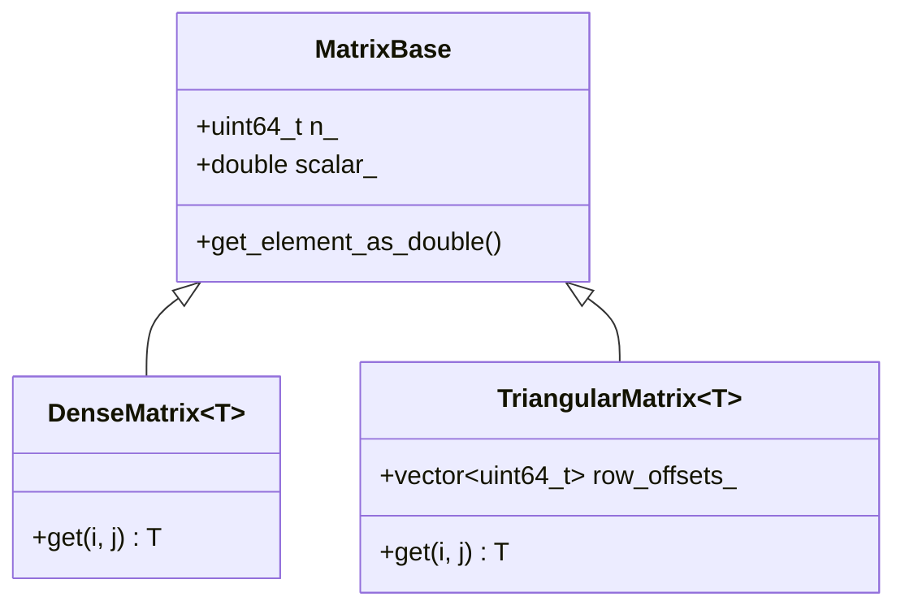

The back-bone of pycauset is the matrix system. While most users will interact with the high-level [[pycauset.CausalSet]] class, the matrix engine powers everything underneath. It is built from the ground-up to allow a seamless workflow as similar to possible to numpy.

`pycauset` behaves like NumPy at small scales (storing data in RAM), but converts to a memory-efficient beast at high scales (automatically spilling to disk).

# Creating a Matrix

Matrices can be created using the [[pycauset.Matrix]] factory function. This function is flexible and accepts lists, NumPy arrays, or dimensions. You can also specify the `dtype` to control the underlying storage format.

`dtype` accepts multiple forms:
*   `pc` dtype tokens like `pc.int8`, `pc.int16`, `pc.int32`, `pc.int64`, `pc.uint32`, `pc.float16`, `pc.float32`, `pc.float64`, `pc.complex_float32`, `pc.bool_`
*   NumPy dtypes like `np.int16`, `np.float32`, `np.bool_`
*   Strings like `"int16"`, `"FLOAT32"` (case-insensitive)
*   Builtins like `int`, `float`, `bool`

Supported dtype strings (recommended):

- Bit/boolean: `"bit"`, `"bool"`, `"bool_"`
- Signed integers: `"int8"`, `"int16"`, `"int32"`, `"int64"`
- Unsigned integers: `"uint8"`, `"uint16"`, `"uint32"`, `"uint64"`
- Floats: `"float16"`, `"float32"`, `"float64"`
- Complex floats: `"complex_float16"`, `"complex_float32"`, `"complex_float64"`

Notes:

- `"int"` normalizes to `"int32"`; `"float"` normalizes to `"float64"`; `"uint"` normalizes to `"uint32"`.
- Complex is limited to complex floats (no `complex int*` / `complex bit`).
- Exact op coverage is declared in the support matrix (see `documentation/internals/DType System.md`).

```python
import pycauset as pc
import numpy as np

# 1. From a list of lists (infers type)
M1 = pc.Matrix(((1, 2), (3, 4)))  # Creates IntegerMatrix

# 2. From a NumPy array
arr = np.random.rand(5, 5)
M2 = pc.Matrix(arr)               # Creates FloatMatrix

# 3. Empty matrix of specific size and type
M3 = pc.Matrix(100, dtype=int)    # 100x100 IntegerMatrix (zeros)
M4 = pc.Matrix(100, dtype=bool)   # 100x100 DenseBitMatrix (zeros)

# 5. Explicit int16 storage
M5 = pc.Matrix(100, dtype=pc.int16)  # returns Int16Matrix

# 6. Unsigned integer storage
Mu = pc.Matrix(100, dtype=pc.uint32)  # returns UInt32Matrix

# 7. Complex float storage
Mc = pc.Matrix(((1 + 2j, 0), (0, 3 - 4j)), dtype=pc.complex_float32)  # ComplexFloat32Matrix

# 4. Causal Matrix (Specialized Triangular Bit Matrix)
# This is optimized for causal sets (strictly upper triangular)
C = pc.CausalMatrix(100)
```

## Precision Tiers (Massive Scale)

For extremely large matrices ($N > 10,000$), PyCauset automatically adjusts the floating-point precision to save storage and bandwidth. This is critical for performance on consumer hardware.

| Matrix Size ($N$) | Default Precision | Storage per Element | Class |
| :--- | :--- | :--- | :--- |
| $N < 10,000$ | Double (64-bit) | 8 bytes | [[pycauset.FloatMatrix]] |
| $N \ge 10,000$ | Single (32-bit) | 4 bytes | [[pycauset.Float32Matrix]] |

**Overriding Defaults:**
You can force a specific precision using the `force_precision` argument:

```python
# Force Double precision even for large N
M = pc.Matrix(20000, force_precision="double")

# Force Half precision for smaller N
M = pc.Matrix(5000, force_precision="half")

You can also set precision explicitly via `dtype`:

```python
M16 = pc.Matrix(5000, dtype="float16")
M32 = pc.Matrix(5000, dtype="float32")
M64 = pc.Matrix(5000, dtype="float64")
```
```

# Matrix Operations

`pycauset` provides efficient implementations for matrix operations, mirroring `numpy` semantics where appropriate but optimized for specific matrix structures (e.g., triangular, bit-packed).

## GPU Acceleration

If a compatible NVIDIA GPU is detected, PyCauset will automatically accelerate:
*   **Multiplication**: $A \times B$ for Float64, Float32, and Boolean matrices.
*   **Inversion**: $A^{-1}$ for Float64 and Float32 matrices.

**Boolean Matrix Acceleration:**
Multiplying `DenseBitMatrix` (boolean) on the GPU is highly optimized. It uses bit-packing to perform 64 operations per cycle, making it ideal for path counting in large causal sets.

```python
A = pc.Matrix(4096, dtype=bool)
B = pc.Matrix(4096, dtype=bool)
# ... fill matrices ...

# Extremely fast GPU multiplication
C = A @ B 
```

## Matrix Multiplication (`matmul`)

Matrix multiplication is performed using [[pycauset.matmul]](A, B). It supports all combinations of matrix types, automatically promoting the result to the most general required structure (Dense > TriangularFloat > Integer > Bit).

| Operand A | Operand B | Result Type |
| :--- | :--- | :--- |
| [[pycauset.FloatMatrix]] (Dense) | Any | [[pycauset.FloatMatrix]] |
| Any | [[pycauset.FloatMatrix]] (Dense) | [[pycauset.FloatMatrix]] |
| [[pycauset.TriangularFloatMatrix]] | Triangular (Any) | [[pycauset.TriangularFloatMatrix]] |
| Triangular (Any) | [[pycauset.TriangularFloatMatrix]] | [[pycauset.TriangularFloatMatrix]] |
| [[pycauset.IntegerMatrix]] | [[pycauset.IntegerMatrix]] or [[pycauset.TriangularBitMatrix]] | [[pycauset.IntegerMatrix]] |
| [[pycauset.TriangularBitMatrix]] | [[pycauset.IntegerMatrix]] | [[pycauset.IntegerMatrix]] |
| [[pycauset.TriangularBitMatrix]] | [[pycauset.TriangularBitMatrix]] | [[pycauset.IntegerMatrix]] |
| [[pycauset.DenseBitMatrix]] | [[pycauset.DenseBitMatrix]] | [[pycauset.IntegerMatrix]] |

**Note**: [[pycauset.IntegerMatrix]] is a **dense** matrix storing 32-bit integers, commonly returned for discrete path counting operations.

### Implementation Details
Operations use memory-mapped files to handle large matrices.
- **Triangular Matrices**: Uses a row-addition algorithm exploiting the strictly upper triangular structure.
- **Dense Matrices**: Uses a row-wise accumulation (IKJ) algorithm.
- **Mixed Types**: Optimized to use the sparse structure of triangular matrices while producing dense results.
- **Scalar Propagation**: $C.scalar = A.scalar \times B.scalar$.

## Element-wise Multiplication

Use the standard `*` operator: `C = A * B`.
-   $C_{ij} = A_{ij} \times B_{ij}$
-   For [[pycauset.TriangularBitMatrix]], this is equivalent to bitwise AND.
-   Returns a new matrix of the same type as the operands.

## Scalar Multiplication

Scalar multiplication is supported for all matrix types and is **lazily evaluated**: `C = 0.5 * A`.
-   The operation is $O(1)$ and does not iterate over data.
-   It updates an internal `scalar` field.
-   Values are multiplied on-the-fly when accessed or converted to numpy.

## Vector-Matrix Multiplication

Use the `@` operator for matrix-vector multiplication.
-   **Matrix @ Vector**: `M @ v` returns a column vector ($M \times v$).
-   **Vector @ Matrix**: `v.T @ M` returns a row vector ($v^T \times M$).

# Linear Algebra

PyCauset includes a suite of linear algebra tools.

## Inversion

Matrix inversion is supported for all square matrices.

```python
# Compute inverse
Inv = M.inverse()
```


# Saving and Storing Matrices
In pycauset, large matrices are automatically stored on your device's storage disk to allow for work with humongous datasets. Small matrices may live in RAM for performance until they grow too large.

### Temporary Files & Lifecycle
By default, `pycauset` manages backing files automatically. Files are stored in a `.pycauset` directory in the current working directory.

*   **Configuration**: Set the `PYCAUSET_STORAGE_DIR` environment variable to relocate the storage directory.
*   **Automatic Cleanup**: Temporary files are deleted when the Python interpreter exits.
*   **Persistence**: Set `pycauset.keep_temp_files = True` to prevent deletion (useful for debugging).
*   **Manual Cleanup**: Call `matrix.close()` to release the memory-mapped handle immediately.

### Saving a Matrix
Matrices are backed by temporary files that are deleted when the program exits, unless [[pycauset.keep_temp_files]] is set to `True`. To permanently save a specific matrix, use [[pycauset.save]]. 

**Note:** If you are working with a [[pycauset.CausalSet]], you should use its `.save()` method (or `pycauset.save(causet)`) to save the entire object including metadata. The method below is for raw matrices.

```python
# Save the matrix to a permanent location
pc.save(C, "my_saved_matrix.pycauset")
```

### Loading a Matrix
You can load any previously saved matrix file using [[pycauset.load]]. The function automatically detects the matrix type (Causal, Integer, Float, etc.) from the file header.

```python
# Load a matrix from disk
matrix = pc.load("my_saved_matrix.pycauset")

# Check the type
print(type(matrix)) 
# <class 'pycauset.pycauset.CausalMatrix'> (or IntegerMatrix, etc.)
```

### Temporary Files
By default, `pycauset` manages backing files automatically. Files are stored in a `.pycauset` directory (or `$PYCAUSET_STORAGE_DIR`).
- **Automatic Cleanup**: Temporary files are deleted on exit.
- **Persistence**: Set `pycauset.keep_temp_files = True` to prevent deletion of temporary files (useful for debugging).
- **Explicit Saving**: Use [[pycauset.save]] to keep specific matrices.

# Caching and Persistence

Expensive operations can be cached to disk to avoid recomputation.

## Compute-Once Caching

*   **Eigenvalues**: Automatically saved to `metadata.json` when you save the matrix.
*   **Eigenvectors**: Use `save=True` to append the eigenvector matrix to the `.pycauset` archive.
*   **Inverse**: Use `save=True` to append the inverse matrix to the archive.

```python
# Compute and store eigenvectors in the ZIP file
vecs = M.eigenvectors(save=True)

# Compute and store inverse in the ZIP file
Inv = M.inverse(save=True)

# ... later ...
M_loaded = pc.load("matrix.pycauset")
vecs_loaded = M_loaded.eigenvectors() # Instant load from disk!
```


# Matrix Hierarchy

All matrix types derive from a shared C++ `MatrixBase` that owns the memory-mapped backing file and lifecycle management. The hierarchy is designed to support both dense and sparse/triangular structures efficiently.



### Common Types
| Python Class | C++ Implementation | Description |
| :--- | :--- | :--- |
| `IntegerMatrix` | `DenseMatrix<int32_t>` | Dense matrix of 32-bit integers. |
| `FloatMatrix` | `DenseMatrix<double>` | Dense matrix of 64-bit floats. |
| `DenseBitMatrix` | `DenseMatrix<bool>` | Dense matrix of booleans (bit-packed). |
| `TriangularBitMatrix` | `TriangularMatrix<bool>` | Strictly upper triangular boolean matrix (Causal Matrix). |
| `TriangularFloatMatrix` | `TriangularMatrix<double>` | Strictly upper triangular float matrix. |

For working with causal matrices (a backbone of the causal set theory), `TriangularBitMatrix` is the primary boolean specialization.  It is exposed as `pycauset.CausalMatrix`. `IntegerMatrix` stores 32-bit counts (e.g., from matrix multiplication). `TriangularFloatMatrix` and `FloatMatrix` (dense) provide floating-point storage for analytical results.

# Performance & Parallelism

Pycauset is designed to handle large matrices ($N > 5000$) efficiently by leveraging multi-core CPUs.

## Automatic Parallelization

The library automatically detects the number of available CPU cores and parallelizes computationally intensive operations. No user configuration is required, but manual control is available.

*   **Matrix Inversion**: Uses a parallel Block Gauss-Jordan algorithm.
*   **Eigenvalues**: Uses a parallel QR algorithm with Hessenberg Reduction.
*   **Matrix Multiplication**: Uses optimized parallel block multiplication.
*   **Skew-Symmetric Solver**: Uses a parallel Block Skew-Lanczos algorithm.

### Controlling Thread Count

You can manually set the number of threads used by the library. This is useful for benchmarking or resource management.

```python
import pycauset
import os

# Use all available cores (default)
pycauset.set_num_threads(os.cpu_count())

# Limit to 4 threads
pycauset.set_num_threads(4)

# Check current setting
print(pycauset.get_num_threads())
```

## Performance Expectations

On a modern multi-core CPU (e.g., 20 threads), you can expect the following performance for dense floating-point matrices:

| Operation | Matrix Size ($N$) | Approx. Time |
| :--- | :--- | :--- |
| **Inversion** | 5,000 | ~25 seconds |
| **Multiplication** | 5,000 | ~10 seconds |
