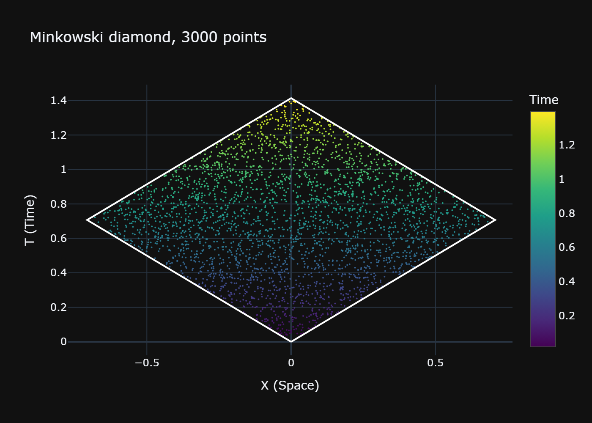

# Quickstart

Ten minutes from `pip install` to a field on a causal set. If you already know
causal set theory, this is the whole library in one page.

## Install

```bash
pip install pycauset
```

Plotting needs `plotly`, which comes with the install.

## 1. Sprinkle a causal set

A causal set is a finite set of points with a causal (partial) order between them.
You make one by "sprinkling" points into a region of spacetime and reading off the
order from the geometry.

```python
import pycauset as pc

c = pc.CausalSet(n=3000, seed=42)
```

That gives you 3000 points in a 2D Minkowski diamond (the default geometry).

```python
c.n          # 3000
c.coordinates()   # (n, 2) array of points
c.C           # the causal matrix: C[i, j] is True when i < j
```

The causal matrix is a bit-packed `TriangularBitMatrix`. You can get it as a NumPy
array with `np.asarray(c.C)`.

## 2. Plot it

```python
pc.plot_embedding(c).show()
```



This opens an interactive Plotly figure. Large causets are subsampled for the plot
(and it tells you when it does); pass `force=True` to plot every point. `c.plot_embedding()`
and `pc.show(c)` are the same thing.

## 3. Pick a spacetime

The default is a 2D diamond, but you can choose the region you sprinkle into:

```python
spacetime = pc.spacetime.MinkowskiDiamond(dimension=4)
c4 = pc.CausalSet(n=5000, spacetime=spacetime, seed=1)
```

There is a whole family: `MinkowskiBox`, `MinkowskiCylinder`, `DeSitter`,
`AntiDeSitter`, `FLRW`, `Schwarzschild`. See the [[Spacetime]] guide.

## 4. Put a field on it

```python
phi = pc.field("scalar", mass=1.5)   # a scalar field (set-independent)
cf = phi.on(c)                        # a correlated field on this causet

K = cf.retarded()       # the retarded propagator K_R
Delta = cf.pauli_jordan()   # iΔ = K_R − K_A
W = cf.wightman()       # the Sorkin–Johnston two-point function
```

`cf` exposes the propagators you would expect: `retarded`, `advanced`,
`pauli_jordan`, `wightman`, `correlator`, plus `entanglement_entropy` and `state`.

See the [[Field Theory]] guide for what these mean and how they are built.

## 5. Save it

```python
c.save("my_universe.pycauset")
c2 = pc.load("my_universe.pycauset")
```

Everything goes into one file: the causal matrix, the coordinates, the metadata.

## Where next

- [[Causal Sets]] — the object model and the order methods (`links`, `past`,
  `future`, intervals, layers).
- [[Field Theory]] — fields, propagators, and the Sorkin–Johnston vacuum.
- [[Spacetime]] — the spacetime library and how to define your own.
- [[Visualization]] — embedding, Hasse, and causal-matrix plots.
- [[Linear Algebra Operations]] — the underlying matrix engine, if you want to
  skip the physics and do plain linear algebra.
