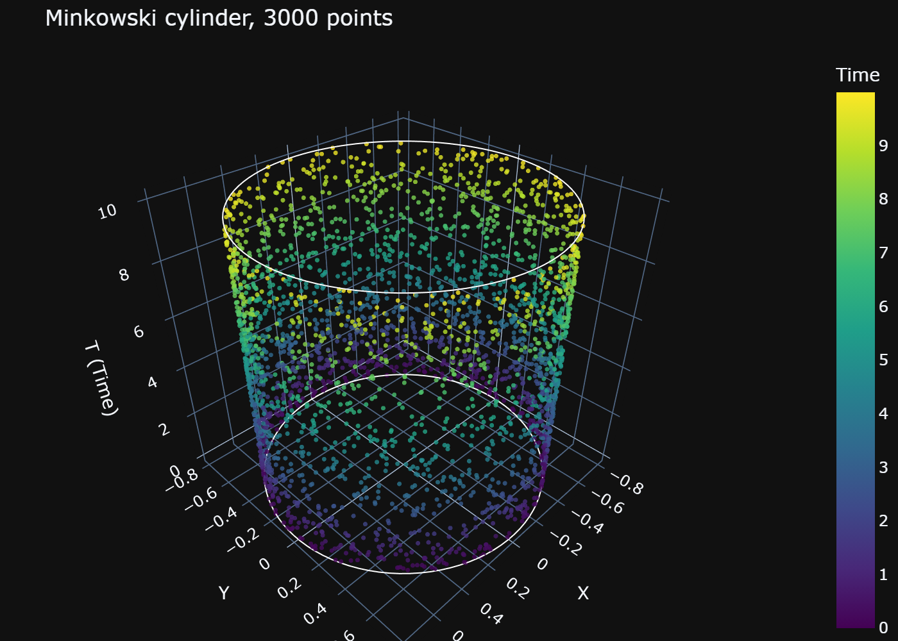
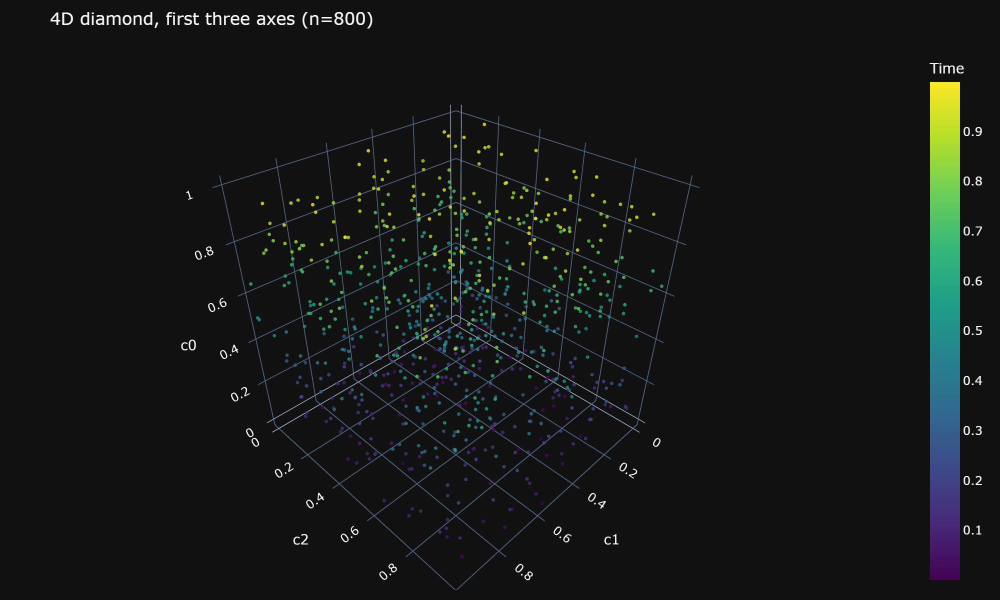
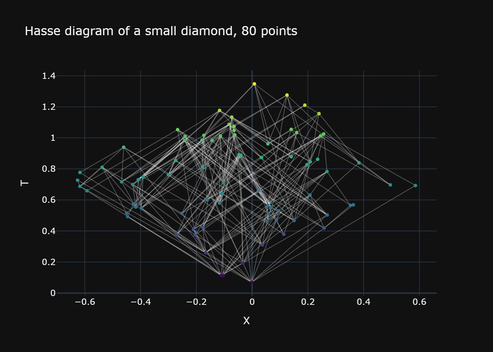
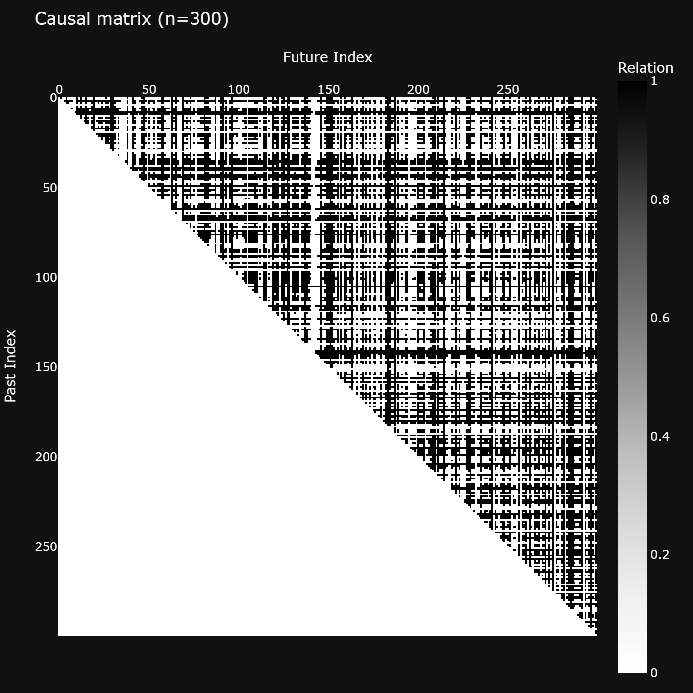

# Visualization Guide

PyCauset ships Plotly-based plotters for causal sets. You get three views: the
spacetime embedding, the Hasse diagram, and the causal-matrix heatmap.

## Basic usage

The plotters live at the top level and as methods on `CausalSet`. Both do the same
thing:

```python
import pycauset as pc

c = pc.causet(n=3000, seed=42)

pc.plot_embedding(c).show()   # top-level function
c.plot_embedding().show()     # method (no import needed)
pc.show(c)                    # one-verb sugar: plot + .show()
```

`pc.show(c)` picks the embedding plot and calls `.show()` for you. The other two
views are `plot_hasse` and `plot_causal_matrix`, also available both ways.

Plotting needs `plotly`. It comes with `pip install pycauset`; if it is missing, the
plotters raise an `ImportError` telling you to install it.

Here is what the embedding plot of a 2D Minkowski diamond looks like:


*3000 points in a 2D diamond. Time runs up the vertical axis; colour is the time
coordinate, and the white outline is the diamond boundary.*

## Reproducibility

The causal set itself is reproducible when you pass a `seed`. The large-set
subsampling uses a fixed internal seed too, so plotting the same causal set always
shows the same subset.

```python
c = pc.causet(n=100_000, seed=12345)
c.plot_embedding().show()   # same subset every time
```

## Large sets

Rendering millions of points in a browser is not practical, so each plotter caps the
number of points it draws. Above the cap it draws a seeded random subset and emits a
`PyCausetPerformanceWarning` naming what was sampled. Pass `force=True` (or
`max_points=None`) to render everything.

| Plotter | Default cap (`max_points`) |
| :--- | :--- |
| `plot_embedding` | 50,000 |
| `plot_hasse` | 500 |
| `plot_causal_matrix` | 2,000 |

```python
c.plot_embedding()               # warns + subsets above 50,000
c.plot_embedding(force=True)     # render every point
c.plot_embedding(max_points=10_000)   # a smaller subset
```

## Customizing the plot

```python
c.plot_embedding(
    title="My universe",
    marker_size=3,
)
```

Each plotter returns a plain Plotly `Figure`, so anything you can do to a Plotly
figure you can do here (change the template, add traces, save to file).

## Coordinates and boundaries

The plotter does not guess the shape of a spacetime. Each `Spacetime` can declare
three presentation hooks — `to_embedding(coords)` (display transform), `boundary()`
(paths in embedding coordinates), and `display_axes()` (axis labels) — and the viz
layer just reads them:

- `MinkowskiDiamond` (2D): lightcone coordinates $(u, v)$ rotated to Cartesian
  $(t, x)$, diamond boundary drawn in white.
- `MinkowskiCylinder` (2D): mapped to a 3D cylinder, top and bottom rings in white.
- `MinkowskiBox` (2D): Cartesian $(t, x)$ with a rectangular boundary.



*The same causal set machinery on a cylinder: the plotter reads the spacetime's
authored shape and draws the 3D cylinder with its end rings.*

A geometry-free custom spacetime renders its raw coordinates with generic
`c0, c1, …` axis labels. Embeddings with more than 3 dimensions show the first three
axes and warn explicitly; nothing is silently truncated.



*A 4D diamond has no flat 2D picture; the plotter renders the first three axes and
warns, rather than silently dropping the fourth.*

## Hasse diagrams

`plot_hasse` draws only the links (the transitive reduction), so you see the skeleton
of the partial order rather than every relation. It places elements at their
spacetime coordinates.

```python
c = pc.causet(n=80, seed=7)
c.plot_hasse().show()
```



*Only the links are drawn, so the skeleton of the partial order is visible. Lines run
between immediate causal neighbours, placed at their spacetime coordinates.*

The default cap is 500 points; above that it subsets with a warning.

## Causal-matrix heatmaps

`plot_causal_matrix` draws the causal matrix $C$ as a heatmap. Since the matrix is
strictly upper triangular for a sorted causal set, you see a triangular pattern.

```python
c.plot_causal_matrix(color_scale="Greys").show()
```



*The strictly upper-triangular pattern is the signature of a time-labelled causal set:
elements below the diagonal are never in the past of anything above it.*

The default cap is 2,000 points; above that it subsets with a warning.

See [[docs/pycauset.vis/index.md|pycauset.vis]] for the exact signatures, and
[[guides/Spacetime|Spacetime]] for how spacetimes author their own shapes.
