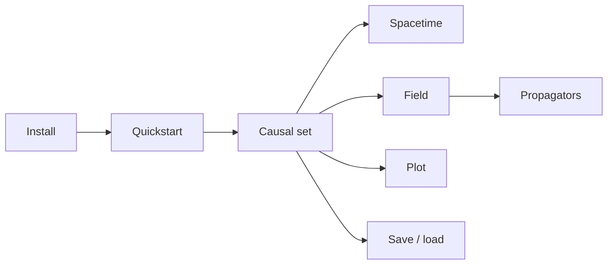

# Guides

A path through PyCauset, from first install to tuning a large run. Work top to
bottom the first time, then come back to whatever section you need.

## Start here

- **[[guides/Installation|Installation]]** — pip or from source.
- **[[guides/Quickstart|Quickstart]]** — five minutes to a causet, a field, and a plot.
- **[[guides/User Guide|User Guide]]** — the guided tour: how the pieces fit, with a running example.

## Learn the concepts

Each of these introduces one idea and shows it working.

- **[[guides/Causal Sets|Causal Sets]]** — sprinkle points, read the order, analyse the structure.
- **[[guides/Spacetime|Spacetime]]** — the built-in regions, and how to define your own.
- **[[guides/Field Theory|Field Theory]]** — scalar fields, propagators, and the Sorkin-Johnston vacuum.
- **[[guides/Visualization|Visualization]]** — embedding, Hasse, and causal-matrix plots.

## Walk through examples

- **[[guides/Tutorials|Tutorials]]** — end-to-end walkthroughs: dimension estimates, propagators, synthetic orders, and more.
- **[[guides/Examples|Examples]]** — short, copy-paste recipes across the whole surface.

## NumPy and data

- **[[guides/Numpy Integration|NumPy Integration]]** — moving data between PyCauset and NumPy.
- **[[guides/Storage and Memory|Storage and Memory]]** — how large objects spill to disk and how to control it.

## The matrix engine

The physics sits on top of a matrix/vector engine you can also use directly.

- **[[guides/Matrix Guide|Matrix Guide]]** — matrix types, dtypes, and operations.
- **[[guides/Vector Guide|Vector Guide]]** — vectors and vector arithmetic.
- **[[guides/Linear Algebra Operations|Linear Algebra Operations]]** — matmul, solves, factorizations, spectral/SVD.
- **[[guides/NxM Support|NxM Support]]** — what is and isn't rectangular yet.

## Scale and tuning

For large runs and when you need to control the machine.

- **[[guides/Performance Guide|Performance Guide]]** — what is accelerated, and how to keep it that way.
- **[[guides/Advanced Usage|Advanced Usage]]** — memory, threads, storage location, device routing.

## Release history

- **[[guides/release1/index|Release 1]]** — the foundations: NxM shapes, storage, dtypes, core linalg.
- **[[guides/R2 Feature Menu|R2 Feature Menu]]** — what Release 2 ships, in one page.

---

## When you need exact details

- [[docs/index|API Reference]] — signatures and behaviors.
- [[internals/index|Internals]] — how it works under the hood.
