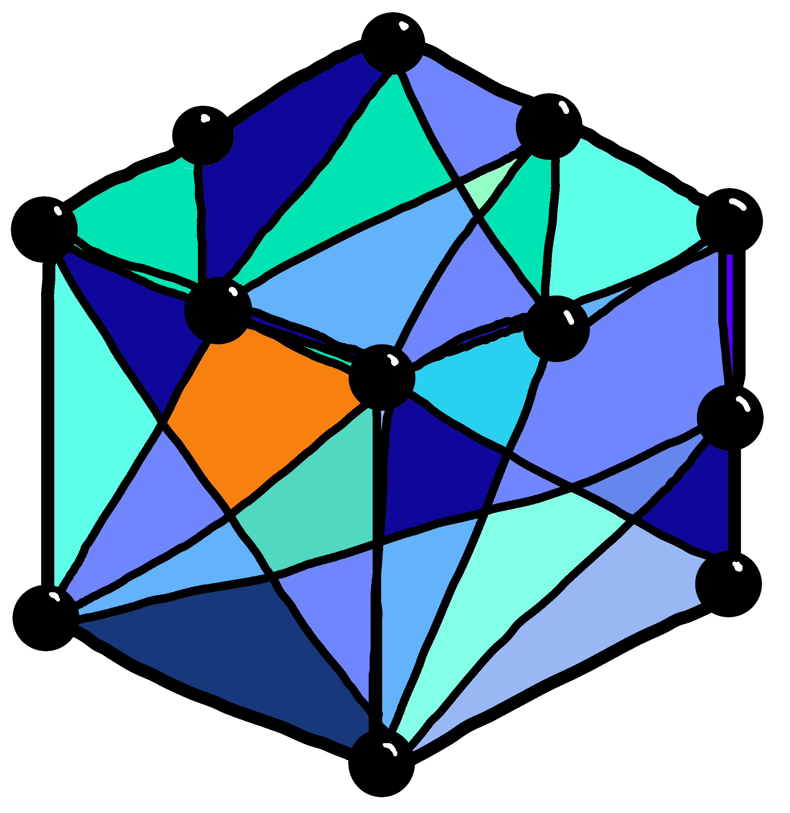

<h1 class="visually-hidden">PyCauset</h1>

**A high-performance Python library for numerical Causal Set Theory**

[Get started](guides/index/){ .md-button .md-button--primary }
[API reference](docs/index/){ .md-button }

## Welcome To PyCauset
This is a tool made for researchers and those curious about causal set theory. It is no secret that causal sets are computationally demanding: for a set of size $N$, the causal matrix is $O(N^2)$, and modules like [NumPy](https://numpy.org/) or [SciPy](https://scipy.org/) are not equiped for working with humongous $N$.

PyCauset solves this with a **Disk-Backed Architecture**: Large matrices can automatically spill to disk, only limiting the size of your matrices by your storage and time. Small matrices behave exactly like NumPy arrays, so you can use PyCauset as a drop-in replacement for NumPy in most cases. See [philosophy](project/Philosophy/) for more details.

## Documentation

-   :material-compass-rose: **Guides**

    ---

    Practical tutorials and conceptual explanations.

    - [[guides/Installation|Installation]]
    - [[guides/User Guide|User Guide]]
    - [[guides/Causal Sets|Causal Sets]]
    - [[guides/Field Theory|Field Theory]]
    - [[guides/Visualization|Visualization]]
    - [[guides/Performance Guide|Performance]]
    - [[guides/Storage and Memory|Storage]]

-   :material-code-braces: **API Reference**

    ---

    Detailed documentation of classes and functions.

    - [[docs/classes/index|Classes]]: `CausalSet`, `Matrix`, `Vector`, `Spacetime`
    - [[docs/functions/index|Functions]]: `matmul`, `inverse`, and more

-   :material-brain: **Internals**

    ---

    Deep dive into the C++ core for contributors.

    - [[internals/Compute Architecture|Compute Architecture]]
    - [[internals/MemoryArchitecture|Memory Architecture]]
    - [[internals/Memory and Data|Memory & Data]]
    - [[internals/Algorithms|Algorithms]]

-   :material-rocket-launch: **Project**

    ---

    Design philosophy and the roadmap.

    - [[project/Philosophy|Philosophy]]
    - [[project/Contributing|Contributing]]
    - [[internals/plans/TODO|Roadmap]]

-   :material-wrench: **Dev Handbook**

    ---

    High-signal onboarding for contributors.

    - [[dev/Restructure Plan|Restructure Plan]]

## Citation

If you use PyCauset in your research, please cite the repository:
[https://github.com/BrorH/pycauset](https://github.com/BrorH/pycauset)
