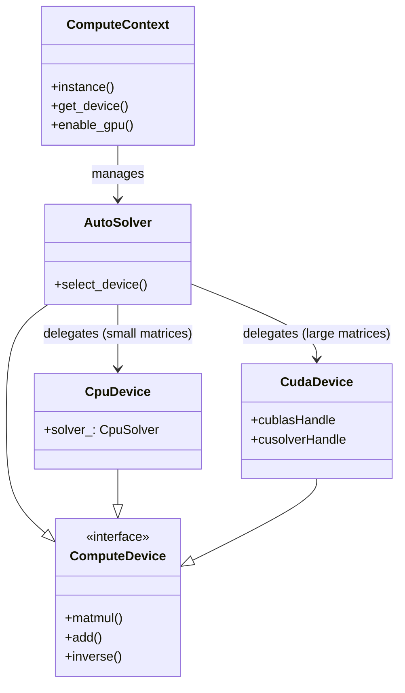

# Compute System Architecture

This document details the computational backend of PyCauset, including the CPU/GPU abstraction layer, parallelization strategies, and hardware-specific optimizations.

## 1. Architecture Overview

PyCauset uses a unified compute architecture that abstracts the underlying hardware (CPU or GPU) from the high-level matrix operations.

### 1.1 ComputeContext
The `ComputeContext` is a singleton that serves as the entry point for all hardware-accelerated operations. It manages the lifecycle of the compute devices and handles the dynamic loading of the CUDA backend.

### 1.2 AutoSolver
The `AutoSolver` is a smart dispatcher that implements the `ComputeDevice` interface. It automatically selects the best device for a given operation based on:
*   **Matrix Size**: Small matrices ($N < 512$) are processed on the CPU to avoid PCIe transfer overhead. Large matrices are sent to the GPU.
*   **Hardware Availability**: If no GPU is detected, it falls back to the CPU.
*   **Data Type**: It ensures the device supports the required precision (Float32/Float64/Int32).

### 1.3 IO Acceleration Integration
To minimize page faults during computation, the compute backend integrates with the **IO Accelerator** (see [[MemoryArchitecture]]).

*   **Prefetching**: Before starting a heavy operation (like `matmul` or `inverse`), the solver calls `matrix->get_accelerator()->prefetch()`. This hints the OS to load the data into RAM asynchronously.
*   **Discarding**: For temporary intermediate results, the solver may call `discard()` after usage to free up memory immediately.

## 2. CPU Backend

The CPU backend is designed for low-latency execution of small-to-medium workloads and robust fallback for all operations.

### 2.1 CpuDevice & CpuSolver
*   **`CpuDevice`**: A thin wrapper that implements the `ComputeDevice` interface.
*   **`CpuSolver`**: The core implementation class containing the algorithms. It handles:
    *   **Dense Matrix Ops**: Blocked matrix multiplication (tiled for cache efficiency).
    *   **Bit Matrix Ops**: Optimized using `std::popcount` (AVX-512/NEON) for 30x speedups over naive loops.
    *   **Element-wise Ops**: Parallelized addition, subtraction, and multiplication.

### 2.2 Parallelization (`ParallelUtils`)
PyCauset uses a custom thread pool (`ThreadPool`) to manage parallelism.
*   **`ParallelFor`**: A helper function that splits loops across available threads.
*   **Granularity**: Tasks are chunked to ensure load balancing without excessive scheduling overhead.

## 3. GPU Backend (CUDA)

The GPU backend leverages NVIDIA CUDA for massive parallelism, particularly for $O(N^3)$ operations like matrix multiplication and inversion.

### 3.1 CudaDevice
*   **Libraries**: Wraps `cuBLAS` (for matrix multiplication) and `cuSOLVER` (for decomposition/inversion).
*   **Memory Management**: Maintains persistent device buffers (`d_A`, `d_B`, `d_C`) to avoid `cudaMalloc` overhead on every call.

### 3.2 Custom Kernels
For operations not supported by standard libraries, PyCauset implements custom CUDA kernels:
*   **BitMatrix Multiplication**: Uses a "Transpose-then-Popcount" strategy.
    1.  Transpose Matrix B using warp shuffles (`__ballot_sync`).
    2.  Perform bitwise AND + POPCOUNT on 64-bit words.
    3.  Achieves theoretical peak throughput (64 ops/cycle/thread).
*   **Element-wise Ops**: `k_add`, `k_sub`, `k_mul_scalar` for massive parallel array operations.

### 3.3 Pinned Memory
To maximize data transfer speeds, PyCauset uses **Pinned Memory** (Page-Locked Memory) when a GPU is active.
*   **Mechanism**: Uses `cudaHostAlloc` instead of `malloc`.
*   **Benefit**: Allows the GPU's DMA engine to read/write directly to host RAM, bypassing CPU staging buffers. This typically doubles transfer bandwidth.

## 4. Hardware Detection & Capabilities

PyCauset uses a `ComputeDevice` abstraction to manage hardware backends. The `CudaDevice` implementation includes logic to query NVIDIA GPU properties and determine the optimal execution strategy.

### Compute Capability Heuristics

The `preferred_precision()` method in `CudaDevice` returns an integer code:
*   `1`: Float32 (Single Precision)
*   `2`: Float64 (Double Precision)

#### Logic
The decision is based on the GPU's Compute Capability (CC):

| CC | Architecture | Example Cards | FP64 Rate | Preference |
|----|--------------|---------------|-----------|------------|
| 6.0 | Pascal | Tesla P100 | 1/2 FP32 | Float64 |
| 6.1 | Pascal | GTX 10-series | 1/32 FP32 | **Float32** |
| 7.0 | Volta | Tesla V100 | 1/2 FP32 | Float64 |
| 7.5 | Turing | RTX 20-series | 1/32 FP32 | **Float32** |
| 8.0 | Ampere | Tesla A100 | 1/2 FP32 | Float64 |
| 8.6 | Ampere | RTX 30-series | 1/64 FP32 | **Float32** |

### Python Binding Integration

The `asarray` function in `bindings.cpp` queries the active `ComputeDevice` (if GPU is enabled).
*   If the input is `float64` (NumPy default) AND the device prefers `Float32`, the data is **downcasted** during import.
*   This ensures that users getting started with `np.random.rand()` immediately see high performance without needing to know about `dtype=np.float32`.

## 5. Async GPU Architecture & Streaming

PyCauset uses an **Asynchronous Heterogeneous Computing** model to handle matrices larger than GPU memory. Instead of blocking the CPU while the GPU computes, or blocking the GPU while the CPU loads data, we use a **Double-Buffered Pipeline**.

### The `AsyncStreamer` Class

The core of this architecture is the `AsyncStreamer<T>` class (`src/accelerators/cuda/AsyncStreamer.hpp`).

#### Responsibilities
1.  **Pinned Memory Management**: Allocates `cudaMallocHost` memory, which is required for asynchronous DMA transfers.
2.  **Stream Management**: Maintains a dedicated `transfer_stream` separate from the `compute_stream`.
3.  **Synchronization**: Uses `cudaEvent_t` to coordinate the CPU (Producer) and GPU (Consumer) without blocking the CPU thread unnecessarily.

### Pipeline Logic

The pipeline consists of two buffers (Index 0 and Index 1) and utilizes **Hybrid CPU/GPU Parallelism**.

1.  **CPU Phase (Producer)**:
    *   **Wait**: Waits for Buffer $i$ to be free (consumed by GPU in previous cycle).
    *   **Fill (Parallelized)**: Uses `pycauset::ParallelFor` (Thread Pool) to pack data from the source matrix into the Pinned Memory Buffer $i$. This multi-threaded approach ensures that memory bandwidth is maximized and the CPU does not become a bottleneck for fast GPUs.
    *   **Submit**: Submits an asynchronous `cudaMemcpyAsync` on the `transfer_stream`.
    *   **Record**: Records `event_transfer_complete`.

2.  **GPU Phase (Consumer)**:
    *   **Wait**: The `compute_stream` waits for `event_transfer_complete`.
    *   **Compute**: Executes kernels (e.g., `cublasDgemm`) reading from Buffer $i$ (Device Memory).
    *   **Record**: Records `event_compute_complete`.

This architecture allows for **True Overlap**:
*   **Time $T$**: GPU computes Batch $k$.
*   **Time $T$**: CPU threads pack Batch $k+1$.
*   **Time $T$**: DMA Engine transfers Batch $k+1$ (once packing is done).

### Supported Operations

#### 1. Matrix Multiplication (`matmul`)
*   **Function**: `CudaDevice::matmul_streaming`
*   **Strategy**: Tiled GEMM.
*   **Pipeline**:
    *   Streams tiles of Matrix A and Matrix B.
    *   Accumulates results into a persistent tile of Matrix C on the GPU.
    *   Allows multiplying matrices of arbitrary size, limited only by system RAM.

#### 2. Eigenvalue Solver (`batch_gemv`)
*   **Function**: `CudaDevice::batch_gemv_streaming`
*   **Strategy**: Blocked Matrix-Vector Multiplication.
*   **Pipeline**:
    *   Keeps vectors $X$ and $Y$ in VRAM.
    *   Streams Matrix $A$ in chunks from Host to Device.
    *   Computes $Y += A_{chunk} \times X$.

#### 3. Matrix Inversion (`inverse`)
*   **Function**: `CudaSolver::invert`
*   **Strategy**: Right-Looking Blocked LU Decomposition.
*   **Pipeline**:
    *   **Panel Factorization**: Loads a block column, factorizes it in VRAM.
    *   **Trailing Update**: Streams the trailing submatrix and updates it using the factorized panel ($A' = A - L \times U$).
    *   Reuses the `matmul_streaming` infrastructure for the update step.
*   **Performance**: Enables inversion of matrices significantly larger than GPU memory.

## 6. Optimization Roadmap & Future Work

This section outlines the plan to address the remaining gaps in the PyCauset acceleration layer.

### Phase 1: Dense Eigenvalues on GPU (Complete)
*   **Status**: ✅ Complete (Symmetric Only)
*   **Implementation**: Uses `syevd` for symmetric matrices (checked at runtime) and falls back to CPU for non-symmetric ones.

### Phase 2: Element-wise Operations on GPU (Complete)
*   **Status**: ✅ Complete
*   **Implementation**: Custom CUDA kernels (`k_add`, `k_sub`, `k_mul_scalar`) implemented in `CudaSolver.cu`. Supports `float` and `double` to avoid round-tripping to CPU.

### Phase 3: BitMatrix Optimization (Complete)
*   **Status**: ✅ Complete
*   **Implementation**: "Bit-Packed GEMM" kernel implemented using `__popc` and shared memory tiling.

### Phase 4: Precision Control
*   **Objective**: Allow users to force Float64 on consumer GPUs.
*   **Plan**: Add `PrecisionMode` enum (`AUTO`, `FORCE_FLOAT32`, `FORCE_FLOAT64`) to `AcceleratorConfig`.
