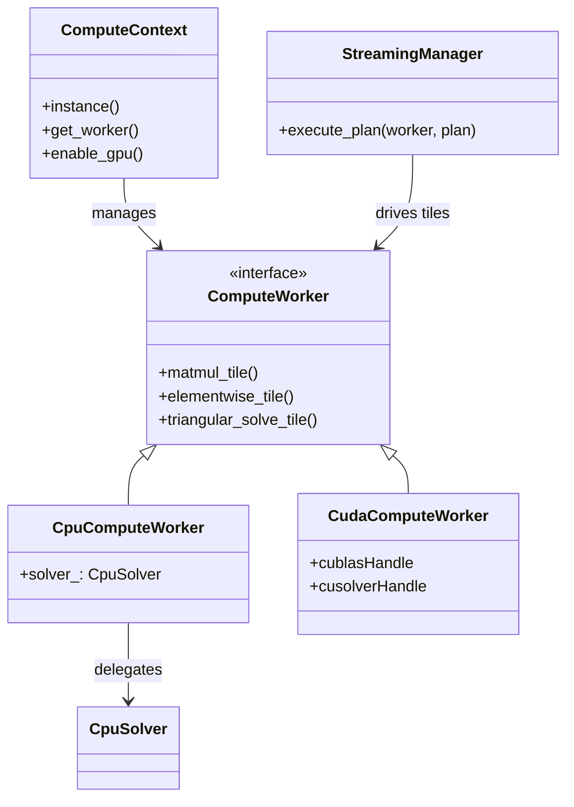

# Compute System Architecture

This document details the computational backend of PyCauset, including the CPU/GPU abstraction layer, parallelization strategies, and hardware-specific optimizations.

## 1. Architecture Overview

PyCauset uses a unified compute architecture that abstracts the underlying hardware (CPU or GPU) from the high-level matrix operations via the **`ComputeWorker`** interface.

### 1.1 ComputeContext
The `ComputeContext` is a singleton that serves as the entry point. It manages the lifecycle of the compute workers (`CpuComputeWorker` and `CudaComputeWorker`) and handles the dynamic loading of the CUDA backend.

### 1.2 ComputeWorker (Shared Interface)
The `ComputeWorker` interface is the heart of the R1 architecture. It exposes tiled, streaming-friendly operations (`matmul_tile`, etc.) that the `StreamingManager` can drive.
*   **CpuComputeWorker**: Implements the worker interface for CPU, delegating to `CpuSolver` for SIMD/tiled execution.
*   **CudaComputeWorker**: Implements the interface for NVIDIA GPUs using cuBLAS/cuSOLVER.
*   **Cost Model Dispatch**: Dispatch compares GPU transfer+compute time against CPU compute time using:
    $$ T_{gpu} = \frac{\text{Bytes}}{\text{BW}_{pci}} + \frac{\text{Ops}}{\text{FLOPS}_{gpu}} + T_{latency} $$
    If no valid profile is available, routing falls back to CPU (pessimistic).
*   **Hardware Availability**: If no GPU is detected, it falls back to the CPU.
*   **Operation + Type Support**: GPU routing is operation-specific and gated by matrix type + dtype compatibility (for example, dense float32/float64 with matching dtypes). Many operations are intentionally CPU-only for now (e.g., matrix-vector multiply, outer product, elementwise multiply/divide, dot/sum/norm).
*   **Manual Overrides**: `pycauset.cuda.force_backend("cpu"|"gpu"|"auto")` can override routing at runtime.

#### Routing pipeline (summary)
1. Frontend validates shapes/dtypes and allocates outputs.
2. AutoSolver checks user preference (`force_backend`) and hardware availability.
3. If GPU is eligible, AutoSolver evaluates cost model vs CPU.
4. If streaming is required, the Streaming Manager provides a plan and IO trace annotations.
5. Device-specific workers execute kernels; errors trigger deterministic fallback.

#### Property-aware routing
AutoSolver can use property flags (mirrored from Python) to bias routing when structural shortcuts exist. This avoids scanning payloads and keeps routing $O(1)$.

### 1.3 IO Acceleration Integration
To minimize page faults during computation, the compute backend integrates with the **IO Accelerator** (see [[internals/MemoryArchitecture.md|MemoryArchitecture]]).

*   **Prefetching**: Before starting a heavy operation (like `matmul` or `inverse`), the solver calls `matrix->get_accelerator()->prefetch()`. This hints the OS to load the data into RAM asynchronously.
*   **Discarding**: For temporary intermediate results, the solver may call `discard()` after usage to free up memory immediately.

### 1.4 Debug trace tags (kernel vs IO)

For deterministic testing and debugging (especially device routing and “did this trigger evaluation?” checks), PyCauset exposes a small trace surface:

- Kernel trace (thread-local):
    - `pycauset._debug_clear_kernel_trace()`
    - `pycauset._debug_last_kernel_trace()`

- IO trace (separate channel, thread-local):
    - `pycauset._debug_clear_io_trace()`
    - `pycauset._debug_last_io_trace()`

The IO trace is intentionally separate so IO hints (prefetch/discard) don’t clobber kernel dispatch traces.

### 1.5 Streaming Manager integration
The Streaming Manager is the policy layer for out-of-core execution. AutoSolver consults it to decide when to stream, how to tile, and which route to annotate. Streaming plans are recorded in the IO trace so tests can assert the expected routing without timing-dependent checks.

## 2. CPU Backend

The CPU backend is designed for low-latency execution of small-to-medium workloads and robust fallback for all operations.

### 2.1 CpuDevice & CpuSolver
*   **`CpuDevice`**: A thin wrapper that implements the `ComputeDevice` interface. It routes operations to the appropriate execution strategy:
    *   **Direct Execution**: For small matrices that fit in memory, calls `CpuSolver` directly.
    *   **Streaming Execution**: For large matrices, delegates to `StreamingManager`, which tiles the operation and executes it using `CpuComputeWorker`.
*   **`CpuSolver`**: The core implementation class containing the mathematical algorithms.
    *   **Dense Matrix Ops**: Blocked matrix multiplication (tiled for cache efficiency) via `gemm`.
    *   **Lazy Initialization**: Uses dynamic `beta` parameter (0.0 for first block, 1.0 for others) to avoid global zero-filling of output matrices. This prevents unnecessary page faults for out-of-core datasets.
    *   **Bit Matrix Ops**: Optimized using `std::popcount` (AVX-512/NEON) for 30x speedups over naive loops.

### 2.2 Streaming Manager (C++)
To handle out-of-core workloads efficiently on the CPU, a C++ `StreamingManager` is used (mirroring the Python-side logic but closer to the metal).
*   **Memory Budgeting**: Consults `MemoryGovernor` to calculate optimal tile sizes that fit within the `working_memory_bytes` limit.
*   **Execution Loop**: Orchestrates the tiling loops (e.g., M, N, K loops for matmul).
*   **Worker Abstraction**: Uses `IComputeWorker` interface to dispatch work, allowing the same tiling logic to potentially drive other backends or thread pools in the future.
*   **CpuComputeWorker**: The concrete worker that calls `CpuSolver::gemm` on individual tiles.
    *   **Element-wise Ops**: Parallelized addition, subtraction, and multiplication.

### 2.3 SIMD and Vectorization
The CPU backend explicitly employs SIMD (AVX2/AVX-512) for critical paths:
*   **Elementwise Ops**: `add`, `sub`, `mul`, `div` use runtime-dispatched SIMD kernels.
    *   **Runtime Dispatch**: At runtime, `CpuSolver` detects CPU features (via `cpuid`) and selects the optimal kernel (Scalar fallback, AVX2, or AVX-512).
    *   **Coverage**: Optimized implementations exist for `float32`, `float64`, `int32`, `int64`. Other types rely on compiler auto-vectorization of the scalar fallback loops.
*   **Bit Ops**: `popcount` accelerated via hardware instructions.

### 2.4 Parallelization (`ParallelUtils`)
PyCauset uses a custom thread pool (`ThreadPool`) to manage parallelism with a **Dynamic Scheduling** model (Work-Stealing Approximation).

*   **`ParallelFor`**: A helper function that splits loops across available threads.
*   **Dynamic Scheduling**: Unlike static partitioning (which suffers from stalls if one thread hits a page fault), `ParallelFor` uses an atomic index to hand out small chunks of work (`grain_size`) to threads as they finish previous tasks.
*   **Load Balancing**: This ensures that if one thread is blocked by I/O or OS paging, other threads continue processing the remaining work, maximizing CPU utilization.
*   **Granularity**: The grain size is tuned (heuristic: `range / (threads * 4)`) to balance load distribution against atomic contention overhead.

## 3. GPU Backend (CUDA)

The GPU backend leverages NVIDIA CUDA for massive parallelism, particularly for $O(N^3)$ operations like matrix multiplication and inversion.

### 3.1 CudaDevice
*   **Libraries**: Wraps `cuBLAS` (for matrix multiplication) and `cuSOLVER` (for decomposition/inversion).
*   **Memory Management**: Maintains persistent device buffers (`d_A`, `d_B`, `d_C`) to avoid `cudaMalloc` overhead on every call.

### 3.2 Custom Kernels
For operations not supported by standard libraries, PyCauset implements custom CUDA kernels:
*   **BitMatrix Multiplication**: Uses a "Transpose-then-Popcount" strategy.
    1.  Transpose Matrix B using warp shuffles (`__ballot_sync`).
    2.  Perform bitwise AND + POPCOUNT on 64-bit words.
    3.  Achieves theoretical peak throughput (64 ops/cycle/thread).
*   **Selected Element-wise Ops**: `k_add`, `k_sub`, `k_mul_scalar` are available for dense float matrices when the `AutoSolver` routes the operation to CUDA. Some elementwise operations (notably elementwise multiply/divide) are currently CPU-only.

### 3.3 Pinned Memory
To maximize data transfer speeds, PyCauset uses **Pinned Memory** (Page-Locked Memory) when a GPU is active.
*   **Mechanism**: Uses `cudaHostAlloc` instead of `malloc`.
*   **Benefit**: Allows the GPU's DMA engine to read/write directly to host RAM, bypassing CPU staging buffers. This typically doubles transfer bandwidth.
*   **Budgeting**: The `MemoryGovernor` enforces a dynamic pinning budget ($\min(0.5\cdot\text{RAM}, 0.8\cdot\text{FreeRAM}, 8\text{GB})$). Users can override via `pycauset.cuda.set_pinning_budget(bytes)`.

## 4. Hardware Detection & Capabilities

PyCauset uses a `ComputeDevice` abstraction to manage hardware backends. The `CudaDevice` implementation includes logic to query NVIDIA GPU properties and determine the optimal execution strategy.

### Compute Capability Heuristics

The `preferred_precision()` method in `CudaDevice` returns an integer code:
*   `1`: Float32 (Single Precision)
*   `2`: Float64 (Double Precision)

#### Logic
The decision is based on the GPU's Compute Capability (CC):

| CC | Architecture | Example Cards | FP64 Rate | Preference |
|----|--------------|---------------|-----------|------------|
| 6.0 | Pascal | Tesla P100 | 1/2 FP32 | Float64 |
| 6.1 | Pascal | GTX 10-series | 1/32 FP32 | **Float32** |
| 7.0 | Volta | Tesla V100 | 1/2 FP32 | Float64 |
| 7.5 | Turing | RTX 20-series | 1/32 FP32 | **Float32** |
| 8.0 | Ampere | Tesla A100 | 1/2 FP32 | Float64 |
| 8.6 | Ampere | RTX 30-series | 1/64 FP32 | **Float32** |

### Python Binding Integration

PyCauset’s Python bindings include an internal “NumPy → PyCauset” import helper (referred to in code as `native.asarray`) that converts NumPy arrays into PyCauset vectors/matrices based on shape and dtype.

Note: this is **not** a public `pycauset.asarray` API; the user-facing constructors are `pycauset.vector(...)` and `pycauset.matrix(...)`.
*   **Shape**: Supports 1D (vector) and 2D (matrix) arrays.
*   **Dtype policy (current)**:
    *   1D `float32` vectors are **promoted to float64** vectors.
    *   2D `float32` matrices remain `float32` matrices.
    *   This conversion does not currently depend on GPU availability or `preferred_precision()`.

## 5. Async GPU Architecture & Streaming

PyCauset uses an **Asynchronous Heterogeneous Computing** model to handle matrices larger than GPU memory. Instead of blocking the CPU while the GPU computes, or blocking the GPU while the CPU loads data, we use a **Double-Buffered Pipeline**.

### The `AsyncStreamer` Class

The core of this architecture is the `AsyncStreamer<T>` class (`src/accelerators/cuda/AsyncStreamer.hpp`).

#### Responsibilities
1.  **Pinned Memory Management**: Allocates `cudaMallocHost` memory, which is required for asynchronous DMA transfers.
2.  **Stream Management**: Maintains a dedicated `transfer_stream` separate from the `compute_stream`.
3.  **Synchronization**: Uses `cudaEvent_t` to coordinate the CPU (Producer) and GPU (Consumer) without blocking the CPU thread unnecessarily.

### Pipeline Logic

The pipeline consists of two buffers (Index 0 and Index 1) and utilizes **Hybrid CPU/GPU Parallelism**.

1.  **CPU Phase (Producer)**:
    *   **Wait**: Waits for Buffer $i$ to be free (consumed by GPU in previous cycle).
    *   **Fill (Parallelized)**: Uses `pycauset::ParallelFor` (Thread Pool) to pack data from the source matrix into the Pinned Memory Buffer $i$. This multi-threaded approach ensures that memory bandwidth is maximized and the CPU does not become a bottleneck for fast GPUs.
    *   **Submit**: Submits an asynchronous `cudaMemcpyAsync` on the `transfer_stream`.
    *   **Record**: Records `event_transfer_complete`.

2.  **GPU Phase (Consumer)**:
    *   **Wait**: The `compute_stream` waits for `event_transfer_complete`.
    *   **Compute**: Executes kernels (e.g., `cublasDgemm`) reading from Buffer $i$ (Device Memory).
    *   **Record**: Records `event_compute_complete`.

This architecture allows for **True Overlap**:
*   **Time $T$**: GPU computes Batch $k$.
*   **Time $T$**: CPU threads pack Batch $k+1$.
*   **Time $T$**: DMA Engine transfers Batch $k+1$ (once packing is done).

### Supported Operations

#### 1. Matrix Multiplication (`matmul`)
*   **Function**: `CudaDevice::matmul_streaming`
*   **Strategy**: Tiled GEMM.
*   **Pipeline**:
    *   Streams tiles of Matrix A and Matrix B.
    *   Accumulates results into a persistent tile of Matrix C on the GPU.
    *   Allows multiplying matrices of arbitrary size, limited only by system RAM.

#### 2. Eigenvalue Solver (`batch_gemv`)
*   **Function**: `CudaDevice::batch_gemv_streaming`
*   **Strategy**: Blocked Matrix-Vector Multiplication.
*   **Pipeline**:
    *   Keeps vectors $X$ and $Y$ in VRAM.
    *   Streams Matrix $A$ in chunks from Host to Device.
    *   Computes $Y += A_{chunk} \times X$.

#### 3. Matrix Inversion (`inverse`)
*   **Function**: `CudaSolver::invert`
*   **Strategy**: Right-Looking Blocked LU Decomposition.
*   **Pipeline**:
    *   **Panel Factorization**: Loads a block column, factorizes it in VRAM.
    *   **Trailing Update**: Streams the trailing submatrix and updates it using the factorized panel ($A' = A - L \times U$).
    *   Reuses the `matmul_streaming` infrastructure for the update step.
*   **Performance**: Enables inversion of matrices significantly larger than GPU memory.

## 6. Optimization Roadmap & Future Work

This section outlines the plan to address the remaining gaps in the PyCauset acceleration layer.

### Phase 1: Dense Eigenvalues on GPU (Complete)
*   **Status**: ✅ Complete (Symmetric Only)
*   **Implementation**: Uses `syevd` for symmetric matrices (checked at runtime) and falls back to CPU for non-symmetric ones.

### Phase 2: Element-wise Operations on GPU (Partial)
*   **Status**: 🟡 Partial
*   **Implementation**: CUDA supports `add`, `subtract`, and `multiply_scalar` for dense float32/float64 with matching dtypes. Elementwise multiply/divide are currently CPU-only.

### Phase 3: BitMatrix Optimization (Complete)
*   **Status**: ✅ Complete
*   **Implementation**: "Bit-Packed GEMM" kernel implemented using `__popc` and shared memory tiling.

### Phase 4: Precision Control
*   **Objective**: Allow users to force Float64 on consumer GPUs.
*   **Plan**: Add `PrecisionMode` enum (`AUTO`, `FORCE_FLOAT32`, `FORCE_FLOAT64`) to `AcceleratorConfig`.

### 1.5 Resilience & Fallback (R1_SAFETY)

To ensure robustness against hardware instability (e.g., GPU driver crashes, OOM), AutoSolver implements a **Circuit Breaker** pattern:

1.  **Pessimistic Initialization**: GPU context creation is wrapped in try-catch. If it fails, the GPU is disabled for the session.
2.  **Operation Guard**: Every GPU operation (matmul, inverse, etc.) is guarded.
3.  **Fallback**: If a GPU operation throws a hardware exception:
    *   A warning is logged to stderr.
    *   AutoSolver disables GPU for the remainder of the session.

### 1.6 Testing hooks (internal)

For deterministic tests that need a stable GPU profile without hardware access, the CUDA backend supports a test-only environment override:

- `PYCAUSET_TEST_CUDA_PROFILE` (key=value pairs) supplies a synthetic hardware profile used by `pycauset.cuda.benchmark()`.

This hook is internal and intended for tests that validate routing and profile parsing.

## See also

- [[internals/Streaming Manager.md|Streaming Manager]]
- [[docs/functions/pycauset.cuda.enable.md|pycauset.cuda.enable]]
- [[docs/functions/pycauset.cuda.benchmark.md|pycauset.cuda.benchmark]]
- [[docs/functions/pycauset.cuda.force_backend.md|pycauset.cuda.force_backend]]
- [[docs/parameters/pycauset.pinning_budget.md|pinning_budget]]
- [[guides/Performance Guide.md|Performance Guide]]
