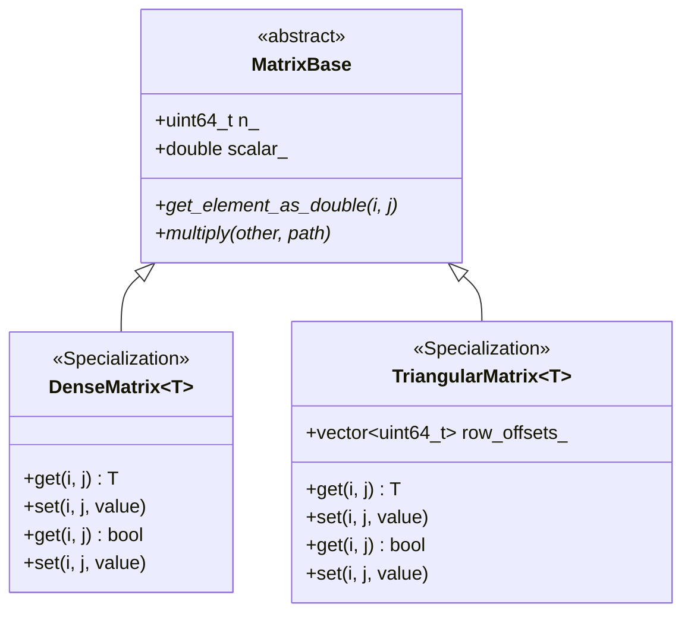

# Matrix Hierarchy

The matrix architecture has been refactored to use C++ templates for better type safety and code reuse. All matrix types derive from a shared abstract `MatrixBase` that handles the memory-mapped backing file and lifecycle management.

## Class Diagram

## Type Aliases

For convenience and backward compatibility, the following type aliases are defined:

| Alias | Template Instantiation | Description |
|-------|------------------------|-------------|
| `FloatMatrix` | `DenseMatrix<double>` | Dense matrix of double-precision floats. |
| `IntegerMatrix` | `DenseMatrix<int32_t>` | Dense matrix of 32-bit integers. |
| `DenseBitMatrix` | `DenseMatrix<bool>` | Dense matrix of booleans (bit-packed). |
| `TriangularFloatMatrix` | `TriangularMatrix<double>` | Upper-triangular matrix of doubles. |
| `TriangularBitMatrix` | `TriangularMatrix<bool>` | Upper-triangular bit-packed boolean matrix. |

## Usage

- **TriangularBitMatrix**: The primary structure for representing causal sets (adjacency matrices). Exposed to Python as `pycauset.CausalMatrix`.
- **IntegerMatrix**: Used for storing counts, such as path counting results.
- **FloatMatrix / TriangularFloatMatrix**: Used for analytical results requiring floating-point precision.

The template architecture allows for easy extension to other data types if needed in the future.