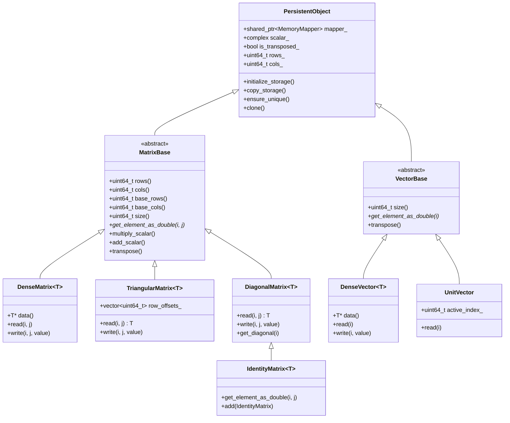

# Memory & Data Architecture

This document details the internal architecture of the Pycauset memory system, matrix/vector hierarchy, and type system.

## 1. Memory System: Tiered Storage

PyCauset is designed to handle causal sets that exceed physical RAM. To achieve this, it adopts a tiered storage architecture where objects can live in RAM or be backed by files on disk.

*   **Persistence**: Objects survive process termination if saved.
*   **Virtual Memory**: The OS handles paging, allowing datasets larger than RAM.
*   **Interprocess Communication**: Memory-mapped files allow multiple processes (e.g., a viewer and a solver) to share data with zero copy overhead.

### The `PersistentObject` Base Class

All matrix and vector classes inherit from `PersistentObject`.

*   **`MemoryMapper`**: A member object that handles the low-level `mmap` (Windows/Linux) calls.
*   **Lifecycle**:
    *   **Creation**: Creates a temporary file in the system temp directory (or a specified path).
    *   **Access**: Maps the file into the process's address space.
    *   **Destruction**: Unmaps the view. If the object was temporary, the file is deleted.

### Snapshot immutability (mutation policy)

PyCauset distinguishes between:

- persisted `.pycauset` snapshots on disk, and
- runtime working copies that may be mutated.

Policy (Release 1):

- Loading a `.pycauset` file yields a snapshot-backed view.
- Payload writes do not implicitly overwrite the snapshot file.
- Mutations transition to a copy-on-write working copy so snapshot payload bytes are not overwritten by incidental edits.

Developer reference:

- [[guides/Storage and Memory]]

### File Format (`.pycauset`)

`.pycauset` is a **single-file binary container** designed for mmap-friendly payload access and sparse, typed metadata.

Authoritative plans:

- `documentation/internals/plans/completed/R1_STORAGE_PLAN.md` (container format)
- `documentation/internals/plans/completed/R1_PROPERTIES_PLAN.md` (metadata semantics)

### Container summary

At a high level, each `.pycauset` file contains:

- A fixed-size header region that selects the active header slot (A/B).
- A raw payload region at a stable, aligned offset (so it can be memory-mapped efficiently).
- A typed metadata block (sparse map) that can be appended/updated without shifting the payload.

This design keeps the “heavy” numeric data mmap-friendly while allowing metadata evolution without scans or full rewrites.
*   **Alignment**: The data is laid out exactly as it would be in memory (e.g., row-major order for dense matrices, bit-packed words for bit matrices).

### Typed metadata is the only schema

All metadata is stored as a typed top-level map (no parallel “legacy”/flattened metadata schema).

Important namespaces:

- `view`: view-state that affects interpretation/derived values (e.g., scalar/transpose/conjugation).
- `properties`: user-facing gospel assertions (semantic hints; not truth-validated).
- `cached`: cached-derived values (both small scalars and big-blob references).

### Big-blob caches (generalized mechanism)

A **big-blob cache** is a cached-derived value that is itself large (often another matrix/vector) and therefore must be persisted as an independent `.pycauset` object.

Persistence model:

- The base snapshot stores a typed entry at `cached.<name>`.
- For big blobs, `cached.<name>.value` is a reference:
    - `ref_kind`: currently `sibling_object_store`
    - `object_id`: UUID hex
- The referenced object lives in a sibling object store directory:
	`BASE.pycauset.objects/<object_id>.pycauset`

Validity model:

- `cached.<name>.signature` must allow $O(1)$ validation against the base object (no scans).
- Signatures use `payload_uuid` (a per-snapshot identifier that changes whenever payload bytes are persisted).
- If the reference is missing/unreadable/stale, it is treated as a cache miss (ignored).
- A `PyCausetStorageWarning` is emitted and the cache is **not** implicitly recomputed.
- Missing/unreadable big-blob references should emit `PyCausetStorageWarning` and continue load.

Implementation reference (Python):

- `python/pycauset/_internal/persistence.py`
    - Object store layout helpers: `object_store_path_for_id`, `new_object_id`
    - Typed ref read/write: `try_get_cached_big_blob_ref`, `write_cached_big_blob_ref`
- `python/pycauset/_internal/big_blob_cache.py`
    - Reusable big-blob cache plumbing for operations: `compute_view_signature`, `try_load_cached_matrix`, `persist_cached_object`

#### Loading Process
1.  Python opens the `.pycauset` container and reads the fixed header.
2.  Python selects the active header slot (A/B), validates it, and reads the typed metadata block.
3.  Python instantiates the appropriate C++ class (e.g., `_TriangularBitMatrix`), passing the filename and the payload offset.
4.  C++ calls `mmap` on the file, applying the payload offset to map only the raw payload region.

## 2. Matrix & Vector Class Hierarchy

The system is built on a hierarchy designed to separate **storage management** from **mathematical operations**.



### Core Concepts

#### Lazy Evaluation & Metadata
To maintain performance with large matrices, we avoid iterating over data whenever possible.

*   **Scalars**: Multiplying a matrix by a scalar $k$ does **not** multiply every element in memory. Instead, it updates `PersistentObject::scalar_`.
*   **Transposition**: Transposing a matrix usually just toggles the `PersistentObject::is_transposed_` flag. This is a metadata view: the backing storage stays in row-major order.

Important: `MatrixBase.rows()` / `MatrixBase.cols()` are *logical* dimensions and account for transpose metadata. `MatrixBase.base_rows()` / `MatrixBase.base_cols()` are the backing storage dimensions.

#### Storage vs. View
The data on disk is the "canonical" storage. The C++ object is a "view" onto that data.
*   **Raw Data**: `mapper_->get_data()` returns the raw bytes.
*   **View**: The class (e.g., `DenseMatrix`) interprets those bytes (as `int`, `double`, etc.) and applies metadata (scalar, transpose).

For dense matrices, `MatrixBase.size()` is NumPy-aligned: it returns the total number of logical elements (`rows * cols`).

#### Indexing and slicing (backend invariants)

Release 1 implements NumPy-style 2D indexing for dense matrices only:

* **Basic indexing (view):** integer/`slice`/`...` with unit steps produces a view that shares the underlying mapper. Logical shape comes from the parsed slice; backing shape/offsets remain on the base. Transpose/conjugate metadata is preserved.
* **Advanced indexing (copy):** 1D integer arrays (negative wrap) and 1D boolean masks are supported per axis. Any use of arrays returns a copy; two array axes must broadcast length or length-1.
* **Assignments:** RHS may be scalar, NumPy 0/1/2-D array, or dense matrix. NumPy 2D broadcast rules must hold; otherwise the setter raises. Casting RHS arrays triggers `PyCausetDTypeWarning`; narrowing or float→int casts also trigger `PyCausetOverflowRiskWarning`.
* **Unsupported:** `None`/newaxis and slicing of structured/triangular matrices.
* **Kernel guardrail:** Offsets in views are not yet honored by matmul/qr/lu/inverse kernels; calls with nonzero offsets throw and should be materialized via `copy()` first.
* **Persistence policy (pending):** Persisted sources must prefer view reuse; oversized slices on in-RAM sources should fail deterministically instead of implicit spill/snapshot (not yet implemented).

Code touchpoints:
* Slice parsing and dispatch: `src/bindings/bind_matrix.cpp` (`SliceInfo`, `parse_matrix_subscript`, `dense_getitem`, `dense_setitem`).
* View metadata: `MatrixBase` (`logical_rows/cols`, `row_offset/col_offset`) and `DenseMatrix` view constructor/accessors.
* Kernel guards: `DenseMatrix::multiply`, `inverse`, `qr`, `lu` reject nonzero view offsets.

See also: [[docs/classes/matrix/pycauset.MatrixBase.md|pycauset.MatrixBase]], [[guides/Matrix Guide.md|Matrix Guide]], [[project/protocols/NumPy Alignment Protocol.md|NumPy Alignment Protocol]]

## 3. Type System and Dispatch

This document explains how PyCauset handles different data types (`double`, `float`, `bool`) and how operations are dispatched to the correct implementation.

### Philosophy: Anti-Promotion

A core principle of PyCauset's type system is **Anti-Promotion**.

*   **Traditional Approach**: Many libraries (like early NumPy or MATLAB) aggressively promote everything to `double` (Float64) to ensure precision.
*   **PyCauset Approach**: We respect the user's choice of type. If a user provides `Float32` data, they likely want the performance benefits of `Float32`. We should not silently promote it to `Float64` unless absolutely necessary (e.g., mixing types).

**Rules:**
1.  `Float32` op `Float32` -> `Float32`
2.  `Float32` op `Float64` -> `Float64` (Promotion allowed for mixed types)

### The Dispatcher

We avoid virtual function overhead for every single element access. Instead, we use a **Templated Dispatcher** pattern at the operation level (e.g., Matrix Multiplication, Addition).

#### CPU Dispatch
On the CPU, we use C++ templates to generate specialized code for each type.

```cpp
// Conceptual example
template <typename T>
void matmul_impl(const MatrixBase& A, const MatrixBase& B, MatrixBase& C) {
    // ... optimized code for type T ...
}

void dispatch_matmul(const MatrixBase& A, const MatrixBase& B, MatrixBase& C) {
    if (A.dtype() == DType::Float32 && B.dtype() == DType::Float32) {
        matmul_impl<float>(A, B, C);
    } else if (A.dtype() == DType::Float64) {
        matmul_impl<double>(A, B, C);
    }
    // ...
}
```

#### GPU Dispatch
On the GPU, `CudaDevice::matmul` inspects the `DType` of the operands and routes the call to the appropriate `cuBLAS` function.

*   `DType::Float64` -> `cublasDgemm`
*   `DType::Float32` -> `cublasSgemm`
*   `DType::Float16` -> `cublasHgemm` (Tensor Cores)

### Memory Layout

To support this efficient dispatch, the backend works with raw, dtype-tagged memory.

*   **Host memory** lives behind `MemoryMapper` (`mapper_->get_data()`), which provides access to the mapped bytes.
*   **Matrix/Vector views** interpret those bytes as typed storage and apply metadata (scalar, transpose).
*   **Device memory** (CUDA) uses dtype-specific buffers to avoid constant casting or reallocation.

## See also

- [[docs/classes/matrix/pycauset.MatrixBase.md|pycauset.MatrixBase]]
- [[internals/DType System|internals/DType System]]
- [[project/protocols/Documentation Protocol.md|Documentation Protocol]]
