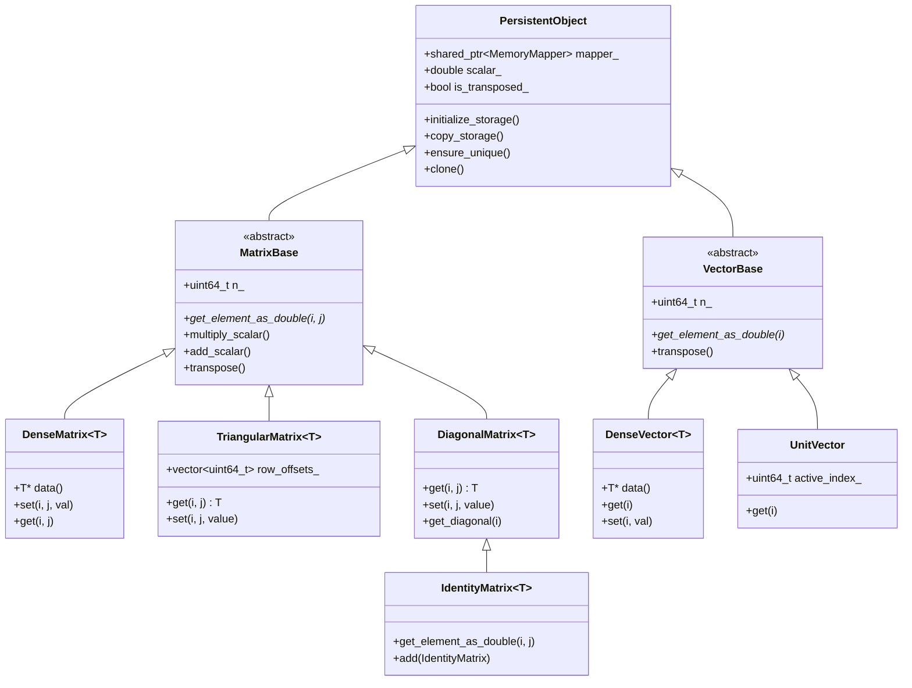

# Memory & Data Architecture

This document details the internal architecture of the Pycauset memory system, matrix/vector hierarchy, and type system.

## 1. Memory System: Tiered Storage

PyCauset is designed to handle causal sets that exceed physical RAM. To achieve this, it adopts a tiered storage architecture where objects can live in RAM or be backed by files on disk.

*   **Persistence**: Objects survive process termination if saved.
*   **Virtual Memory**: The OS handles paging, allowing datasets larger than RAM.
*   **Interprocess Communication**: Memory-mapped files allow multiple processes (e.g., a viewer and a solver) to share data with zero copy overhead.

### The `PersistentObject` Base Class

All matrix and vector classes inherit from `PersistentObject`.

*   **`MemoryMapper`**: A member object that handles the low-level `mmap` (Windows/Linux) calls.
*   **Lifecycle**:
    *   **Creation**: Creates a temporary file in the system temp directory (or a specified path).
    *   **Access**: Maps the file into the process's address space.
    *   **Destruction**: Unmaps the view. If the object was temporary, the file is deleted.

### File Format (`.pycauset`)

The `.pycauset` format is a **ZIP archive** (uncompressed) that bundles metadata with raw binary data. This design allows for easy inspection of metadata (using any ZIP tool) while maintaining the performance benefits of memory mapping for the heavy numerical data.

#### Structure
A `.pycauset` file is a standard ZIP file containing at least two entries:

1.  **`metadata.json`**: A JSON file containing object properties.
2.  **`data.bin`**: The raw binary data, stored **uncompressed** (`ZIP_STORED`).

#### `metadata.json` Schema
The metadata file describes how to interpret the binary data.

```json
{
  "rows": 1000,
  "cols": 1000,
  "seed": 12345,
  "scalar": 1.0,
  "is_transposed": false,
  "matrix_type": "CAUSAL",      // e.g., CAUSAL, DENSE_FLOAT, VECTOR
  "data_type": "BIT",           // e.g., BIT, FLOAT64, INT32
  "cached_trace": 1000.0,       // Optional cached properties
  "cached_determinant": 1.0
}
```

#### `data.bin` Layout
The `data.bin` entry contains the raw memory dump of the matrix or vector.
*   **Storage Method**: It is stored with `zipfile.ZIP_STORED` (no compression).
*   **Memory Mapping**: When loading, the Python wrapper calculates the absolute byte offset of `data.bin` within the `.pycauset` archive. It passes this offset to the C++ backend, which memory-maps the file starting at that position.
*   **Alignment**: The data is laid out exactly as it would be in memory (e.g., row-major order for dense matrices, bit-packed words for bit matrices).

#### Loading Process
1.  Python opens the ZIP archive and reads `metadata.json`.
2.  Python locates the file header for `data.bin` and calculates the data's start offset.
3.  Python instantiates the appropriate C++ class (e.g., `_TriangularBitMatrix`), passing the filename and the offset.
4.  C++ calls `mmap` on the file, applying the offset to map only the relevant binary section.

## 2. Matrix & Vector Class Hierarchy

The system is built on a hierarchy designed to separate **storage management** from **mathematical operations**.



### Core Concepts

#### Lazy Evaluation & Metadata
To maintain performance with large matrices, we avoid iterating over data whenever possible.

*   **Scalars**: Multiplying a matrix by a scalar $k$ does **not** multiply every element in memory. Instead, it updates `PersistentObject::scalar_`.
*   **Transposition**: Transposing a matrix usually just toggles the `PersistentObject::is_transposed_` flag.

#### Storage vs. View
The data on disk is the "canonical" storage. The C++ object is a "view" onto that data.
*   **Raw Data**: `mapper_->get_data()` returns the raw bytes.
*   **View**: The class (e.g., `DenseMatrix`) interprets those bytes (as `int`, `double`, etc.) and applies metadata (scalar, transpose).

## 3. Type System and Dispatch

This document explains how PyCauset handles different data types (`double`, `float`, `Float16`, `bool`) and how operations are dispatched to the correct implementation.

### Philosophy: Anti-Promotion

A core principle of PyCauset's type system is **Anti-Promotion**.

*   **Traditional Approach**: Many libraries (like early NumPy or MATLAB) aggressively promote everything to `double` (Float64) to ensure precision.
*   **PyCauset Approach**: We respect the user's choice of type. If a user provides `Float32` data, they likely want the performance benefits of `Float32`. We should not silently promote it to `Float64` unless absolutely necessary (e.g., mixing types).

**Rules:**
1.  `Float32` op `Float32` -> `Float32`
2.  `Float16` op `Float16` -> `Float16` (or `Float32` accumulator if needed for stability, but stored as `Float16`)
3.  `Float32` op `Float64` -> `Float64` (Promotion allowed for mixed types)

### The Dispatcher

We avoid virtual function overhead for every single element access. Instead, we use a **Templated Dispatcher** pattern at the operation level (e.g., Matrix Multiplication, Addition).

#### CPU Dispatch
On the CPU, we use C++ templates to generate specialized code for each type.

```cpp
// Conceptual example
template <typename T>
void matmul_impl(const MatrixBase& A, const MatrixBase& B, MatrixBase& C) {
    // ... optimized code for type T ...
}

void dispatch_matmul(const MatrixBase& A, const MatrixBase& B, MatrixBase& C) {
    if (A.dtype() == DType::Float32 && B.dtype() == DType::Float32) {
        matmul_impl<float>(A, B, C);
    } else if (A.dtype() == DType::Float64) {
        matmul_impl<double>(A, B, C);
    }
    // ...
}
```

#### GPU Dispatch
On the GPU, `CudaDevice::matmul` inspects the `DType` of the operands and routes the call to the appropriate `cuBLAS` function.

*   `DType::Float64` -> `cublasDgemm`
*   `DType::Float32` -> `cublasSgemm`
*   `DType::Float16` -> `cublasHgemm` (Tensor Cores)

### Memory Layout

To support this efficient dispatch, `MatrixBase` and `CudaDevice` must handle raw pointers of different types.

*   **Host Memory**: `MatrixBase` stores a `void* data_` pointer. The `dtype_` field tells us how to cast it.
*   **Device Memory**: `CudaDevice` maintains separate persistent buffers for each type to avoid constant casting or reallocation.
    *   `d_A` (double), `d_A_f` (float), `d_A_h` (half)
