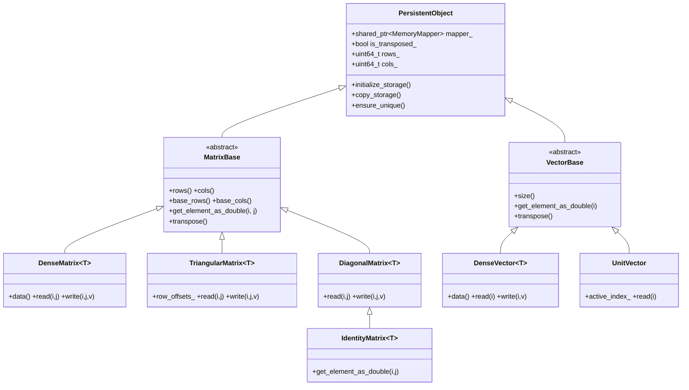

# Memory & Data Architecture

How PyCauset stores matrices and vectors, and how it decides whether a given
object lives in RAM or on disk.

## Tiered storage

PyCauset can handle matrices larger than RAM. It does that by keeping each object
in one of two places:

- **RAM** — anonymous memory (`VirtualAlloc` on Windows, `mmap` with a shared-memory
  fd on macOS/Linux). The fast path.
- **Disk** — a memory-mapped file, either a temporary session file (`.tmp`) or a
  persisted `.pycauset` snapshot.

Objects start in RAM and spill to disk when the `MemoryGovernor` decides there is
no room, or when you ask for disk directly (`storage="disk"` on `matrix()`).

## PersistentObject

Every matrix and vector inherits from `PersistentObject`. It owns a `MemoryMapper`
(which does the low-level map/unmap calls) and remembers whether the object is
RAM-backed or disk-backed.

- On creation it decides RAM vs disk, creates the backing store, and maps it.
- On destruction it unmaps, and if the backing was a temporary file, deletes it.

### Snapshot immutability

A persisted `.pycauset` file behaves like an immutable snapshot once loaded:

- Loading it gives you a snapshot-backed view.
- Mutating it does not overwrite the snapshot file. The object switches to a
  copy-on-write working copy instead.

See [[guides/Storage and Memory]] for the user-facing policy.

## The Memory Governor

`MemoryGovernor` is the singleton that decides what fits and what spills.

- **Budget.** It polls the OS for actually-available RAM (using `free + inactive`
  pages on macOS, `MemAvailable` on Linux) and keeps a safety margin (10% of RAM
  or 2 GB, whichever is smaller).
- **Tracking.** It keeps every `PersistentObject` in an LRU list. Touching an
  object moves it to the front.
- **Eviction.** `request_ram(size)` returns true when `available > size + margin`.
  Otherwise it spills the least-recently-used objects to disk until there is room.

```cpp
// In PersistentObject::initialize_storage
if (MemoryGovernor::instance().request_ram(size_bytes)) {
    use_ram_buffer();
    MemoryGovernor::instance().register_object(this, size_bytes);
} else {
    use_disk_file();
}
```

### Direct path (the "anti-nanny" rule)

For operations that fit in RAM, streaming them through the tiled/out-of-core path
is slower than just letting the OS page them. `should_use_direct_path(bytes)`
encodes that:

1. Fits in the pinned-memory budget -> pin and use the BLAS direct path.
2. Fits in available RAM but not the pin budget -> use the direct path without
   pinning (trust the OS pager).
3. Exceeds available RAM -> use the streaming/out-of-core solver.

The CPU solver's `attempt_direct_path<T>` tries these in order before falling back
to tiled streaming.

## IO Accelerator

`IOAccelerator` makes the disk-backed path fast by telling the OS what is coming.

- **Write:** `SetFileValidData` (Windows) / `fallocate` (Linux) reserves file space
  without zero-filling it, which removes the "import gap".
- **Read:** `PrefetchVirtualMemory` (Windows) / `madvise(MADV_WILLNEED)` or
  `MAP_POPULATE` (Linux) pulls pages into the page cache before the CPU faults on
  them.
- **Discard:** `OfferVirtualMemory` (Windows) / `MADV_DONTNEED` (Linux) lets the
  OS drop pages that will not be reused.

The workflow is: create (reserve space) -> prefetch -> compute -> discard.

Solvers declare their access pattern up front (sequential, strided, random, or
once) through `pycauset.AccessPattern` / `pycauset.MemoryHint`, and the accelerator
turns that into the right prefetch/discard syscalls.

## Export guard

A disk-backed object converted naively to a NumPy array would blow up RAM. The
export guard stops that: file-backed objects are blocked from `np.array()` /
`to_numpy()` unless you pass `allow_huge=True`. See [[pycauset.to_numpy]].

## File formats

There are two on-disk formats.

### `.pycauset` (snapshot container)

Portable, persistent storage for matrices and causal sets. Managed by
`python/pycauset/_internal/persistence.py`.

- A fixed header (magic `PYCAUSET`, version, and A/B slot pointers).
- Double-buffered slots for crash-consistent metadata updates.
- A typed, sparse metadata block (shape, dtype, properties, cached values).
- A raw payload region at a stable, aligned offset so it can be mmap'd.

The payload is laid out exactly as it would be in memory (row-major dense, packed
words for bit matrices). Metadata updates never shift the payload.

### `.tmp` (session backing file)

Temporary storage for spilled objects and large intermediates. Managed by
`src/core/MemoryMapper.cpp`.

- A 64-byte header (magic + version + reserved).
- The raw payload.

The header stops a raw file from being mistaken for a `.pycauset` container (and
the other way around).

### Typed metadata is the only schema

All metadata is a typed top-level map. The important namespaces:

- `view` — view state (scalar, transpose, conjugation).
- `properties` — user-facing "gospel" assertions (semantic hints, not validated).
- `cached` — cached-derived values (scalars and big-blob references).

### Big-blob caches

A big-blob cache is a cached-derived value that is itself large (another matrix or
vector), so it is persisted as its own `.pycauset` object next to the base.

- The base stores `cached.<name>.value` as a reference: `ref_kind` and `object_id`.
- The object lives in `BASE.pycauset.objects/<object_id>.pycauset`.
- Validity is checked with a `signature` derived from the base payload, so a stale
  or missing reference is just a cache miss (a `PyCausetStorageWarning`, then
  continue; it is not recomputed implicitly).

## Matrix & vector hierarchy

The class hierarchy separates storage management from math:


```mermaid
classDiagram
    class PersistentObject {
        +shared_ptr~MemoryMapper~ mapper_
        +bool is_transposed_
        +uint64_t rows_
        +uint64_t cols_
        +initialize_storage()
        +copy_storage()
        +ensure_unique()
    }
    class MatrixBase {
        <<abstract>>
        +rows() +cols()
        +base_rows() +base_cols()
        +get_element_as_double(i, j)
        +transpose()
    }
    class VectorBase {
        <<abstract>>
        +size()
        +get_element_as_double(i)
        +transpose()
    }
    class DenseMatrix~T~ { +data() +read(i,j) +write(i,j,v) }
    class TriangularMatrix~T~ { +row_offsets_ +read(i,j) +write(i,j,v) }
    class DiagonalMatrix~T~ { +read(i,j) +write(i,j,v) }
    class IdentityMatrix~T~ { +get_element_as_double(i,j) }
    class DenseVector~T~ { +data() +read(i) +write(i,v) }
    class UnitVector { +active_index_ +read(i) }

    PersistentObject <|-- MatrixBase
    PersistentObject <|-- VectorBase
    MatrixBase <|-- DenseMatrix
    MatrixBase <|-- TriangularMatrix
    MatrixBase <|-- DiagonalMatrix
    DiagonalMatrix <|-- IdentityMatrix
    VectorBase <|-- DenseVector
    VectorBase <|-- UnitVector
```

### Lazy metadata

Small operations avoid touching the payload:

- Scaling a matrix updates `scalar_`; it does not multiply every element.
- Transposing toggles `is_transposed_`; the backing bytes stay row-major.

`rows()` / `cols()` are logical (they account for the transpose). `base_rows()` /
`base_cols()` are the backing dimensions.

### Storage vs view

The disk bytes are the storage; the C++ object is a view that interprets them and
applies metadata (scalar, transpose). `mapper_->get_data()` is the raw pointer.

## Type system and dispatch

PyCauset does not silently widen your types ("anti-promotion"): float32 in, float32
out. It only promotes when you mix types (float32 with float64 -> float64).

Dispatch is templated, not virtual-per-element. At the operation level the code
picks the instantiation for the operand dtype (and on the GPU, the matching cuBLAS
call). See [[internals/DType System]].

## See also

- [[guides/Storage and Memory]] — the user-facing guide.
- [[internals/DType System]]
- [[internals/LazyEvaluation]]
- [[docs/classes/matrix/pycauset.MatrixBase.md|pycauset.MatrixBase]]
