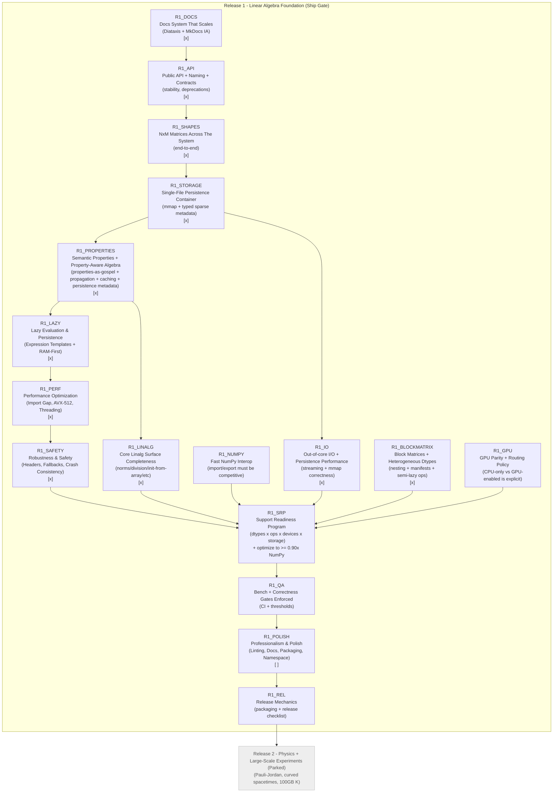

# PyCauset Roadmap (Canonical, Sequence-Based)

## Roadmap principles

### Roadmap hygiene (convergence rules)

It is normal for implementation work to reveal new dependencies (e.g., linear algebra work reveals missing metadata semantics; metadata semantics reveals persistence constraints). To avoid accumulating half-finished work and repeatedly reshuffling the graph, Release 1 follows these convergence rules:

- **Freeze contracts early:** when a lower layer is needed (e.g., persistence), we first lock the interface contract it must satisfy (types, invariants, on-disk encoding conventions). Higher layers may not keep changing those contracts while the lower layer is being completed.
- **One implementation WIP at a time:** only one of {Storage, Properties, Linalg} is actively being implemented at any moment. The other plans may be edited for clarity, but do not spawn new implementation work.
- **Gate before expanding scope:** a node is “done” only when its Definition of Done is met (tests + docs included). New ideas go into the appropriate plan’s Open Questions or into R2, unless they are a hard blocker for the current node.

This is how we keep the roadmap “tasteful”: each layer becomes stable before the next layer depends on it.

### Release definition

**Release 1 (“Foundation Release”) ships when** the linear algebra base is *solid*:

- Operations are **correct** across all declared dtypes and structures.
- Operations are **optimized** on CPU and GPU (or explicitly blocked/routed).
- Out-of-core / persistence paths are correct and efficient.

“Physics features” are intentionally downstream of Release 1.

### What “optimized” means

Ideal target (C): “as close to theoretical optimal as possible”, including (examples):

- CPU parallelism (SIMD + threads) where appropriate.
- GPU kernels where appropriate.
- **Hybrid execution** (CPU + GPU cooperating for a single op) if it produces real speedups.
- Disk → RAM streaming that matches access patterns, using lookahead hints.

Practical acceptance target (B): **never slower than NumPy** in the regimes we claim to compete in.

- “Equivalent to NumPy” means: throughput ≥ **0.90× NumPy** for the benchmark regime.
- If PyCauset is slower than NumPy for a regime, it must be either:
    - explicitly out-of-scope for now, or
    - treated as a performance bug.

### Why NxM should happen early (discussion)

Yes: it is generally in your interest to move **NxM generalization earlier**, because:

- Shape rules infect everything: allocation, stride assumptions, kernels, persistence metadata, Python interop, and docs.
- If we fully “optimize everything” under NxN assumptions, we will later be forced to rewrite many kernels and tests.

However, NxM is not a single switch. The roadmap below breaks NxM into phases:

- First: make **DenseMatrix + VectorBase** truly rectangular-safe end-to-end.
- Then: expand structures that inherently assume square-ness (triangular/symmetric) with explicit policies.

We will keep “2D only” as a non-goal: no N-D arrays.

---

## Progress tracking (manual checkmarks)

Use GitHub-style task boxes:
- `[ ]` = not done
- `[x]` = done

Release 1 nodes:
- [x] R1_DOCS
- [x] R1_API
- [x] R1_SHAPES
- [x] R1_STORAGE
- [x] R1_PROPERTIES
- [x] R1_IO
- [x] R1_LAZY
- [x] R1_PERF
- [x] R1_SAFETY
- [/] R1_NUMPY (In Progress)
- [x] R1_LINALG
- [x] R1_BLOCKMATRIX
- [ ] R1_GPU
- [ ] R1_SRP
- [ ] R1_QA
- [ ] R1_POLISH
- [ ] R1_REL

Parked:
- [ ] R2_PHYS

---

## Canonical Roadmap Graph (Mermaid)

---

## Node details (keyed by ID)

### R1_DOCS — Docs System That Scales (Diátaxis + MkDocs IA)

Status: - [x]

Goal: documentation stays maintainable as features grow.

Deliverables:
- Adopt Diátaxis as the organizing principle for *meaning* (even if folders are renamed later).
- MkDocs information architecture (IA) makes it obvious where to look:
    - Reference (API)
    - Guides (How-to)
    - Explanation (internals that are readable)
    - Dev Handbook
    - Project meta
- Update the documentation protocol so “redundancy” is implemented as:
    - **one canonical source of truth** per concept, and
    - required cross-links from guides/reference/dev.

### R1_API — Public API + Naming + Contracts

Status: - [x]

Goal: reduce churn and ambiguity in the Python surface while the project grows.

Starting point:
- [[project/Public API Contract|Public API Contract]]

Deliverables:
- Naming conventions documented (types, functions, dtype tokens, warnings/errors).
- Public vs internal boundaries explicit.
- Deprecation policy: Any feature asked to be deprecated should be completely removed. There is no existing user base to respect. It is confusing for future work when deprecated features aren't completely removed, because their lingering functions, namespaces, parameters etc still linger in the codebase, causing confusion. Regarding documentation, never write "this has been deprecated" - just REMOVE IT. "Deprecation" = "Purge" in this workflow.

### R1_SHAPES — NxM Matrices Across The System

Status: - [x]

Goal: remove square-only assumptions so later work doesn’t require rewrites.

Phased approach:
- Phase 1: Dense matrices + vectors are rectangular-safe (allocation, indexing, NumPy, persistence).
- Phase 2: Matmul/matvec/vecmat and elementwise ops support NxM × MxK rules.
- Phase 3: Structures with inherent square semantics (triangular/symmetric/antisymmetric/identity/diagonal) get explicit policies:
    - what shapes they allow,
    - how they interact with NxM operands,
    - and what gets blocked vs implemented.

### R1_STORAGE — Single-File Persistence Container

Status: - [x]

Goal: define and maintain the **single-file `.pycauset` binary container** that preserves mmap-friendly payload access and supports sparse, typed, forward-compatible metadata.

Starting point:
- `documentation/internals/plans/completed/R1_STORAGE_PLAN.md`

Deliverables:
- Single-file container spec (header + payload offsets + metadata blocks).
- Typed sparse metadata encoding that preserves missing vs explicit values.
- Append/update strategy that does not shift payload.
- Hard-break policy: one format only; format changes update tests/docs in lockstep.

Definition of Done:
- Payload is mmap-accessible at a stable offset.
- Metadata round-trips preserve tri-state property semantics (missing vs explicit `False`).
- Frontend save/load APIs are unchanged; only storage plumbing changes.

### R1_PROPERTIES — Semantic Properties + Property-Aware Algebra

Status: - [x]

Goal: introduce a **canonical semantic properties system** that is treated as **gospel** by the compute layer.

Properties are not validated for mathematical truth. If a matrix has `is_unitary=True`, the system is allowed to use unitary identities and skip work, even if the underlying data is not truly unitary.

Starting point:
- `documentation/internals/plans/completed/R1_PROPERTIES_PLAN.md`

Deliverables:
- A canonical properties schema (keys, meanings, typing, and a priority/implication model for structural properties).
- Property propagation rules for metadata-only transforms (`transpose`, conjugation, scalar scale, etc).
- Minimal sanity checks for **incompatible** structural properties (not truth validation).
- Persistence: properties stored in `.pycauset` metadata with explicit-vs-unset semantics preserved.
- Property-aware operator implementations and/or dispatch in the compute layer.
- A more rigorous cached-derived model (validation + invalidation) so cached metadata cannot become stale.

Definition of Done:
- Every public matrix/vector object exposes a `properties` container and preserves the distinction between `False` and “unset” (missing/`None`), per `documentation/internals/plans/R1_PROPERTIES_PLAN.md`.
- Every public matrix/vector object exposes a `properties` container and preserves the distinction between `False` and “unset” (missing/`None`), per `documentation/internals/plans/completed/R1_PROPERTIES_PLAN.md`.
- Operators that can exploit properties do so deterministically and correctly per “properties-as-gospel”.

Persistence format note:

- R1_PROPERTIES depends on the storage layer for encoding, but the container format change itself is tracked under **R1_STORAGE**.
- The metadata schema must not block moving to a single-file binary `.pycauset` container with a sparse, forward-compatible typed metadata block (see `documentation/internals/plans/completed/R1_STORAGE_PLAN.md`).

### R1_LAZY — Lazy Evaluation & Persistence

Status: - [x]

Goal: Implement the "RAM-First, Disk-Later" strategy and Expression Templates to ensure R1 performance and safety.

Deliverables:
- **Expression Templates:** Rewrite `MatrixBase` to support lazy evaluation (e.g., `C = A + B + D` is fused).
    - Eliminates temporary file creation for intermediate results.
    - Enables "Fly Swatting" (O(1) metadata ops) to compose with compute ops.
- **Lazy Persistence:**
    - Matrices default to RAM-backed (anonymous memory).
    - Spilling to disk (`mmap`) only occurs when:
        - RAM limit is exceeded (MemoryGovernor), OR
        - User explicitly saves (`.save()`), OR
        - Matrix is too large for RAM at creation time.
- **NumPy UFunc Bridge:**
    - Implement `__array_ufunc__` to capture NumPy calls (e.g., `np.sin(A)`).
    - Return lazy `Expression` objects instead of dense NumPy arrays.
    - Ensures "It feels like NumPy" without crashing RAM.
- **Safety:** Ensure `discard()` works correctly on Windows (VirtualUnlock) to prevent "Ghost RAM" usage.

### R1_PERF — Performance Optimization & Verification

Status: - [x]

Goal: Address specific performance bottlenecks to reach "NumPy Parity" and "Theoretical Optimality".

Deliverables:
- **The 50% Import Gap:** Investigate and fix OS overhead in `import_matrix` (target >= 4.0GB/s).
- **"Fake" AVX-512:** Implement explicit AVX-512 intrinsics for `DenseBitMatrix` (popcount, logic ops).
- **Robust Threading:** Implement Dynamic Scheduling in `ParallelUtils` to avoid static partitioning stalls.
- **Pipeline Verification:** Instrument `AsyncStreamer` with NVTX to prove compute/transfer overlap.

### R1_SAFETY — Robustness & Safety (The Shield)

Status: - [x]

Goal: Ensure PyCauset survives crashes, power outages, and bad hardware states.

Deliverables:
- **File Version Header:** Add magic bytes + version to `.pycauset` files to prevent future breakage.
- **AutoSolver Safety:** Implement Pessimistic Fallback (default to CPU) on GPU error.
- **Crash Consistency:** Verify `FlushFileBuffers`/`msync` behavior.
- **Windows I/O Leak:** Implement `discard()` using `VirtualUnlock`.

### R1_IO — Out-of-core I/O + Persistence Performance

Status: - [x]

Goal: disk-backed operation performance is a first-class feature, not an accident.

Deliverables:
- Streaming strategy for large operations (read patterns + hints).
- Persistence round-trips for every public dtype/structure.
- Persistence round-trips must preserve required metadata fields that affect semantics (including properties after R1_PROPERTIES).
- Large-scale read/write is demonstrably efficient.
- Decide and enforce the **NumPy conversion surface** in a matrix/vector-first way:
    - PyCauset does not expose a `pc.asarray` “array” API; only matrices and vectors are first-class.
    - Define the supported conversion entrypoints (e.g., `pc.matrix(np_array)`, `pc.vector(np_array)`, and `np.asarray(obj)`), and their copy/materialization policy.
    - Ensure conversions do not accidentally materialize huge out-of-core data; default UX is a hard error with an explicit power-user override.
    - Import/export override kwargs (RAM cap on import; `allow_huge` on export) and snapshot copy semantics are defined canonically in `documentation/internals/plans/R1_IO_PLAN.md`.
- **Format interoperability (pipeline-friendly):**
    - PyCauset can load relevant external formats (at least NumPy `.npy` / `.npz`).
    - PyCauset can export to relevant external formats (at least `.npy` / `.npz`).
    - Provide a file conversion utility (proposed: `pc.convert_file(...)`) to convert `.pycauset` ⇄ other supported formats.
    - Optional: define a minimal pandas interoperability surface (explicit scope + optional dependency).

Authoritative plan: `documentation/internals/plans/R1_IO_PLAN.md`.

### R1_LINALG — Core Linalg Surface Completeness

Status: - [x]

Goal: the base toolbox feels complete for users.

Seed items (from prior TODO):
- Norms, normalization, projections
- Elementwise division for matrices/vectors
- Initialization from array input for typed classes (not only factories)
- Block matrices/vectors (moved to **R1_BLOCKMATRIX**; see `documentation/internals/plans/R1_BLOCKMATRIX_PLAN.md`)
- Advanced indexing (slicing, fancy indexing)
- Random matrix/vector generation
- Matrix properties (expressed via **properties** and consumed by operators; see `documentation/internals/plans/completed/R1_PROPERTIES_PLAN.md`)

### R1_BLOCKMATRIX — Block Matrices + Heterogeneous Dtypes

Status: - [x]

Progress:
- Phase A (contract lock): [x] (2025-12-21)
- Phase B (core types & validation): [x] (completed 2025-12-21)
- Phase C (views & refinement): [x]
- Phase D (ops orchestration & thunks): [x]
- Phase E (persistence & caching): [x]
- Phase F (integration): [x] (completed 2025-12-21)
- Phase H (testing & hardening): [x] (completed 2025-12-22)

Goal: make block matrices a first-class internal representation built from existing matrices,
with **heterogeneous dtypes**, **manifest-based reference persistence**, and **semi-lazy block ops**
that preserve storage efficiency.

Authoritative plan: `documentation/internals/plans/R1_BLOCKMATRIX_PLAN.md`.

Deliverables:
- `pycauset.matrix(block_grid)` constructs a block matrix from a 2D grid of blocks (e.g., list-of-lists) without densifying.
- Block matrices are infinitely nestable.
- Element indexing behaves like normal matrices (elements, not blocks).
- Block replacement via explicit API (e.g., `set_block`).
- Elementwise ops + matmul decompose into leaf ops that route via AutoSolver/ComputeDevice.
- Save/load uses a reference-manifest (no expanded dense write) and is nestable.

### R1_NUMPY — Fast NumPy Interop

Status: - [ ]

Goal: converting to/from NumPy is not a bottleneck. Assert compatibility

Deliverables:
- `np.array(obj)` and `Matrix(np_array)`/`Vector(np_array)` paths are optimized.
- Performance target: ≥0.90× NumPy baseline for conversion-heavy workflows (define regimes).
- Performance target for very large datasets: PyCauset should **dominate** NumPy by avoiding avoidable materialization and using streaming/out-of-core friendly paths where appropriate (coordinated with R1_IO).
- More streamlined numpy-compatibility. 
- Make sure np arrays and pc matrices are interchangeable
- make pycasuet api and experience "as close to numpy" as possible

### R1_GPU — GPU Parity + Routing Policy

Status: - [ ]

Goal: GPU behavior is predictable and correct.

Deliverables:
- AutoSolver routing is explicit and testable.
- For unsupported GPU cases: either CPU route or clear error.
- Benchmark-based thresholds are documented.
- Routing policy must account for **semantic properties** (effective structure categories) deterministically when GPU/CPU support differs by structure.
- Default UX is seamless/automatic, but power users can override:
    - a supported way to disable GPU globally (force CPU),
    - a supported way to tweak thresholds/heuristics and precision policy,
    - a supported way to inspect/verify what routing decision was taken.

### R1_SRP — Support Readiness Program (SRP)

Status: - [ ]

This is the long “painstaking” program.

Authoritative checklist: `documentation/internals/plans/SUPPORT_READINESS_FRAMEWORK.md`.

SRP phases:
- SRP-0: Canonical inventories locked (dtypes + ops + structures + devices).
- SRP-1: CPU correctness across the inventory (Gate A + Gate B).
- SRP-2: CPU optimization to ≥0.90× NumPy for declared benchmark regimes (Gate E).
- SRP-3: GPU coverage implemented OR explicitly routed/blocked (Gate C).
- SRP-4: CCA lookahead hints + out-of-core performance validation (Gate D + Gate E).

Definition of Done (Release 1 gate):
- Every op in the canonical inventory has an explicit support status for every public dtype/structure/device case.
- No “silent wrong answers” and no “mysterious slow paths”.
- Benchmarks exist and failures are actionable.

Notes:
- SRP correctness/coverage must include **property-aware variants** of operators once R1_PROPERTIES lands (because properties change semantics and algorithmic work).
- Streaming manager: every op in the canonical inventory must either (a) have a per-op streaming descriptor with memory-optimized defaults for CPU and GPU (when GPU is in-scope) or (b) be explicitly routed/blocked with rationale. Close SRP only after this inventory is covered using the final CPU/GPU profiling data. This should be done through the "streaming manager".
### R1_QA — Bench + Correctness Gates Enforced

Status: - [ ]

Goal: prevent regressions (correctness and performance).

Deliverables:
- Gate-style CI checks: correctness + persistence + a small benchmark suite.
- Performance regressions are visible (even if not hard-failed at first).
-  Sniff out deprecated features and dead code to clean up codebase

### R1_POLISH — Professionalism & Polish

Status: - [ ]

Goal: Ensure `pycauset` meets high professional standards (NumPy-like quality).

Deliverables:
- **Packaging:** Clean up loose DLLs, use `libs/` directory.
- **Docs:** Standardize Markdown links (no more `[[wiki_links]]`).
- **Linting:** Configure `ruff` and `mypy` in `pyproject.toml`.
- **Build:** Audit and reduce CMake warning suppressions.
- **Namespace:** Refactor `__init__.py` to be minimal.
- **Cleanup:** Remove dead code, legacy "eager" evaluation paths, and unused temporary file logic.

### R1_REL — Release Mechanics

Status: - [ ]

Goal: releasing is routine and reproducible.

Deliverables:
- Release checklist referencing SRP gates.
- Packaging sanity checks.

---

## Parked (post-Release-1) ideas from the old TODO

These are intentionally downstream of the foundation release:

- 100GB propagator matrix $K$ (capstone large-scale experiment)
- Pauli–Jordan function $i\Delta$
- Curved spacetimes (Schwarzschild / de Sitter)
- User-defined spacetimes
- A more robust user profiler tool - collect info on ram, gpu, cpu etc, so that pycauset can easily optimize performance based on user hardware

