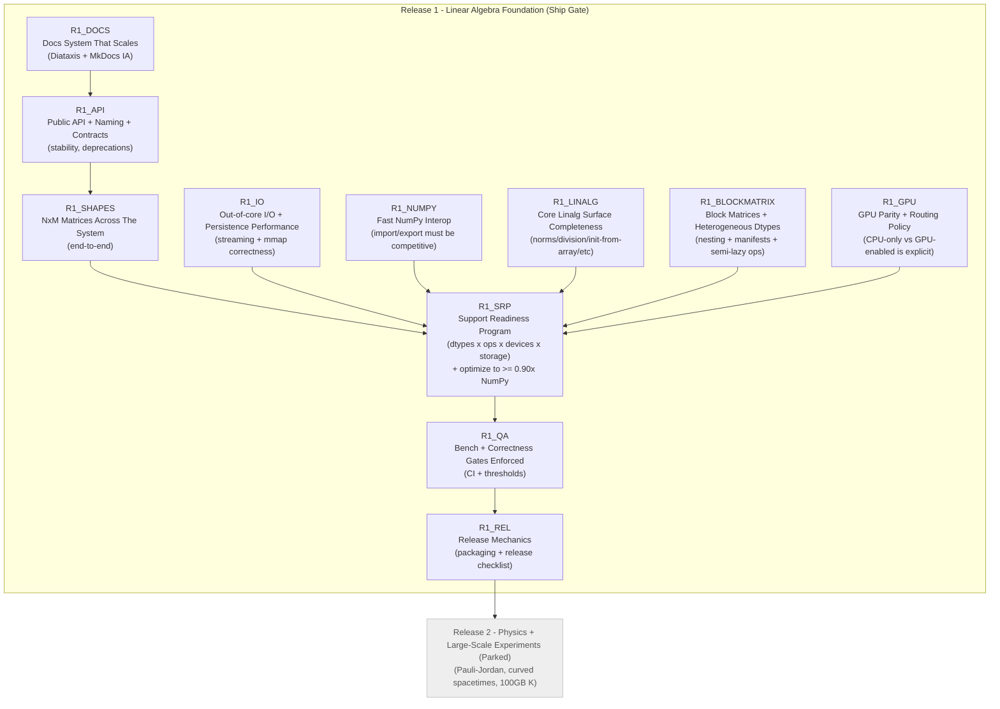

# PyCauset Roadmap (Canonical, Sequence-Based)

## Roadmap principles

### Release definition

**Release 1 (“Foundation Release”) ships when** the linear algebra base is *solid*:

- Operations are **correct** across all declared dtypes and structures.
- Operations are **optimized** on CPU and GPU (or explicitly blocked/routed).
- Out-of-core / persistence paths are correct and efficient.

“Physics features” are intentionally downstream of Release 1.

### What “optimized” means

Ideal target (C): “as close to theoretical optimal as possible”, including (examples):

- CPU parallelism (SIMD + threads) where appropriate.
- GPU kernels where appropriate.
- **Hybrid execution** (CPU + GPU cooperating for a single op) if it produces real speedups.
- Disk → RAM streaming that matches access patterns, using lookahead hints.

Practical acceptance target (B): **never slower than NumPy** in the regimes we claim to compete in.

- “Equivalent to NumPy” means: throughput ≥ **0.90× NumPy** for the benchmark regime.
- If PyCauset is slower than NumPy for a regime, it must be either:
    - explicitly out-of-scope for now, or
    - treated as a performance bug.

### Why NxM should happen early (discussion)

Yes: it is generally in your interest to move **NxM generalization earlier**, because:

- Shape rules infect everything: allocation, stride assumptions, kernels, persistence metadata, Python interop, and docs.
- If we fully “optimize everything” under NxN assumptions, we will later be forced to rewrite many kernels and tests.

However, NxM is not a single switch. The roadmap below breaks NxM into phases:

- First: make **DenseMatrix + VectorBase** truly rectangular-safe end-to-end.
- Then: expand structures that inherently assume square-ness (triangular/symmetric) with explicit policies.

We will keep “2D only” as a non-goal: no N-D arrays.

---

## Progress tracking (manual checkmarks)

Use GitHub-style task boxes:
- `[ ]` = not done
- `[x]` = done

Release 1 nodes:
- [x] R1_DOCS
- [x] R1_API
- [x] R1_SHAPES
- [ ] R1_SRP
- [ ] R1_IO
- [ ] R1_NUMPY
- [ ] R1_LINALG
- [ ] R1_BLOCKMATRIX
- [ ] R1_GPU
- [ ] R1_QA
- [ ] R1_REL

Parked:
- [ ] R2_PHYS

---

## Canonical Roadmap Graph (Mermaid)

---

## Node details (keyed by ID)

### R1_DOCS — Docs System That Scales (Diátaxis + MkDocs IA)

Status: - [x]

Goal: documentation stays maintainable as features grow.

Deliverables:
- Adopt Diátaxis as the organizing principle for *meaning* (even if folders are renamed later).
- MkDocs information architecture (IA) makes it obvious where to look:
    - Reference (API)
    - Guides (How-to)
    - Explanation (internals that are readable)
    - Dev Handbook
    - Project meta
- Update the documentation protocol so “redundancy” is implemented as:
    - **one canonical source of truth** per concept, and
    - required cross-links from guides/reference/dev.

### R1_API — Public API + Naming + Contracts

Status: - [x]

Goal: reduce churn and ambiguity in the Python surface while the project grows.

Starting point:
- [[project/Public API Contract|Public API Contract]]

Deliverables:
- Naming conventions documented (types, functions, dtype tokens, warnings/errors).
- Public vs internal boundaries explicit.
- Deprecation policy: Any feature asked to be deprecated should be completely removed. There is no existing user base to respect. It is confusing for future work when deprecated features aren't completely removed, because their lingering functions, namespaces, parameters etc still linger in the codebase, causing confusion. Regarding documentation, never write "this has been deprecated" - just REMOVE IT. "Deprecation" = "Purge" in this workflow.

### R1_SHAPES — NxM Matrices Across The System

Status: - [ ]

Goal: remove square-only assumptions so later work doesn’t require rewrites.

Phased approach:
- Phase 1: Dense matrices + vectors are rectangular-safe (allocation, indexing, NumPy, persistence).
- Phase 2: Matmul/matvec/vecmat and elementwise ops support NxM × MxK rules.
- Phase 3: Structures with inherent square semantics (triangular/symmetric/antisymmetric/identity/diagonal) get explicit policies:
    - what shapes they allow,
    - how they interact with NxM operands,
    - and what gets blocked vs implemented.

### R1_SRP — Support Readiness Program (SRP)

Status: - [ ]

This is the long “painstaking” program.

Authoritative checklist: `documentation/internals/plans/SUPPORT_READINESS_FRAMEWORK.md`.

SRP phases:
- SRP-0: Canonical inventories locked (dtypes + ops + structures + devices).
- SRP-1: CPU correctness across the inventory (Gate A + Gate B).
- SRP-2: CPU optimization to ≥0.90× NumPy for declared benchmark regimes (Gate E).
- SRP-3: GPU coverage implemented OR explicitly routed/blocked (Gate C).
- SRP-4: CCA lookahead hints + out-of-core performance validation (Gate D + Gate E).

Definition of Done (Release 1 gate):
- Every op in the canonical inventory has an explicit support status for every public dtype/structure/device case.
- No “silent wrong answers” and no “mysterious slow paths”.
- Benchmarks exist and failures are actionable.

### R1_IO — Out-of-core I/O + Persistence Performance

Status: - [ ]

Goal: disk-backed operation performance is a first-class feature, not an accident.

Deliverables:
- Streaming strategy for large operations (read patterns + hints).
- Persistence round-trips for every public dtype/structure.
- Large-scale read/write is demonstrably efficient.

### R1_NUMPY — Fast NumPy Interop

Status: - [ ]

Goal: converting to/from NumPy is not a bottleneck.

Deliverables:
- `np.array(obj)` and `Matrix(np_array)`/`Vector(np_array)` paths are optimized.
- Performance target: ≥0.90× NumPy baseline for conversion-heavy workflows (define regimes).

### R1_LINALG — Core Linalg Surface Completeness

Status: - [ ]

Goal: the base toolbox feels complete for users.

Seed items (from prior TODO):
- Norms, normalization, projections
- Elementwise division for matrices/vectors
- Initialization from array input for typed classes (not only factories)
- Block matrices/vectors (moved to **R1_BLOCKMATRIX**; see `documentation/internals/plans/R1_BLOCKMATRIX_PLAN.md`)
- Advanced indexing (slicing, fancy indexing)
- Random matrix/vector generation
- Matrix properties (is_symmetric, is_positive_definite, etc)

### R1_BLOCKMATRIX — Block Matrices + Heterogeneous Dtypes

Status: - [ ]

Goal: make block matrices a first-class internal representation built from existing matrices,
with **heterogeneous dtypes**, **manifest-based reference persistence**, and **semi-lazy block ops**
that preserve storage efficiency.

Authoritative plan: `documentation/internals/plans/R1_BLOCKMATRIX_PLAN.md`.

Deliverables:
- `pycauset.matrix([[A, B], [C, D]])` constructs a block matrix without densifying.
- Block matrices are infinitely nestable.
- Element indexing behaves like normal matrices (elements, not blocks).
- Block replacement via explicit API (e.g., `set_block`).
- Elementwise ops + matmul decompose into leaf ops that route via AutoSolver/ComputeDevice.
- Save/load uses a reference-manifest (no expanded dense write) and is nestable.

### R1_GPU — GPU Parity + Routing Policy

Status: - [ ]

Goal: GPU behavior is predictable and correct.

Deliverables:
- AutoSolver routing is explicit and testable.
- For unsupported GPU cases: either CPU route or clear error.
- Benchmark-based thresholds are documented.

### R1_QA — Bench + Correctness Gates Enforced

Status: - [ ]

Goal: prevent regressions (correctness and performance).

Deliverables:
- Gate-style CI checks: correctness + persistence + a small benchmark suite.
- Performance regressions are visible (even if not hard-failed at first).

### R1_REL — Release Mechanics

Status: - [ ]

Goal: releasing is routine and reproducible.

Deliverables:
- Release checklist referencing SRP gates.
- Packaging sanity checks.

---

## Parked (post-Release-1) ideas from the old TODO

These are intentionally downstream of the foundation release:

- 100GB propagator matrix $K$ (capstone large-scale experiment)
- Pauli–Jordan function $i\Delta$
- Curved spacetimes (Schwarzschild / de Sitter)
- User-defined spacetimes

