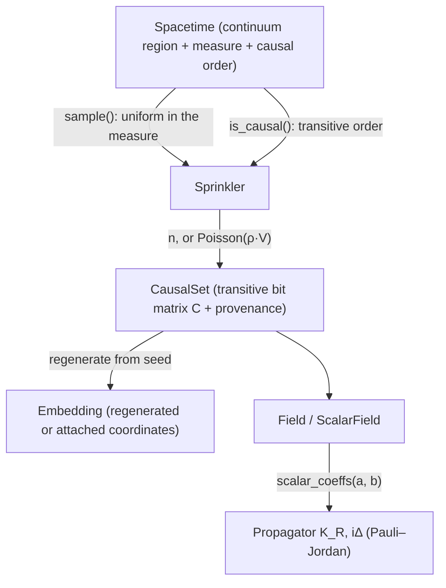
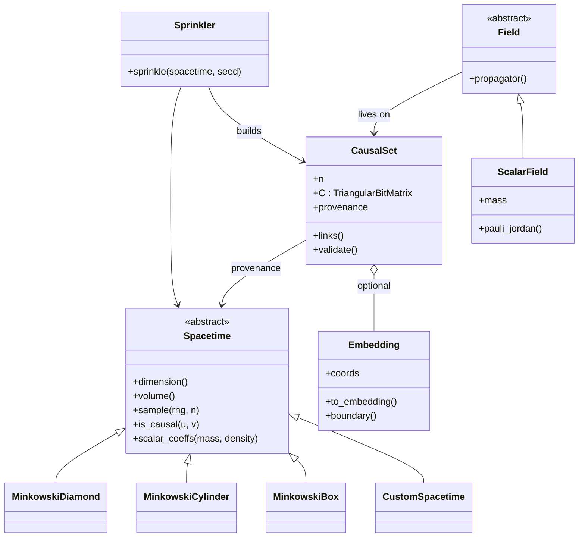

# R2 API Design, Spacetime, Fields, and Visualization

**Status**: Design proposal (planning only, no implementation)
**Audience**: Creative director + R2 planning
**Scope**: How the *physics* layer of PyCauset should be shaped for R2 and beyond.

> **Note (director decisions locked):** the decisions and feature roadmap for R2 are consolidated
> in **[`R2_PLAN_MAP.md`](R2_PLAN_MAP.md)**. This document remains the deep-dive rationale and
> tradeoff analysis; where the two differ, the plan map is authoritative.

---

## 0. North star

> PyCauset is "NumPy for causal sets." NumPy won because there is exactly one obvious
> way to hold an array (`ndarray`) and a small set of verbs that compose. R2 should aim
> for the same property: **one obvious object for a causal set, one obvious object for a
> continuum spacetime, and clean seams between the two.**

The pipeline, visually (renders on the MkDocs site, Mermaid is already wired into `mkdocs.yml`,
so no new dependency is needed):



The core pipeline that already exists, *create a spacetime → sprinkle → extract the causal
matrix*, is fundamentally sound and worth keeping. The R2 work is not to replace it, but to
fix four things that currently work against "professional yet fun":

1. **The spacetime concept is split-brain.** Physics lives in C++ (`dimension`, `volume`,
   `generate_point`, `causality`), but visualization lives as Python functions monkey-patched
   onto concrete classes (`transform_coordinates`, `get_boundary`). A user can't write a
   spacetime in pure Python, and presentation is welded to geometry.
2. **Physics coefficients are hardcoded and fragile.** `ScalarField._get_coeffs()` sniffs
   `"Minkowski" in class.__name__` and knows only 2D/4D. Custom spacetimes can't plug in.
3. **Coordinates are regenerated from a seed, never stored.** Memory-light and elegant, but it
   means a causal set *must* have come from a (spacetime, seed) sprinkling, you can't attach an
   arbitrary point set, an adaptive/non-Poisson sprinkling, or a user's own embedding.
4. **Invariants are unenforced.** `CausalSet(matrix=...)` accepts any matrix without checking it
   is reflexive-free, antisymmetric, and transitive. For a "serious research tool" that's a
   correctness hole.

---

## 1. What is a "spacetime"?

### 1.1 The distinction that matters most

There are **three** concepts today collapsed into one word "spacetime":

| Concept | What it is | Intrinsic? |
| :-- | :-- | :-- |
| **Causal set** | The discrete partial order (the bit matrix `C`). | Yes, this is the physics. |
| **Spacetime** | A continuum region + a measure + a causal (Lorentzian) order. Used as a *sampling oracle* to *build* a causal set. | No, it's a construction tool. |
| **Embedding** | Coordinates in some chart/space, used to plot or to compare against the continuum. | No, it's derived and optional. |

The single most important R2 decision (already in motion, but worth naming): **the causal set is
the primary object, and the continuum spacetime + coordinates are provenance/attachments, not the
object itself.** A causal set should be constructible from *just* an order (the purest case), from
a spacetime + seed (sprinkled, coordinates regenerable), or from explicit coordinates (order
*derived* via a causality oracle).

### 1.2 Minimal hierarchy

```
CausalSet                         # the discrete partial order, PRIMARY
  ├─ n, C (TriangularBitMatrix)   # the order; the only mandatory data
  ├─ links()                      # transitive reduction (Hasse), R2
  ├─ provenance                   # how it was made (spacetime+seed+density) OR an attached embedding
  └─ validate()                   # reflexive-free, antisymmetric, transitive

Spacetime (Python ABC)            # continuum: region + measure + causal order
  ├─ dimension() -> int           # TOTAL d, index 0 = time
  ├─ volume() -> float            # total mass of the sampling measure
  ├─ sample(rng, n) -> (n, d)     # draw n points uniformly w.r.t. that measure
  ├─ is_causal(u, v) -> bool      # strict partial order on points (transitive!)
  └─ (optional, presentation) to_embedding(coords), boundary()

Sprinkler (algorithm, not a type) # policy: Spacetime + seed -> CausalSet
  ├─ fixed n  /  Poisson(density·V)
  └─ uses sample() + is_causal()  (batched when available)
```

The same structure as a class diagram (inheritance + composition):



Notes:

- `dimension()` stays **total** spacetime dimension (d = t + s). Signature `(t, s)` is a
  first-class property on `Spacetime` (decisions #8/#10 in `R2_PLAN_MAP.md`): Lorentzian `(1, d−1)`
  carries the causal order, Euclidean `(0, d)` is a point process with no causal order, and
  multi-time `(t > 1, s)` requires a user-supplied "future" convention.
- `to_embedding`/`boundary` are **presentation**, moved out of the physics contract. A spacetime
  that doesn't implement them still sprinkles and still plots (raw coordinates, no boundary).
- `Sprinkler` is deliberately a free function/algorithm, not a base class. The sampling strategy
  (Poisson vs. fixed-N vs. future adaptive) should vary without subclassing the spacetime.

### 1.3 Invariants (must hold, and R2 should enforce)

**Spacetime:**
1. `dimension() >= 2`; consistent across `volume`, `sample`, `is_causal`.
2. `0 < volume() < ∞`, and **`sample()` is uniform with respect to the same measure whose total
   mass equals `volume()`**. (This is what makes `density = n / volume` meaningful for field
   coefficients. It is currently *assumed*, e.g. the diamond's unit volume in (u,v), but never
   stated or checked.)
3. `is_causal` is irreflexive and antisymmetric (a strict partial order), and it is the
   **transitive** order, not the link order. The sprinkler stores the transitive closure.
4. Reproducibility: same `(spacetime, seed, n)` ⇒ bit-identical points and order.

**CausalSet:**
5. `C` is square n×n, zero diagonal, antisymmetric, **transitive**; strictly upper-triangular once
   labeled by time.
6. `density` and `n` are consistent: `n ≈ density · spacetime.volume()` when provenance is known.
7. Provenance records *either* `(spacetime identity, seed, density)` (coordinates regenerable)
   *or* an explicit attached embedding, never silently neither when coordinates are requested.

**Recommendation on validation:** validate eagerly at construction for `matrix=` and on `load()`
(fail-fast; O(n²), amortized/optional for huge n via a `validate=False` escape hatch). A library
that lets a non-transitive matrix masquerade as a causal set will produce silently-wrong
propagators, which is the worst failure mode for research software.

---

## 2. Custom spacetimes, the extension point

Today there is no Python extension point: built-ins are C++ classes, and the Python layer only
monkey-patches visualization onto them. Fix this by making the **Python `Spacetime` ABC the
public extension seam**, with the C++ classes as fast built-ins implementing the same protocol.

### 2.1 Two-tier protocol (easy by default, fast when needed)

```python
from pycauset import spacetime

@spacetime.register("de_sitter_2d")          # name = persistable identity
class DeSitter2D(spacetime.Spacetime):
    dimension = 2

    def sample(self, rng, n):                # tier 1: (n, 2) ndarray
        return rng.uniform(0, 1, size=(n, 2)) # user vectorizes with NumPy

    def is_causal(self, u, v):               # tier 1: element-wise bool
        return (u[0] < v[0]) and (u[1] < v[1])

    def volume(self):
        return 1.0

    # --- optional, presentation only ---
    def to_embedding(self, coords): ...      # default: identity
    def boundary(self): ...                  # default: none

    # --- optional, physics ---
    def scalar_coeffs(self, mass, density):  # default: NotImplementedError
        return (a, b)
```

- **Tier 1 (element-wise)** is the "20 lines and it works" path, fun for prototyping, fine for
  small n. The sprinkler falls back to a straightforward O(n²) loop.
- **Tier 2 (batch hooks)**, if the user also provides `is_causal_batch(coords)` (returns an
  (n,n) boolean) or the sprinkler detects a fast path, the O(n²) pairwise step runs in NumPy/C.
  Same API, optional performance.
- **RNG is injected**, so the reproducibility invariant survives custom spacetimes.

### 2.2 Registry + decorator (the "fun" and the "persistent")

The `@spacetime.register("name")` decorator does two jobs:

1. **Discoverability & ergonomics**, `spacetime.de_sitter_2d(...)` / a registry listing, so
   custom spacetimes feel first-class rather than anonymous.
2. **Persistence**, `CausalSet.save/load` currently round-trips through provenance. A *name*
   registry is what lets a custom spacetime survive a save/load on a later session. Without it,
   custom spacetimes are in-session-only. (See decisions, this is optional-but-recommended.)

### 2.3 Physics extension point: move the coefficients onto the spacetime

`ScalarField._get_coeffs()` currently hardcodes dimension↔(a,b) and sniffs the class name. Move
the derivation to `Spacetime.scalar_coeffs(mass, density) -> (a, b)`:

- Built-in Minkowski spacetimes implement the known 2D/4D table (and raise `NotImplementedError`
  outside it, honest about what's actually supported).
- Custom spacetimes either implement it or the user passes `a, b` manually (the existing override
  path stays).
- **Honest caveat to surface:** the (a, b) discretization of the retarded d'Alembertian is
  dimension- and curvature-dependent and is an *active research* area for non-Minkowski spaces.
  R2 should provide the *seam* (spacetime owns coefficients) and correct Minkowski defaults, and
  explicitly punt "correct coefficients for generic curved spacetimes" to manual override. Do not
  pretend to auto-derive what the literature hasn't settled.

### 2.4 Tradeoffs of this approach

| Option | Pro | Con |
| :-- | :-- | :-- |
| **Python ABC + optional batch hooks (recommended)** | Anyone can extend; reproducible; Minkowski stays C++-fast; viz decoupled | Pure-Python element-wise path is slow for large n (mitigated by batch hook) |
| C++-subclass only (status quo) | Max speed | Extension requires C++/pybind work → effectively no user extensibility |
| Fully vectorized `sample(n)+causality_matrix` contract only | Fastest Python path | Forces users to write the matrix form up front; less "fun" for quick sketches |
| JIT callback (numba/jax) | Speed + Python | Heavy dependency, niche audience; revisit post-R2 |

---

## 3. Visualization library

**Recommendation: keep Plotly as the single primary backend for R2**, and, more importantly -
refactor `vis.py` so the *data preparation* (subsampling, coordinate transform, link computation,
boundary) is decoupled from the *trace emission*. That decoupling is the real deliverable; the
backend choice becomes a pluggable detail.

### 3.1 Why Plotly (primary)

- Already integrated, dark-theme-polished, and matches the "fun / interactive" mantra: rotate,
  zoom, hover, notebook-native, HTML/PNG export.
- 3D is WebGL-backed (`go.Scatter3d`), fine at the current 50k-point subsample.
- Zero migration cost and one dependency (`plotly.py`, MIT).

### 3.2 Why not the others (and when they earn a place)

| Library | Verdict | When it matters |
| :-- | :-- | :-- |
| **Matplotlib** | Not the primary: `mplot3d` is slow and interactivity is poor. | *Publication renderer*: a static, print-quality PNG path for papers. Add as a second backend later, not now. |
| **PyVista / vedo / VTK** | GPU point clouds + meshes are excellent, but heavy, less "just works" in a notebook, overkill for causal sets. | Only if R2 needs mesh/surface rendering (e.g. lightcone sheets). |
| **Datashader (with Bokeh/HoloViews)** | Rasterizes huge point clouds; the right tool for N ~ 10⁶. | Evaluate for R2's "humongous" regime; it's an *addition*, not a replacement. |
| **ipyvolume / deck.gl / three.js** | Dead or web-server-heavy. | Skip. |

### 3.3 The specific pain point: Hasse diagrams

Plotly is weakest exactly where Hasse diagrams are hardest: thousands of 3D line segments
(one trace with `None` separators is required; per-edge traces are pathological). Keep the low
`N ≤ 500` cap for interactive Hasse (correct, it's a skeleton view), and note two escape hatches
for R2: (a) a **matplotlib static** Hasse renderer for publication figures, (b) **graph-layout
tooling** (networkx layouts → plotly, or pyvis) when the goal is *topology*, not the spacetime
embedding. The embedding-based Hasse is only one of two Hasse meanings, flagging this now avoids
a later API tangle: `plot_hasse(embedding=...)` vs `plot_hasse(layout="spring")`.

### 3.4 Heatmaps

`plotly.imshow` is fine up to the current N ≤ 2000 cap. For larger N, route through a rasterization
backend (datashader) rather than pushing Plotly past its limit. Don't raise an error for N > 2000
in R2, downsample or rasterize instead (the current hard error is unfriendly).

---

## 4. Open questions: what I decide vs. what you decide

### 4.1 I can decide (engineering/UX, my defaults, unless you object)

- The hierarchy shape in §1.2 and the invariants in §1.3.
- The two-tier custom-spacetime protocol and the `@register` decorator in §2.
- Moving `a, b` derivation onto the spacetime (§2.3) and keeping the manual override.
- Plotly as primary backend + the data-prep/emission decoupling (§3).
- Naming defaults: keep `CausalSet` (already public), introduce `Spacetime` as the Python ABC,
  call coordinates an **`Embedding`** (not "coordinates") to make its derived nature obvious.
  Happy to be overruled on taste.

### 4.2 Director decisions (resolved)

All seven were decided by the director and are recorded in **[`R2_PLAN_MAP.md`](R2_PLAN_MAP.md)**
(§11 "Decision log"). Summary:

1. **Coordinate model**, hybrid: regenerate-from-seed by default, attach an explicit `Embedding`
   when asked; documented clearly to avoid confusion.
2. **Dimensional scope**, arbitrary dimension for sprinkling/geometry/causality; viz 2D/3D
   required, higher-D deferred (lowest priority).
3. **Coefficients**, never guess from a name; library-authorized values only; otherwise manual
   `a, b` (the "professional, not Apple" principle).
4. **Primary object**, causal set is primary; spacetime/embedding are provenance/attachments.
5. **Validation**, eager partial-order validation with a `validate=False` escape hatch.
6. **Spacetime persistence**, save/load, plus modify (subclass/compose) predefined spacetimes;
   registry + recipe serialization.
7. **Plotting**, Plotly only; subset + warning + bypass for huge sets.

Additional decisions folded in: **arbitrary signature** (first-class; causal order only for
Lorentzian, Euclidean is a point process, not a causet), a **Tier-0 declarative builder +
code generator + online tool** for even-easier custom spacetimes, and an **extensive built-in
spacetime library**. See the plan map for the full feature map and tentative R2.0/R2.1/R2.2
roadmap.
