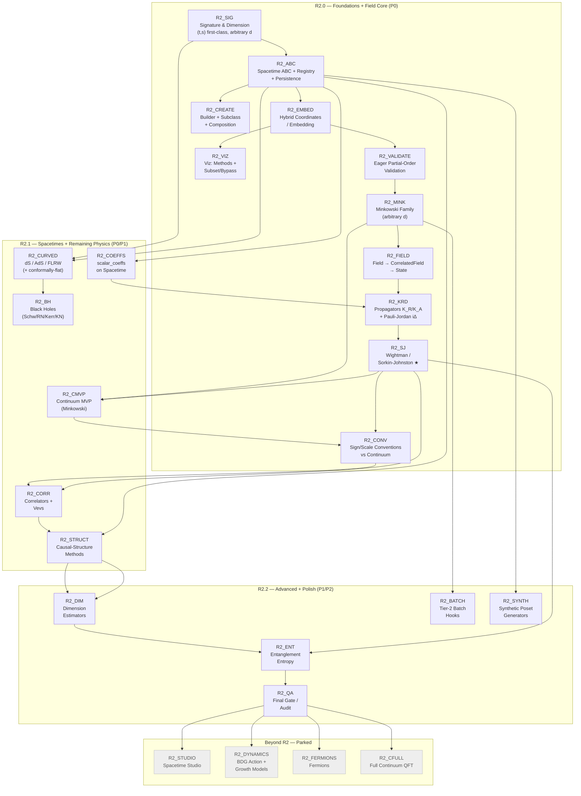

# PyCauset R2 Roadmap (Canonical, Sequence-Based)

**Authoritative decisions live in** `R2_PLAN_MAP.md` (§11 Decision log). This document is the
*tickable execution plan* for R2 — mirroring the R1 roadmap in `documentation/internals/plans/TODO.md`.
Deep rationale and tradeoffs live in the `project/plans/R2_*.md` docs; this file only records
**what**, **in what order**, and **when it's done**.

## Progress legend

- `[ ]` = not started / in progress
- `[x]` = done (meets its Definition of Done — tests + docs included)
- `★` = flagship (the thing we demo; the highest-stakes node)

Phase codes: **R2.0** foundations + field core · **R2.1** spacetimes + remaining physics ·
**R2.2** advanced + polish · **R2X** parked (Beyond R2).

---

## Roadmap principles (locked, from `R2_PLAN_MAP.md` §1)

1. **Causal sets are the primary citizens.**
2. **Professional: never guess** — no inference from names/heuristics; unknown ⇒ raise and ask.
3. **Fun and easy** — a few lines to a working causet; advanced control is opt-in.
4. **Correct first** — invariants validated; no non-transitive matrix masquerading as a causet.
5. **Arbitrary dimension and geometry** — signature is first-class, not a hidden Lorentzian assumption.

### Roadmap hygiene (convergence rules — same spirit as R1)

- **Docs + tests are in-step (non-negotiable):** every node ships its own documentation and tests
  *inside* its step — both are part of the Definition of Done, never deferred to a later phase.
  `R2_QA` is a final *audit* that verifies nothing was skipped; it is not where docs/tests get
  written.
- **Freeze contracts early:** lock the `Spacetime` and `Field` interfaces (types, invariants,
  recipes) before building the library on top of them.
- **Gate before expanding scope:** a node is done only when its Definition of Done is met; new
  ideas go to `R2_PLAN_MAP.md` Open Questions or Beyond-R2, not into the current node.
- **Never guess, structurally:** no physics coefficient is ever inferred; library values are
  authored, everything else raises.

### Release definition ("R2 ships when…")

R2 ships when the **causal-set physics core is flawless on flat Minkowski**:

- Sprinkling works for arbitrary dimension/signature (causal order where Lorentzian).
- The field core — `K_R`, `K_A`, Pauli–Jordan `iΔ`, and **Wightman/Sorkin–Johnston** — reproduces
  the continuum limit with sign/scale conventions pinned and tested.
- Custom spacetimes and fields are *extensible without guessing* (builder + subclass + registry).

"Flawless" = correct + tested against known continuum results + documented, not merely "it runs."

---

## Phase overview

| Phase | Nodes | Priority | Gist |
| :-- | :-- | :-: | :-- |
| R2.0 | R2_SIG … R2_CONV | P0 | foundations + the field core (SJ flagship) |
| R2.1 | R2_CURVED … R2_CMVP | P0/P1 | full spacetime library + correlators/vevs/structure |
| R2.2 | R2_DIM … R2_QA | P1/P2 | advanced physics + polish |
| R2X | parked | — | future bonus (not R2) |

---

## Progress tracking (manual checkmarks)

R2.0 — Foundations + Field Core:
- [ ] R2_SIG
- [ ] R2_ABC
- [ ] R2_EMBED
- [ ] R2_VALIDATE
- [ ] R2_CREATE
- [ ] R2_VIZ
- [ ] R2_MINK
- [ ] R2_FIELD
- [ ] R2_KRD
- [ ] R2_SJ ★
- [ ] R2_CONV

R2.1 — Spacetimes + Remaining Physics:
- [ ] R2_CURVED
- [ ] R2_BH
- [ ] R2_COEFFS
- [ ] R2_CORR
- [ ] R2_STRUCT
- [ ] R2_CMVP

R2.2 — Advanced + Polish:
- [ ] R2_DIM
- [ ] R2_ENT
- [ ] R2_BATCH
- [ ] R2_SYNTH
- [ ] R2_QA

Parked (Beyond R2):
- [ ] R2_STUDIO
- [ ] R2_DYNAMICS
- [ ] R2_FERMIONS
- [ ] R2_CFULL
- [ ] R2_MULTITIME
- [ ] R2_JIT
- [ ] R2_DATASHADER
- [ ] R2_GAUGE
- [ ] R2_INTERACT

---

## Canonical Roadmap Graph (Mermaid)

---

## Node details (keyed by ID)

### R2_SIG — Signature & Dimension Model

Status: - [ ]

Goal: `Spacetime` exposes `signature = (t, s)` (timelike, spacelike) with `dimension = t + s`;
no hidden Lorentzian assumption anywhere. Causal order exists only for Lorentzian `t = 1`.

Deliverables:
- `signature` property on the `Spacetime` ABC; convention `(t, s)` (decision #10).
- `is_causal` base default raises for `t != 1` (Euclidean ⇒ point process; multi-time ⇒ user-defined).
- Arbitrary-`d` volume/sampling/causality for the flat family (no placeholder diamonds).

DoD: a Euclidean "spacetime" sprinkles as a point process and refuses a causal order; a
multi-time spacetime raises unless the user supplies a future convention.

### R2_ABC — Spacetime ABC + Registry + Persistence

Status: - [ ]

Goal: a Python `Spacetime` ABC is the single extension seam; built-ins and custom spacetimes share
it; name registry + recipe serialization make spacetimes saveable/loadable.

Deliverables:
- `Spacetime` ABC: `dimension`, `signature`, `volume()`, `sample(rng, n)`, `is_causal(u, v)`,
  optional `is_causal_batch`, `scalar_coeffs`, `to_embedding`, `boundary`.
- `@spacetime.register("name")` registry; collision = explicit error + `overwrite=True` (#11).
- Save serializes a *recipe* `{kind, params, transforms}`, not code.

DoD: a custom 3-method subclass sprinkles, validates, plots, and round-trips save/load.

### R2_EMBED — Hybrid Coordinates / Embedding

Status: - [ ]

Goal: coordinates regenerate from `(spacetime, seed)` provenance by default; an explicit
`Embedding` can be attached when asked (user points, adaptive/non-Poisson sprinklings).

Deliverables: `CausalSet.coordinates()` (regenerate) + `attach_embedding()`; unambiguous
documentation of which mode an instance is in; clear error when neither is available.

DoD: no-providence-and-no-embedding ⇒ clear error (never a guess); attached embeddings round-trip.

### R2_VALIDATE — Eager Partial-Order Validation

Status: - [ ]

Goal: a causal matrix is verified reflexive-free, antisymmetric, and **transitive** at construction
and on `load()`.

Deliverables: `validate()` + eager enforcement with a `validate=False` escape hatch (#5).

DoD: a non-transitive matrix is rejected with an actionable error; `validate=False` skips the check.

### R2_CREATE — Builder + Subclass + Composition

Status: - [ ]

Goal: three rungs to define a spacetime — `spacetime.create(recipe)` (declarative), subclass
(3 methods), and composition decorators (`Restricted`/`Conformal`/`Transformed`/`Periodic`).

Deliverables: recipe schema with 1:1 parameter→setting mapping (no inference); decorators preserve
`volume ↔ sample` consistency; `export_python` emits a paste-ready subclass.

DoD: `create` covers every advertised `(domain, metric)` pair; unsupported combos raise with a
"valid options" message.

### R2_VIZ — Viz Call Surface + Authored Shapes + Subset/Bypass

Status: - [ ]

Goal: uniform large-set policy across all plotters; an **authored visualization declaration** so
known geometries "just work" without guessing; and a **hybrid call surface** (#16) — zero-import
methods on the primary citizen, lazy top-level functions elsewhere.

Deliverables: `CausalSet.plot_embedding()` / `.plot_hasse()` / `.plot_causal_matrix()` (lazy plotly
import in-body, tab-complete); lazy top-level `pc.plot_*` for non-causet objects (e.g.
`pc.plot_heatmap(K_R)`); fun one-verb `pc.show(c)`; explicit verbs only (no `kind=` dispatch);
returns Plotly `Figure`. Seeded random subset above a threshold; `PyCausetPerformanceWarning`
naming what was sampled; `force=True` (or `max_points=None`) bypass; optional `to_embedding` /
`boundary` / `display_axes` declared by the spacetime (viz layer has no geometry-specific code; no
declaration ⇒ honest generic fallback). Never silently truncate (#7); never infer a shape.

DoD: plotting a causet needs no import and no arguments beyond the object; huge inputs warn +
subset; `force=True` renders everything; a declared boundary renders even under subsampling; a
geometry-free custom spacetime renders raw with no inferred shape.

### R2_MINK — Minkowski Family (arbitrary d)

Status: - [ ]

Goal: correct arbitrary-d flat spacetimes replacing the current 2D-only / placeholder code.

Deliverables: `MinkowskiDiamond` (true causal diamond, not the product-interval placeholder),
`MinkowskiCylinder`, `MinkowskiBox` — exact volume, uniform sampler, causal predicate.

DoD: Monte Carlo volume test + order consistency (transitivity) + reproducibility (same seed).

### R2_FIELD — Field Model (Field → CorrelatedField → State)

Status: - [ ]

Goal: the locked field model. `pc.field("scalar", mass=…)` is a set-independent **Field**;
`phi.on(causet)` / `phi.on(spacetime)` returns a **`CorrelatedField`**; states are built on top.

Deliverables: `Field` (species: kind, mass, spin, scheme) + string factory sugar (unknown strings
raise); `CorrelatedField` exposing `.retarded()`, `.pauli_jordan()`, `.wightman()`, `.correlator()`;
vacuum choice explicit in `.wightman()` (SJ default).

DoD: `phi.on(c1)` / `phi.on(c2)` reuse one field across a sequence of causets; `.on()` never
silently "quantizes" — the vacuum choice is explicit.

### R2_KRD — Propagators K_R/K_A + Pauli–Jordan iΔ

Status: - [ ]

Goal: the retarded/advanced Green's functions and the commutator function, exactly and tested.

Deliverables: `K_R = aC(I − baC)⁻¹`, `K_A = K_Rᵀ`, `iΔ = K_R − K_A` stored antisymmetrically with
scalar `1j`; verified antisymmetry.

DoD: matches known Minkowski continuum results (2D and 4D) within tolerance.

### R2_SJ — Wightman / Sorkin–Johnston ★

Status: - [ ]

Goal: **flagship** — the SJ vacuum two-point function, correct and flawless.

Deliverables: `iΔ` is Hermitian; diagonalize; `W` = its positive-eigenvalue part (uses the existing
`eigh`); exposed as `.wightman()`.

DoD: `W` reproduces the continuum Wightman function for flat Minkowski as ρ → ∞ (continuum-limit
test, via R2_CMVP).

### R2_CONV — Sign/Scale Conventions vs Continuum

Status: - [ ]

Goal: pin the exact metric-convention factors in `K_R`, `iΔ`, `W` and test against known continuum
results (free scalar, 1+1 and 3+1 Minkowski).

Deliverables: a documented conventions page + a test harness asserting agreement with the
closed-form continuum Green's/Wightman functions.

DoD: no "off-by-a-factor-of-i" ambiguity; conventions are stated, tested, and locked.

### R2_CURVED — Curved Spacetimes (dS / AdS / FLRW)

Status: - [ ]

Goal: approved curved set (#9) — de Sitter, anti-de Sitter (universal cover — no CTCs), FLRW
(open/flat/closed); conformally-flat as stretch.

Deliverables: geometry + volume + uniform sampler + causal predicate for each; **no automatic
`scalar_coeffs`** (raises `NotImplementedError`; manual `a, b`).

DoD: order consistency + reproducibility; AdS ships the cover (or is explicitly flagged "no causal
order").

### R2_BH — Black Holes (Schwarzschild / RN / Kerr / Kerr–Newman)

Status: - [ ]

Goal: the black-hole family (P2/stretch) with honest causal pathology documented.

Deliverables: `Schwarzschild`, `ReissnerNordstrom`, `Kerr`, `KerrNewman` — geometry-only, manual
coeffs; documented ergosphere / Cauchy-horizon / CTC caveats.

DoD: ships only if sampler + causal predicate are correct; otherwise stays parked.

### R2_COEFFS — `scalar_coeffs` on Spacetime

Status: - [ ]

Goal: generalize the `(a, b)` derivation onto the `Spacetime` ABC (replacing the name-sniffing in
`ScalarField._get_coeffs`).

Deliverables: `Spacetime.scalar_coeffs(mass, density)`; built-in Minkowski implements 2D/4D;
curved/custom raise unless authored; manual `propagator(a=…, b=…)` override stays.

DoD: no `"Minkowski" in class.__name__` anywhere; unknown ⇒ explicit raise (#3).

### R2_CORR — Correlators + Vevs

Status: - [ ]

Goal: 2-point ⟨φφ⟩ (from Wightman) and basic vevs ⟨φ⟩, ⟨φ²⟩ via a field configuration + measure.

Deliverables: `.correlator()`; free-field Wick for higher points; UV-regularization caveats documented.

DoD: 2-point agrees with Wightman; higher points follow Wick for the free field.

### R2_STRUCT — Causal-Structure Methods

Status: - [ ]

Goal: order methods as first-class citizens on `CausalSet` ("a causet is just a poset").

Deliverables: `links()` (transitive reduction), chains/antichains, longest chain, intervals
`I(x,y)`, past/future sets, layering.

DoD: link matrix = `C & ~(C@C)`; longest chain verified against a known small example.

### R2_CMVP — Continuum MVP (Minkowski)

Status: - [ ]

Goal: bare-minimum continuum comparison — closed-form flat-Minkowski Green's/Wightman kernels +
`Q_ct.at(coords)` sampling (#12). Explicitly **not** a full continuum-QFT tool.

Deliverables: `phi.on(spacetime)` for flat Minkowski (1+1 and 3+1); `.at(coords)` to sample at the
causet's points; everything else raises.

DoD: `Q_ct.at(coords)` diff vs `Q_c.wightman()` → 0 as ρ → ∞ (drives R2_CONV).

### R2_DIM — Dimension Estimators

Status: - [ ]

Goal: "what dimension is this causet?" — Myrheim–Meyer, mid-point scaling, spectral dimension
(from d'Alembertian eigenvalues).

Deliverables: estimators on `CausalSet`, each with its continuum-limit target documented.

DoD: recovers d = 2 and d = 4 from sprinkled Minkowski causets.

### R2_ENT — Entanglement Entropy

Status: - [ ]

Goal: entanglement entropy / mutual information from the Wightman function (Sorkin–Yazdi style).

Deliverables: region-restricted two-point matrices → entropy; needs R2_SJ first.

DoD: reproduces a known reference value for a small analytic case.

### R2_BATCH — Tier-2 Batch Hooks

Status: - [ ]

Goal: `is_causal_batch(coords)` fast path so the O(n²) sprinkling step runs in NumPy/C.

Deliverables: optional batch hook; sprinkler uses it when present, else element-wise fallback.

DoD: both paths give bit-identical orders for the same seed.

### R2_SYNTH — Synthetic Poset Generators

Status: - [ ]

Goal: order generators for testing/pedagogy/null models (Chain, Antichain, TransitivePercolation,
RandomDAGOrder, KleitmanRothschild, IntervalOrder, Dimension2Poset, ProductOrder, Poset).

Deliverables: each generator produces a valid `CausalSet` order (no geometry).

DoD: outputs pass R2_VALIDATE.

### R2_QA — Final Gate (Audit & Benchmarks)

Status: - [ ]

Goal: verify that every node shipped its own in-step docs + tests (per the non-negotiable rule),
and add the cross-cutting benchmark suite. This is an *audit*, **not** where docs/tests are written.

Deliverables: CI correctness gates enforced; continuum-limit benchmark suite; an audit that the
public surface has no undocumented / untested objects; the "conference feature menu" page.

DoD: zero undocumented public API; zero untested public behavior; every node's in-step DoD verified.

---

## Parked (Beyond R2 — bonus, not R2 scope)

- [ ] **R2_STUDIO** — Spacetime Studio website (`export_python` + hosted form, GitHub Pages /
      `pycauset.studio()` open-in-browser). Sideline; revisit as a fun bonus.
- [ ] **R2_DYNAMICS** — causal-set dynamics: BDG action (Einstein–Hilbert limit), growth models,
      path sum. Deferred, but on the map.
- [ ] **R2_FERMIONS** — Dirac operator on a causet (open research; experimental module).
- [ ] **R2_CFULL** — full continuum-QFT comparison tooling (R2 ships only the Minkowski MVP).
- [ ] **R2_MULTITIME** — multi-time signatures with user-defined causality.
- [ ] **R2_JIT** — JIT (numba/jax) sampling hooks.
- [ ] **R2_DATASHADER** — datashader large-N rendering.
- [ ] **R2_GAUGE** — vector / gauge fields.
- [ ] **R2_INTERACT** — interacting fields / path integrals.
