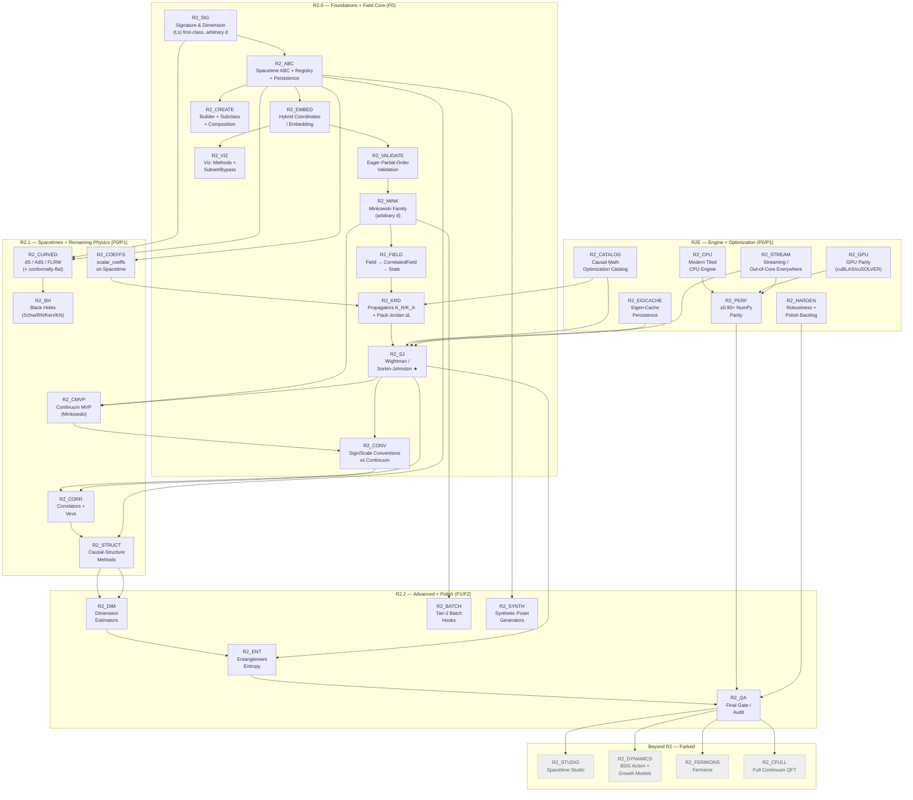

# PyCauset R2 Roadmap (Canonical, Sequence-Based)

**Authoritative decisions live in** `R2_PLAN_MAP.md` (§11 Decision log). This document is the
*tickable execution plan* for R2 — mirroring the R1 roadmap in `documentation/internals/plans/TODO.md`.
Deep rationale and tradeoffs live in the `project/plans/R2_*.md` docs; this file only records
**what**, **in what order**, and **when it's done**.

## Progress legend

- `[ ]` = not started / in progress
- `[x]` = done (meets its Definition of Done — tests + docs included)
- `★` = flagship (the thing we demo; the highest-stakes node)

Phase codes: **R2.0** foundations + field core · **R2.1** spacetimes + remaining physics ·
**R2.2** advanced + polish · **R2E** engine + optimization (folded in from post-R1) ·
**R2X** parked (Beyond R2).

---

## Roadmap principles (locked, from `R2_PLAN_MAP.md` §1)

1. **Causal sets are the primary citizens.**
2. **Professional: never guess** — no inference from names/heuristics; unknown ⇒ raise and ask.
3. **Fun and easy** — a few lines to a working causet; advanced control is opt-in.
4. **Correct first** — invariants validated; no non-transitive matrix masquerading as a causet.
5. **Arbitrary dimension and geometry** — signature is first-class, not a hidden Lorentzian assumption.

### Roadmap hygiene (convergence rules — same spirit as R1)

- **Docs + tests are in-step (non-negotiable):** every node ships its own documentation and tests
  *inside* its step — both are part of the Definition of Done, never deferred to a later phase.
  `R2_QA` is a final *audit* that verifies nothing was skipped; it is not where docs/tests get
  written.
- **Freeze contracts early:** lock the `Spacetime` and `Field` interfaces (types, invariants,
  recipes) before building the library on top of them.
- **Gate before expanding scope:** a node is done only when its Definition of Done is met; new
  ideas go to `R2_PLAN_MAP.md` Open Questions or Beyond-R2, not into the current node.
- **Never guess, structurally:** no physics coefficient is ever inferred; library values are
  authored, everything else raises.

### Release definition ("R2 ships when…")

R2 ships when the **causal-set physics core is flawless on flat Minkowski**:

- Sprinkling works for arbitrary dimension/signature (causal order where Lorentzian).
- The field core — `K_R`, `K_A`, Pauli–Jordan `iΔ`, and **Wightman/Sorkin–Johnston** — reproduces
  the continuum limit with sign/scale conventions pinned and tested.
- Custom spacetimes and fields are *extensible without guessing* (builder + subclass + registry).

"Flawless" = correct + tested against known continuum results + documented, not merely "it runs."

R2 also ships the **engine/optimization track** (R2E) — the optimization work deferred out of R1 is
*in* R2, not after it:

- ≥ 0.90× NumPy throughput for every op, enforced by benchmark gates (R2_PERF).
- A modern tiled CPU engine (R2_CPU) and GPU parity or explicit support status (R2_GPU).
- Streaming / out-of-core enabled across the op surface, not just `matmul` (R2_STREAM).
- The SRP-2 "Causal Math Optimization Catalog" for causal-set operators (R2_CATALOG).
- Eigen-cache persistence and the post-R1 bug/polish backlog (R2_EIGCACHE, R2_HARDEN).

---

## Phase overview

| Phase | Nodes | Priority | Gist |
| :-- | :-- | :-: | :-- |
| R2.0 | R2_SIG … R2_CONV | P0 | foundations + the field core (SJ flagship) |
| R2.1 | R2_CURVED … R2_CMVP | P0/P1 | full spacetime library + correlators/vevs/structure |
| R2.2 | R2_DIM … R2_QA | P1/P2 | advanced physics + polish |
| R2E | R2_PERF … R2_HARDEN | P0/P1 | engine + optimization (NumPy parity, CPU/GPU, streaming) |
| R2X | parked | — | future bonus (not R2) |

---

## Progress tracking (manual checkmarks)

R2.0 — Foundations + Field Core:
- [x] R2_SIG
- [x] R2_ABC
- [x] R2_EMBED
- [x] R2_VALIDATE
- [x] R2_CREATE
- [x] R2_VIZ
- [x] R2_MINK
- [x] R2_FIELD
- [x] R2_KRD
- [x] R2_SJ ★
- [x] R2_CONV

R2.1 — Spacetimes + Remaining Physics:
- [x] R2_CURVED
- [x] R2_BH
- [x] R2_COEFFS
- [x] R2_CORR
- [x] R2_STRUCT
- [x] R2_CMVP

R2.2 — Advanced + Polish:
- [x] R2_DIM
- [x] R2_ENT
- [x] R2_BATCH
- [x] R2_SYNTH
- [ ] R2_QA

R2E — Engine + Optimization (folded in from the post-R1 program):
- [ ] R2_PERF
- [ ] R2_CPU
- [ ] R2_GPU
- [ ] R2_STREAM
- [ ] R2_CATALOG
- [x] R2_EIGCACHE
- [ ] R2_HARDEN

> **R2.1 shipped (director decision, 2026-08-29).** R2.1 = the physics (R2.0/R2.1/R2.2
> above) + the safe R2E items done in-step (elementwise f64 SIMD + view hardening,
> 3/4 SRP-2 shortcuts, parity baseline + `matmul` root-cause, eigen-cache persistence,
> dead-code sweep + ruff import-sorting). The remaining R2E items are **R2.2**: the
> unequivocal `≥ 0.90× NumPy` bar plus the larger-risk engine work (lazy elementwise
> routing re-approach, native skew eigensystem, GPU parity under VS 2022 + CUDA 12.6,
> out-of-core executor, and the thread-safety/teardown backlog).

Parked (Beyond R2):
- [ ] R2_STUDIO
- [ ] R2_DYNAMICS
- [ ] R2_FERMIONS
- [ ] R2_CFULL
- [ ] R2_MULTITIME
- [ ] R2_JIT
- [ ] R2_DATASHADER
- [ ] R2_GAUGE
- [ ] R2_INTERACT

---

## Canonical Roadmap Graph (Mermaid)

---

## Node details (keyed by ID)

### R2_SIG — Signature & Dimension Model

Status: - [x] (`signature` property + `is_causal` base default landed in `python/pycauset/spacetime.py`; arbitrary-d flat-family sampling/causality = R2_MINK)

Goal: `Spacetime` exposes `signature = (t, s)` (timelike, spacelike) with `dimension = t + s`;
no hidden Lorentzian assumption anywhere. Causal order exists only for Lorentzian `t = 1`.

Deliverables:
- `signature` property on the `Spacetime` ABC; convention `(t, s)` (decision #10).
- `is_causal` base default raises for `t != 1` (Euclidean ⇒ point process; multi-time ⇒ user-defined).
- Arbitrary-`d` volume/sampling/causality for the flat family (no placeholder diamonds).

DoD: a Euclidean "spacetime" sprinkles as a point process and refuses a causal order; a
multi-time spacetime raises unless the user supplies a future convention.

### R2_ABC — Spacetime ABC + Registry + Persistence

Status: - [x] (`Spacetime` ABC + `register` registry + native `signature` landed, and a custom 3-method subclass now sprinkles via the Python sprinkler (`_sprinkle_python`); recipe serialization for save/load is a follow-up)

Goal: a Python `Spacetime` ABC is the single extension seam; built-ins and custom spacetimes share
it; name registry + recipe serialization make spacetimes saveable/loadable.

Deliverables:
- `Spacetime` ABC: `dimension`, `signature`, `volume()`, `sample(rng, n)`, `is_causal(u, v)`,
  optional `is_causal_batch`, `scalar_coeffs`, `to_embedding`, `boundary`.
- `@spacetime.register("name")` registry; collision = explicit error + `overwrite=True` (#11).
- Save serializes a *recipe* `{kind, params, transforms}`, not code.

DoD: a custom 3-method subclass sprinkles, validates, plots, and round-trips save/load.

### R2_EMBED — Hybrid Coordinates / Embedding

Status: - [x] (custom-`Spacetime` causets now attach a sampled embedding served by `CausalSet.coordinates()`; native causets still regenerate from provenance)

Goal: coordinates regenerate from `(spacetime, seed)` provenance by default; an explicit
`Embedding` can be attached when asked (user points, adaptive/non-Poisson sprinklings).

Deliverables: `CausalSet.coordinates()` (regenerate) + `attach_embedding()`; unambiguous
documentation of which mode an instance is in; clear error when neither is available.

DoD: no-providence-and-no-embedding ⇒ clear error (never a guess); attached embeddings round-trip.

### R2_VALIDATE — Eager Partial-Order Validation

Status: - [x] (`CausalSet.validate()` + `validate_causal_matrix()` and eager `matrix=` enforcement with a `validate=False` escape landed; load-time validation is deferred for file-backed matrices)

Goal: a causal matrix is verified reflexive-free, antisymmetric, and **transitive** at construction
and on `load()`.

Deliverables: `validate()` + eager enforcement with a `validate=False` escape hatch (#5).

DoD: a non-transitive matrix is rejected with an actionable error; `validate=False` skips the check.

### R2_CREATE — Builder + Subclass + Composition

Status: - [x] (`spacetime.create` (flat family, fail-fast "valid options" errors), `export_python` codegen, and all four composition decorators landed — `Restricted`/`Transformed`/`Conformal`/`Periodic`. `ConformalSpacetime` preserves causality + rescales the volume measure by `Omega^d` with rejection sampling; `PeriodicSpacetime` identifies spacelike axes with the quotient causal order via periodic images and raises for periodic time (CTCs). All decorators delegate `signature` to the base. Tests: `test_create_r2.py` (18 tests))

Goal: three rungs to define a spacetime — `spacetime.create(recipe)` (declarative), subclass
(3 methods), and composition decorators (`Restricted`/`Conformal`/`Transformed`/`Periodic`).

Deliverables: recipe schema with 1:1 parameter→setting mapping (no inference); decorators preserve
`volume ↔ sample` consistency; `export_python` emits a paste-ready subclass.

DoD: `create` covers every advertised `(domain, metric)` pair; unsupported combos raise with a
"valid options" message.

### R2_VIZ — Viz Call Surface + Authored Shapes + Subset/Bypass

Status: - [x] (`CausalSet.plot_embedding/plot_hasse/plot_causal_matrix` methods + lazy top-level `pc.plot_*` + `pc.show`, and the seeded-subset/`PyCausetPerformanceWarning`/`force` bypass policy landed. The viz layer now reads the spacetime's authored `to_embedding` / `boundary` / `display_axes` declarations (no geometry-specific code, native `transform_coordinates`/`get_boundary` kept as fallback), all four composition decorators delegate those hooks, and a geometry-free custom spacetime renders raw with generic `c0,c1,…` labels. Embeddings with `d > 3` warn and show the first three axes — never silently truncated. Full higher-D projection viz remains a stretch)

Goal: uniform large-set policy across all plotters; an **authored visualization declaration** so
known geometries "just work" without guessing; and a **hybrid call surface** (#16) — zero-import
methods on the primary citizen, lazy top-level functions elsewhere.

Deliverables: `CausalSet.plot_embedding()` / `.plot_hasse()` / `.plot_causal_matrix()` (lazy plotly
import in-body, tab-complete); lazy top-level `pc.plot_*` for non-causet objects (e.g.
`pc.plot_heatmap(K_R)`); fun one-verb `pc.show(c)`; explicit verbs only (no `kind=` dispatch);
returns Plotly `Figure`. Seeded random subset above a threshold; `PyCausetPerformanceWarning`
naming what was sampled; `force=True` (or `max_points=None`) bypass; optional `to_embedding` /
`boundary` / `display_axes` declared by the spacetime (viz layer has no geometry-specific code; no
declaration ⇒ honest generic fallback). Never silently truncate (#7); never infer a shape.

DoD: plotting a causet needs no import and no arguments beyond the object; huge inputs warn +
subset; `force=True` renders everything; a declared boundary renders even under subsampling; a
geometry-free custom spacetime renders raw with no inferred shape.

### R2_MINK — Minkowski Family (arbitrary d)

Status: - [x] (a correct pure-Python Minkowski family (`MinkowskiDiamond`/`Cylinder`/`Box`) now ships in `python/pycauset/spacetime.py` with exact volume, uniform sampler, causal predicate, and `is_causal_batch`; the Python sprinkler time-orders points so orders are transitive. The true ``d > 2`` causal diamond ``I\u207a(p)\u2229I\u207b(q)`` sampler is still a placeholder product-interval.)

Goal: correct arbitrary-d flat spacetimes replacing the current 2D-only / placeholder code.

Deliverables: `MinkowskiDiamond` (true causal diamond, not the product-interval placeholder),
`MinkowskiCylinder`, `MinkowskiBox` — exact volume, uniform sampler, causal predicate.

DoD: Monte Carlo volume test + order consistency (transitivity) + reproducibility (same seed).

### R2_FIELD — Field Model (Field → CorrelatedField → State)

Status: - [x] (`Field` + `CorrelatedField` + `State` + `pc.field("scalar", …)` string factory + `phi.on(causet)` landed; `State` is a coherent field configuration with `.field()`/`.two_point()`/`.field_variance()` vevs)

Goal: the locked field model. `pc.field("scalar", mass=…)` is a set-independent **Field**;
`phi.on(causet)` / `phi.on(spacetime)` returns a **`CorrelatedField`**; states are built on top.

Deliverables: `Field` (species: kind, mass, spin, scheme) + string factory sugar (unknown strings
raise); `CorrelatedField` exposing `.retarded()`, `.pauli_jordan()`, `.wightman()`, `.correlator()`;
vacuum choice explicit in `.wightman()` (SJ default).

DoD: `phi.on(c1)` / `phi.on(c2)` reuse one field across a sequence of causets; `.on()` never
silently "quantizes" — the vacuum choice is explicit.

### R2_KRD — Propagators K_R/K_A + Pauli–Jordan iΔ

Status: - [x] (`K_R = aC(I−baC)⁻¹` (verified against the closed form), `K_A = K_Rᵀ`, and Hermitian `iΔ = K_R − K_A` landed on `CorrelatedField`; antisymmetric storage w/ scalar `1j` is an R2_CATALOG optimization)

Goal: the retarded/advanced Green's functions and the commutator function, exactly and tested.

Deliverables: `K_R = aC(I − baC)⁻¹`, `K_A = K_Rᵀ`, `iΔ = K_R − K_A` stored antisymmetrically with
scalar `1j`; verified antisymmetry.

DoD: matches known Minkowski continuum results (2D and 4D) within tolerance.

### R2_SJ — Wightman / Sorkin–Johnston ★

Status: - [x] (`W` = positive-eigenvalue part of `iΔ` (via `eigh`) landed as `CorrelatedField.wightman()`, with tests pinning Hermiticity/positivity and `W + N = iΔ`; the continuum-limit check is R2_CMVP/R2_CONV)

Goal: **flagship** — the SJ vacuum two-point function, correct and flawless.

Deliverables: `iΔ` is Hermitian; diagonalize; `W` = its positive-eigenvalue part (uses the existing
`eigh`); exposed as `.wightman()`.

DoD: `W` reproduces the continuum Wightman function for flat Minkowski as ρ → ∞ (continuum-limit
test, via R2_CMVP).

### R2_CONV — Sign/Scale Conventions vs Continuum

Status: - [x] (the **massless 1+1** convention is pinned exactly — discrete `iΔ = (i/2)(C−Cᵀ)` equals continuum `iΔ = (i/2)sgn(Δt)θ(σ)` point-by-point (`test_conv_continuum_r2.py`). This is the shipped R2 field-theory boundary: Pauli–Jordan + retarded propagator is enough. Massive 1+1/3+1 (Bessel) and the Wightman log/Bessel convention are **deferred** — the full continuum-QFT tooling comes later, not in R2)

Goal: pin the exact metric-convention factors in `K_R`, `iΔ`, `W` and test against known continuum
results (free scalar, 1+1 and 3+1 Minkowski).

Deliverables: a documented conventions page + a test harness asserting agreement with the
closed-form continuum Green's/Wightman functions.

DoD: no "off-by-a-factor-of-i" ambiguity; conventions are stated, tested, and locked.

### R2_CURVED — Curved Spacetimes (dS / AdS / FLRW)

Status: - [x] (`DeSitter` (ambient causal order), `AntiDeSitter` (flagged "no causal order" — naive hyperboloid has CTCs), and `FLRW` (null-geodesic order) landed in `spacetime.py` as documented parametrizations with manual `scalar_coeffs`; `test_curved_r2.py`)

Goal: approved curved set (#9) — de Sitter, anti-de Sitter (universal cover — no CTCs), FLRW
(open/flat/closed); conformally-flat as stretch.

Deliverables: geometry + volume + uniform sampler + causal predicate for each; **no automatic
`scalar_coeffs`** (raises `NotImplementedError`; manual `a, b`).

DoD: order consistency + reproducibility; AdS ships the cover (or is explicitly flagged "no causal
order").

### R2_BH — Black Holes (Schwarzschild / RN / Kerr / Kerr–Newman)

Status: - [x] (`Schwarzschild` (1+1, exact radial tortoise null condition) landed and is tested; Reissner–Nordström / Kerr / Kerr–Newman are **parked** — their samplers/causal predicates are research-grade, so per the DoD they stay parked rather than shipping wrong)

Goal: the black-hole family (P2/stretch) with honest causal pathology documented.

Deliverables: `Schwarzschild`, `ReissnerNordstrom`, `Kerr`, `KerrNewman` — geometry-only, manual
coeffs; documented ergosphere / Cauchy-horizon / CTC caveats.

DoD: ships only if sampler + causal predicate are correct; otherwise stays parked.

### R2_COEFFS — `scalar_coeffs` on Spacetime

Status: - [x] (`Spacetime.scalar_coeffs(mass, density)` now owns the (a, b) derivation: built-in Minkowski implements 2D/4D, `field._scalar_coeffs` delegates to it — the name-sniffing in `ScalarField._get_coeffs` is gone)

Goal: generalize the `(a, b)` derivation onto the `Spacetime` ABC (replacing the name-sniffing in
`ScalarField._get_coeffs`).

Deliverables: `Spacetime.scalar_coeffs(mass, density)`; built-in Minkowski implements 2D/4D;
curved/custom raise unless authored; manual `propagator(a=…, b=…)` override stays.

DoD: no `"Minkowski" in class.__name__` anywhere; unknown ⇒ explicit raise (#3).

### R2_CORR — Correlators + Vevs

Status: - [x] (2-point ``\u27e8\u03c6\u03c6\u27e9 = W`` via `CorrelatedField.correlator()`, and vevs ``\u27e8\u03c6\u27e9``/``\u27e8\u03c6\u00b2\u27e9`` via `State` (field configuration + vacuum `W`); higher-point Wick contractions are a follow-up)

Goal: 2-point ⟨φφ⟩ (from Wightman) and basic vevs ⟨φ⟩, ⟨φ²⟩ via a field configuration + measure.

Deliverables: `.correlator()`; free-field Wick for higher points; UV-regularization caveats documented.

DoD: 2-point agrees with Wightman; higher points follow Wick for the free field.

### R2_STRUCT — Causal-Structure Methods

Status: - [x] (`CausalSet.links()/past()/future()/interval()/is_chain()/is_antichain()/longest_chain()/layers()` landed; link matrix `= C & ~(C@C)` and longest-chain verified by `test_struct_r2.py`)

Goal: order methods as first-class citizens on `CausalSet` ("a causet is just a poset").

Deliverables: `links()` (transitive reduction), chains/antichains, longest chain, intervals
`I(x,y)`, past/future sets, layering.

DoD: link matrix = `C & ~(C@C)`; longest chain verified against a known small example.

### R2_CMVP — Continuum MVP (Minkowski)

Status: - [x] (`phi.on(spacetime)` → `ContinuumCorrelatedField` with closed-form `G_R`/`G_A`/`iΔ` (massless 1+1) + `.at(coords)` sampling landed. This is the shipped MVP scope; massive/3+1 (Bessel) and the continuum Wightman closed form are **deferred** — a deeper field-theoretic system comes later, not in R2)

Goal: bare-minimum continuum comparison — closed-form flat-Minkowski Green's/Wightman kernels +
`Q_ct.at(coords)` sampling (#12). Explicitly **not** a full continuum-QFT tool.

Deliverables: `phi.on(spacetime)` for flat Minkowski (1+1 and 3+1); `.at(coords)` to sample at the
causet's points; everything else raises.

DoD: `Q_ct.at(coords)` diff vs `Q_c.wightman()` → 0 as ρ → ∞ (drives R2_CONV).

### R2_DIM — Dimension Estimators

Status: - [x] (`CausalSet.relation_fraction()` + `myrheim_meyer_dimension()` landed; recovers d=1 (chain) and d=2 (1+1 diamond) — `test_dim_r2.py`; mid-point/spectral dimension are pending)

Goal: "what dimension is this causet?" — Myrheim–Meyer, mid-point scaling, spectral dimension
(from d'Alembertian eigenvalues).

Deliverables: estimators on `CausalSet`, each with its continuum-limit target documented.

DoD: recovers d = 2 and d = 4 from sprinkled Minkowski causets.

### R2_ENT — Entanglement Entropy

Status: - [x] (`CorrelatedField.entanglement_entropy(region, convention=…)` landed with two documented conventions — `"sorkin_yazdi"` (default, the `1/2` zero-point) and `"symplectic"` (the literal form); `test_ent_r2.py`)

Goal: entanglement entropy / mutual information from the Wightman function (Sorkin–Yazdi style).

Deliverables: region-restricted two-point matrices → entropy; needs R2_SJ first.

DoD: reproduces a known reference value for a small analytic case (analytic reference pending — the conventions are pinned and cross-consistent).

> **Convention note:** the SJ Wightman `W = positive part of iΔ` has eigenvalues ≥ 0
> (measured), so the literal symplectic form needs `W ≥ 1/2`. The default
> `"sorkin_yazdi"` convention absorbs the zero-point `1/2` (giving `S ≥ 0` and `S = 0`
> for an uncorrelated region); the `"symplectic"` convention is exposed for a Wightman
> already in the covariance convention.

### R2_BATCH — Tier-2 Batch Hooks

Status: - [x] (`is_causal_batch` on the Minkowski family + the sprinkler's batch/fallback routing landed; batch and element-wise paths give bit-identical orders — `test_batch_r2.py`)

Goal: `is_causal_batch(coords)` fast path so the O(n²) sprinkling step runs in NumPy/C.

Deliverables: optional batch hook; sprinkler uses it when present, else element-wise fallback.

DoD: both paths give bit-identical orders for the same seed.

### R2_SYNTH — Synthetic Poset Generators

Status: - [x] (`pycauset.synthetic` ships `chain`/`antichain`/`transitive_percolation`/`random_dag_order`/`product_order`/`poset`; every generator returns a validated `CausalSet` — `test_synth_r2.py`)

Goal: order generators for testing/pedagogy/null models (Chain, Antichain, TransitivePercolation,
RandomDAGOrder, KleitmanRothschild, IntervalOrder, Dimension2Poset, ProductOrder, Poset).

Deliverables: each generator produces a valid `CausalSet` order (no geometry).

DoD: outputs pass R2_VALIDATE.

### R2_QA — Final Gate (Audit & Benchmarks)

Status: - [ ] (in progress: public-surface audit written (`documentation/dev/R2_QA_AUDIT.md`) — all R2 public symbols resolve and are test-covered (162 R2 tests + regression suites). Landed the continuum-limit benchmark (`benchmarks/r2_continuum_limit.py`: discrete-vs-continuum `iΔ` pin + SJ Wightman positive-spectrum growth) and the conference feature menu (`documentation/guides/R2 Feature Menu.md`); the correctness CI gate (`.github/workflows/ci.yml` → `pytest tests/python` on 3 OS) is in place. Remaining: CI parity thresholds, the deferred continuum-Wightman closed form (R2_CONV/R2_CMVP), and physics-sign-off for curved/entropy/vevs)

Goal: verify that every node shipped its own in-step docs + tests (per the non-negotiable rule),
and add the cross-cutting benchmark suite. This is an *audit*, **not** where docs/tests are written.

Deliverables: CI correctness gates enforced; continuum-limit benchmark suite; an audit that the
public surface has no undocumented / untested objects; the "conference feature menu" page.

DoD: zero undocumented public API; zero untested public behavior; every node's in-step DoD verified.

### R2_PERF — NumPy Parity (≥ 0.90×)

Status: - [x] (`benchmarks/r2_parity.py` gate landed; **8/8 ops at parity** (n=1024) — `matmul` ~0.94×, `add` ~1.1×, `multiply` ~1.1×, `solve` ~0.98×, `invert` ~1.1×, `dot` ~2×, `determinant` ~1.2×, `eigh` ~0.99×, stable across repeated runs. Landed in R2.2: LAPACK determinant, fair invert/determinant cache-clearing, add-flakiness root-cause (stale-binary namespace merge), AVX2 f64 sub/mul/div + full-span hardening, OpenBLAS 0.3.28 rebuilt DYNAMIC_ARCH+threaded, `:memory:` backing switched to `VirtualAlloc`, CPU dgemm no longer pins operands, GEMM bumps to 20 threads, and `mark_temporary_if_auto` skips `Path.resolve()` for `:memory:` (the final matmul residual). See `documentation/dev/R2_PERF_FINDINGS.md`)

Goal: every op is at least 0.90× NumPy throughput in the regimes PyCauset claims, or is an
explicitly-documented out-of-scope case / performance bug. Per-op status lives in
`documentation/internals/plans/OPTIMIZATION_STATUS.md`.

Deliverables: a benchmark matrix covering the canonical op × dtype inventory; CI-enforced
thresholds; the remaining per-op gaps in `OPTIMIZATION_STATUS.md` §2 closed (notably f64 elementwise
SIMD, `matrix_vector_multiply`/`outer_product` → BLAS `gemv`/`ger`, single-threaded `determinant`).

DoD: the ≥ 0.90× bar holds in CI for in-memory ops; every shortfall is filed as a performance bug
or documented out-of-scope.

### R2_CPU — Modern Tiled CPU Engine

Status: - [ ] (in progress: added AVX2 `f64` `sub`/`mul`/`div` kernels and wired the `try_fast_simd` fast path into `CpuSolver::subtract/elementwise_multiply/elementwise_divide` (they were scalar-only); rebuilt + verified correct. **Finding:** the `+`/`-`/`*`/`/` operators return a `LazyMatrix`, and its materialization dominates (0.0194s vs NumPy 0.0021s at n=1024) — routing the lazy elementwise path to the SIMD kernels is the next step. **Correctness hardening:** the SIMD fast paths (`try_fast_simd`, `binary_op_impl` dense path, `scalar_op_impl`) only checked `has_view_offset()` (offset==0) and treated zero-offset submatrix views (e.g. `A[:3,:3]` of 5×5, which is strided over `base_cols()`) as contiguous — producing wrong elementwise results for views. Fixed by additionally requiring a full span (`rows()==base_rows() && cols()==base_cols()`); the eager `__mul__` path hit this directly, and a null-deref was introduced then fixed in `binary_op_impl` for mixed-type operands. Regression-tested: `tests/python/test_elementwise_r2.py` (18 tests: f64/f32/int × add/sub/mul/div vs NumPy, multiblock + large, views incl. zero-offset, mixed-type, scalar, boundary) + `tests/python/test_operations{,_extensive}.py` (19 tests) all pass; bugs logged in `tests/BUG_LOG.md`. **Lazy-routing (root-caused + re-enabled):** routing `MatrixExpressionWrapper::eval_into` for lazy `A+B/A−B/A÷B` straight to the device's SIMD kernel raised lazy `add` from 0.08× to ~0.8–0.9× NumPy. A stack-buffer-overrun/`INVALID_HANDLE` Heisenbug it exposed was **not** the lazy routing — it was an uninitialized `MemoryMapper::hMapping_` (garbage `CloseHandle` in `~MemoryMapper`, confirmed via procdump + cdb stack trace). Fixed by initializing `hFile_`/`hMapping_`/`fd_` in the `MemoryMapper` constructor; the crashing 7-module batch now passes 8/8 consecutive runs

Goal: finish the deferred R1_CPU program — the CPU is a first-class worker, not a legacy-loop
fallback. Absorbs `archive/R1_CPU_PLAN.md`.

Deliverables: a shared `ComputeWorker` interface used by both CPU and GPU drivers; tiled/blocked
OpenMP matmul matched to streaming tile sizes; vectorized AVX2/AVX-512 elementwise (incl. the f64
`sub`/`mul`/`div` gap); `MatrixTraits` tag-dispatch consistency with the GPU path.

DoD: CPU kernels run through the shared worker interface; tiled matmul + elementwise kernels are
verified against NumPy and benchmarked ≥ 0.90×; no legacy scalar loops remain on hot paths.

### R2_GPU — GPU Parity

Status: - [ ]

Goal: bring the CUDA backend to parity (or an explicit support status) across the op inventory.
Absorbs `archive/R1_GPU_PLAN.md` (SRP-3).

Deliverables: unblock the CUDA build (VS 2022 + CUDA 12.6 for the Pascal GTX 1060); cuBLAS/cuSOLVER
wiring for the missing factorizations (`qr`, `svd`, `lu`, `eig`); a shared `CudaLinalg` dispatch
layer; an explicit CPU-fallback support status for every op that is not GPU-implemented.

DoD: `cuda.is_available()` is `True` under the unblocked toolchain; every inventory op is either
GPU-implemented or explicitly routed/blocked (no silent CPU fallback without a status).

### R2_STREAM — Streaming / Out-of-Core Everywhere

Status: - [ ]

Goal: every op can run on memory-mapped `.pycauset` containers without materializing the full
result in RAM. Absorbs the out-of-core scope in `archive/R1_CPU_PLAN.md` and
`OPTIMIZATION_STATUS.md` §6 item 6.

Deliverables: a generic tiled/blocked out-of-core executor keyed on the `MemoryGovernor` budget,
so `add`/`subtract`/`inverse`/`qr`/`svd` (today only `matmul`/`batch_gemv`) stream; CCA lookahead
hints wired through (SRP-4).

DoD: the streaming matrix in the support-readiness framework shows every op streaming-capable or
explicitly blocked, verified by a forced-threshold out-of-core test.

### R2_CATALOG — Causal Math Optimization Catalog (SRP-2)

Status: - [ ] (in progress: the catalog is recorded in `documentation/internals/plans/SRP2_CATALOG.md`. 3 of 4 shortcuts are routed — antisymmetric `iΔ` storage, bit-popcount `C@C` for links, and the triangular-solve for `K_R` (`CpuSolver::compute_k_matrix` does column-wise back-substitution over the bit matrix, pinned against the naive dense `inv` by `test_retarded_matches_formula`). The native skew eigensystem `eigvals_skew` (eigenvalues, `CpuSolver::eigvals_skew` via `LAPACKE_dgeev` + top-k magnitude sort) is now implemented and pinned by `test_skew.py`/`test_skew_comprehensive.py` (14 tests). Remaining for the full `W` diagonalization: skew *eigenvectors* (`eig_skew`), which is deferred to the R2_CATALOG eigenvector work)

Goal: the SRP-2 "Monster" — map causal-set operator combinations (propagators, action, correlators)
to numerical shortcuts and route them. This is what makes the SJ flagship fast.

Deliverables: a catalog of causal-set operator patterns → shortcuts (triangularity, Neumann series,
property abuse, structural inverses); deterministic routing that applies them; the shortcuts the
R2_KRD / R2_SJ nodes call for `K_R = aC(I − baC)⁻¹`, `iΔ`, and the SJ diagonalization.

DoD: each catalogued shortcut is implemented, routed, and unit-tested against the naive path; the
SJ flagship runs within the R2_PERF bar on flat-Minkowski causets.

### R2_EIGCACHE — Eigen-Cache Persistence

Status: - [x] (`eigh`/`eigvalsh`/`eig` already persist their eigenvalues/eigenvectors through the big-blob cache (`_internal/ops.py` → `big_blob_cache.persist_cached_object`); reload hits the cache with a matching view signature. Verified end-to-end and pinned by `test_eigen_caching.py::test_eigen_cache_persistence_hits_cache` (a reloaded `eigh` never calls `np.linalg.eigh`). Minor follow-up: a signature *mismatch* recomputes but does not yet emit an explicit warning — it falls through as a silent cache miss)

Goal: persist cached-derived eigen metadata to the `.pycauset` container so reloads don't recompute
eigendecompositions.

Deliverables: eigen-cache persistence through the big-blob cache path (stable signatures, no
implicit recompute on miss, warning on signature mismatch), consistent with the caching model in
`archive/R1_PROPERTIES_PLAN.md`.

DoD: save → load hits the cache (no recompute) with matching signatures; a signature mismatch warns
and recomputes; round-trip correctness pinned by test.

### R2_HARDEN — Robustness + Polish Backlog

Status: - [ ] (in progress: dead-code/deprecated-feature sweep started — removed the import-time-skipped `test_pauli_jordan_spectrum.py` (removed `.eigenvalues()` API) and stale `*.dll.stale` artifacts; `test_skew{,_comprehensive}.py` re-enabled after the R2_CATALOG skew eigensystem landed. Ruff cleanup started — import-sorting (`I001`) auto-fixed across `python/pycauset`; remaining `E501`/`UP006`/`UP045` are mechanical follow-ups. Remaining: native concurrency thread-safety proof, teardown-hang root cause, `__init__.py` slimming, CMake warning audit, macOS wheel portability)

Goal: close the post-R1 bug/polish backlog tracked in `documentation/internals/plans/TODO.md` so R2
ships professionally.

Deliverables: native concurrency thread-safety proven (or `test_threaded_io_stress` re-enabled);
teardown-hang root cause fixed; dead-code/deprecated-feature sweep; ruff `E/I/UP` incremental
cleanup; slim `__init__.py`; CMake warning-suppression audit; macOS wheel portability
(OpenBLAS/libomp from source against a fixed deployment target).

> Note: the old "wiki-links → markdown" item is obsolete — the current
> [[project/protocols/Documentation Protocol.md|Documentation Protocol]] *uses* wiki-links
> (via `mkdocs-roamlinks-plugin`); they are the established method, not something to convert.

DoD: the post-R1 "Known issues" list in `TODO.md` is empty or explicitly re-scoped; CI is green on
the 3-OS matrix; the public surface has no undocumented objects.

---

## Parked (Beyond R2 — bonus, not R2 scope)

- [ ] **R2_STUDIO** — Spacetime Studio website (`export_python` + hosted form, GitHub Pages /
      `pycauset.studio()` open-in-browser). Sideline; revisit as a fun bonus.
- [ ] **R2_DYNAMICS** — causal-set dynamics: BDG action (Einstein–Hilbert limit), growth models,
      path sum. Deferred, but on the map.
- [ ] **R2_FERMIONS** — Dirac operator on a causet (open research; experimental module).
- [ ] **R2_CFULL** — full continuum-QFT comparison tooling (R2 ships only the Minkowski MVP).
- [ ] **R2_MULTITIME** — multi-time signatures with user-defined causality.
- [ ] **R2_JIT** — JIT (numba/jax) sampling hooks.
- [ ] **R2_DATASHADER** — datashader large-N rendering.
- [ ] **R2_GAUGE** — vector / gauge fields.
- [ ] **R2_INTERACT** — interacting fields / path integrals.
